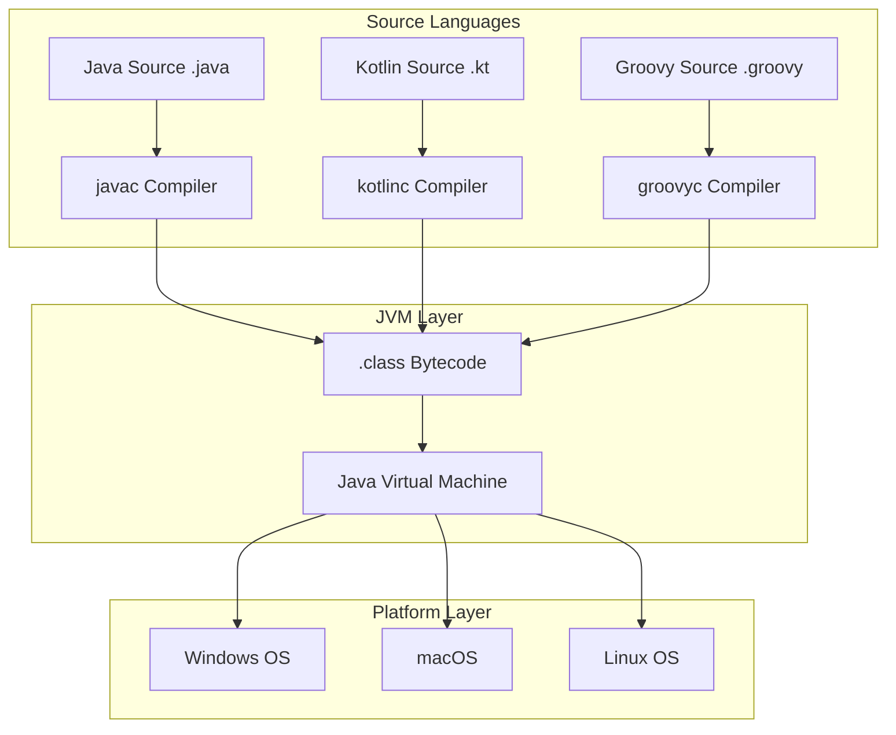
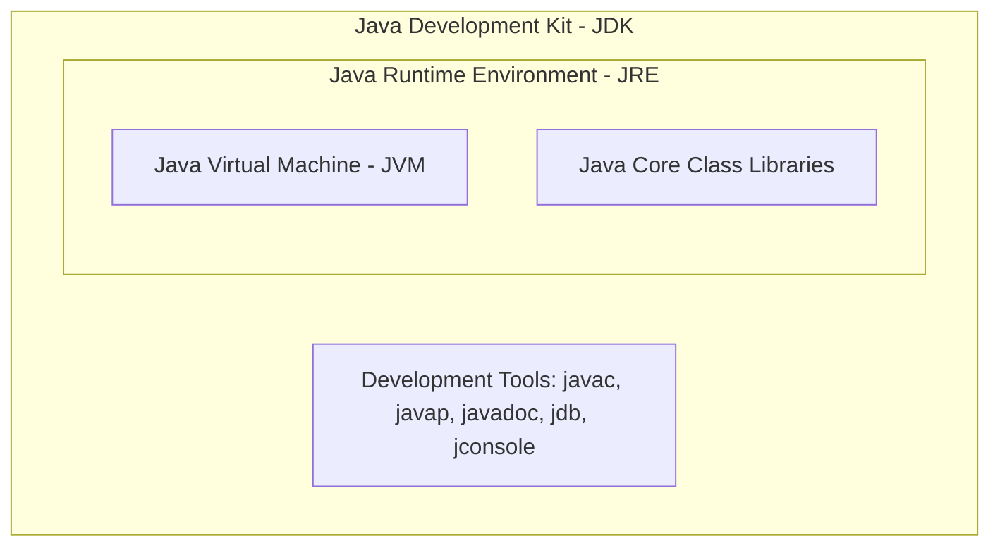
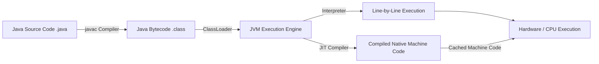
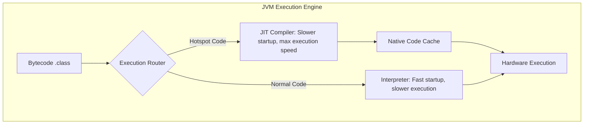
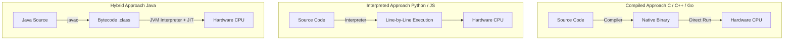
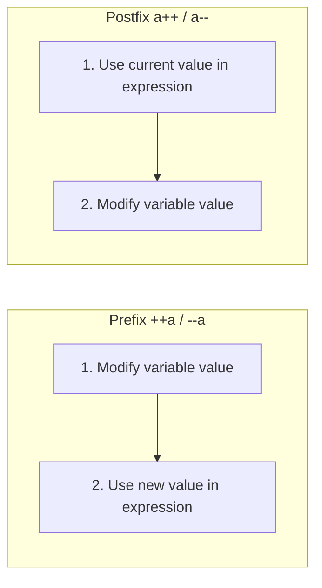
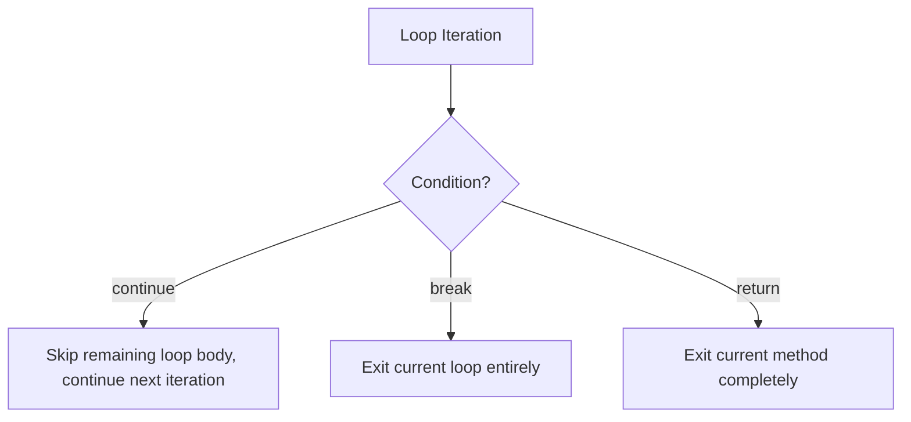
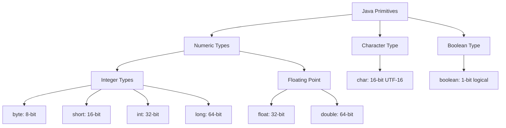
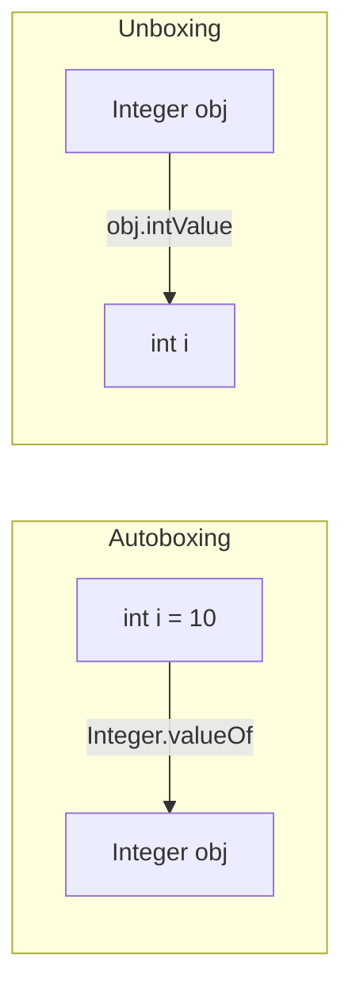

# Java Basics Core Interview Questions (Part 1)

---

## 1. Basic Concepts & General Knowledge

### What are the main features of the Java language?

1. **Simple and Easy to Learn:** Clean, C-style syntax with a gentle learning curve.
2. **Object-Oriented Programming (OOP):** Built around Encapsulation, Inheritance, and Polymorphism.
3. **Platform Independence:** "Write Once, Run Anywhere" enabled by the Java Virtual Machine (JVM).
4. **Built-in Multithreading Support:** Built-in primitives (`Thread`, `Runnable`, `java.util.concurrent`) for concurrent programming.
5. **Reliability:** Automatic memory management (Garbage Collection) and robust structured exception handling.
6. **Security:** Multi-layered security protections including access modifiers, secure class loading, and strict memory safety (no raw pointers).
7. **High Performance:** Just-In-Time (JIT) compilers optimize hot code paths to approach native execution speeds.
8. **Rich Networking Support:** Comprehensive standard libraries for network communication (HTTP, WebSockets, Sockets, NIO).
9. **Hybrid Compilation & Interpretation:** Source code compiles to portable bytecode, which is then interpreted and JIT-compiled at runtime.

> **Multithreading Note (C++ Comparison):** C++ added standard multithreading via `<thread>` (`std::thread`, `std::async`) in C++11.

> **Perspective - "Write Once, Run Anywhere":** While cross-platform portability was Java's flagship feature in the 1990s, modern container technologies (like Docker) provide cross-platform capabilities for any runtime. Today, Java's key advantage is its **massive ecosystem, enterprise reliability, and mature tooling**.

---

### Java SE vs. Java EE (Jakarta EE) vs. Java ME

* **Java SE (Java Platform, Standard Edition):** The foundational core of Java. Includes core libraries (I/O, collections, networking, concurrency) and the JVM. Used for desktop apps and core server applications.
* **Java EE (Enterprise Edition / Jakarta EE):** Built on top of Java SE. Defines enterprise specifications (Servlet, JSP, EJB, JDBC, JPA, JTA, JMS) for scalable enterprise backend systems.
* **Java ME (Micro Edition):** Lightweight runtime designed for embedded consumer electronics (legacy feature phones, smart appliances).

---

### ⭐️ JVM vs. JDK vs. JRE

#### 1. JVM (Java Virtual Machine)
The **JVM** is an abstract virtual machine that executes compiled Java bytecode (`.class` files). Operating systems have system-specific JVM implementations (Windows, macOS, Linux) that interpret the same bytecode to guarantee identical results across platforms.



> **Note:** HotSpot VM (by Oracle) is the default JVM implementation, but others exist (IBM J9, Azul Zing, Eclipse OpenJ9).

---

#### 2. JDK vs. JRE

* **JRE (Java Runtime Environment):** The runtime required to execute compiled Java programs. Contains:
  1. **JVM**
  2. **Java Core Class Libraries** (`java.lang`, `java.util`, `java.io`, etc.)
* **JDK (Java Development Kit):** A complete development toolkit. Contains:
  1. **JRE**
  2. **Development Tools** (Compiler `javac`, Disassembler `javap`, Debugger `jdb`, Doc Generator `javadoc`, Monitoring `jconsole`).



> **JDK 9+ Modularization:** Since JDK 9, the runtime was reorganized into 94 modules and introduced `jlink` to package custom, lightweight runtimes. Oracle discontinued standalone JRE installers starting with JDK 11.

---

### ⭐️ What is Bytecode? What are its Advantages?

**Bytecode** is an architecture-neutral intermediate instruction set saved as `.class` files. It is executed by the JVM rather than physical CPU hardware.



**Key Advantages:**
1. **Portability:** Write once, run anywhere with a compatible JVM.
2. **Dynamic Optimization:** Allows the JVM JIT compiler to profile execution and optimize hotspot code at runtime.

#### The Role of JIT (Just-In-Time) Compilation
HotSpot JVM uses **Lazy Evaluation**: 80% of system execution time is spent on 20% of the code ("hotspots"). The JIT compiler compiles these hotspots into native machine code and caches them for direct CPU execution.



---

### ⭐️ Why is Java Called "Both Compiled and Interpreted"?

* **Compiled Languages (C, C++, Rust, Go):** Source code is translated directly into native machine binaries before execution.
* **Interpreted Languages (Python, JavaScript, PHP):** Source code is interpreted line-by-line during runtime.



**Java combines both:**
1. **Compilation:** `javac` converts `.java` source code into intermediate `.class` bytecode.
2. **Interpretation & JIT:** The JVM interprets bytecode at startup and JIT-compiles hot code into native machine code.

---

### Ahead-Of-Time (AOT) Compilation vs. JIT Compilation

Introduced in JDK 9 (and expanded by GraalVM Native Image), **AOT Compilation** compiles Java bytecode directly into a native executable binary before execution.

| Dimension | JIT (Just-In-Time Compilation) | AOT (Ahead-Of-Time Compilation) |
| :--- | :--- | :--- |
| **Compilation Timing** | Runtime (during execution) | Build-time (before execution) |
| **Startup Speed** | Slower (requires warmup) | Instant (no warmup required) |
| **Peak Throughput** | Higher (uses runtime metrics) | Moderate |
| **Memory Footprint** | Higher (JVM overhead + JIT cache) | Significantly lower |
| **Binary Size** | Compact (`.jar` file) | Larger (contains machine code) |
| **Dynamic Features** | Full support (Reflection, Dynamic Proxies) | Restricted (requires reflection config) |
| **Best Use Cases** | Long-running microservices | Cloud-native, Serverless Functions, CLI tools |

---

### Oracle JDK vs. OpenJDK

* **OpenJDK:** An open-source reference implementation of the Java SE platform under the GPL v2 license.
* **Oracle JDK:** Built on top of OpenJDK by Oracle. Provides commercial support, enterprise licenses, and scheduled LTS builds.

**Popular OpenJDK Vendors:** AWS Corretto, Alibaba Dragonwell, Eclipse Temurin (Adoptium), Microsoft Build of OpenJDK, Azul Zulu.

---

### Java vs. C++: Key Differences

| Feature | Java | C++ |
| :--- | :--- | :--- |
| **Memory Management** | Automatic Garbage Collection (GC); no explicit pointers. | Manual memory management (`new`/`delete`); explicit pointers. |
| **Inheritance** | Single class inheritance; multiple interface implementation. | Multiple class inheritance supported. |
| **Operator Overloading** | Not supported. | Fully supported. |
| **Portability** | Platform-independent bytecode runs on any JVM. | Requires recompilation for target OS/architecture. |

---

## 2. Basic Syntax & Operators

### Comments in Java

1. **Single-line Comments:** `// Comment text`
2. **Multi-line Comments:** `/* Comment text */`
3. **Javadoc Comments:** `/** Documentation text */` (used to generate API documentation)

---

### Identifiers vs. Keywords

* **Identifier:** A user-defined name given to a class, variable, or method (e.g., `userScore`, `calculateTotal`).
* **Keyword:** A reserved word with specific language meaning (e.g., `class`, `public`, `static`, `void`, `final`).

#### Java Keywords Reference

| Category | Keywords |
| :--- | :--- |
| **Access Control** | `private`, `protected`, `public` |
| **Modifiers** | `abstract`, `class`, `extends`, `final`, `implements`, `interface`, `native`, `new`, `static`, `strictfp`, `synchronized`, `transient`, `volatile`, `enum` |
| **Control Flow** | `break`, `continue`, `return`, `do`, `while`, `if`, `else`, `for`, `instanceof`, `switch`, `case`, `default`, `assert` |
| **Error Handling** | `try`, `catch`, `throw`, `throws`, `finally` |
| **Package** | `import`, `package` |
| **Primitives** | `boolean`, `byte`, `char`, `double`, `float`, `int`, `long`, `short` |
| **References** | `super`, `this`, `void` |
| **Reserved** | `goto`, `const` |

> *Note:* `true`, `false`, and `null` are literal values, not keywords, but cannot be used as identifiers.

---

### ⭐️ Increment and Decrement Operators (`++` / `--`)

* **Prefix Form (`++a` / `--a`):** Increments/decrements the variable first, then evaluates the expression.
* **Postfix Form (`a++` / `a--`):** Evaluates the expression with the current value first, then increments/decrements.



#### Example Puzzle:
```java
int a = 9;
int b = a++; // b = 9, a becomes 10
int c = ++a; // a becomes 11, c = 11
int d = c--; // d = 11, c becomes 10
int e = --d; // d becomes 10, e = 10
```
**Result:** `a = 11`, `b = 9`, `c = 10`, `d = 10`, `e = 10`.

---

### ⭐️ Bitwise Shift Operators (`<<`, `>>`, `>>>`)

```mermaid
flowchart TB
    subgraph LeftShift ["Left Shift <<"]
        L1["Shift bits left by n"] --> L2["Discard high bits, pad low bits with 0"]
        L2 --> L3["Equivalent to x * 2^n"]
    end

    subgraph SignedRightShift ["Signed Right Shift >>"]
        R1["Shift bits right by n"] --> R2["Discard low bits, pad high bits with sign bit"]
        R2 --> R3["Equivalent to x / 2^n"]
    end

    subgraph UnsignedRightShift ["Unsigned Right Shift >>>"]
        U1["Shift bits right by n"] --> U2["Discard low bits, pad high bits with 0"]
        U2 --> U3["Logical right shift for bitmasks"]
    end
```



* `<<` **(Left Shift):** Shifts bits to the left, padding 0 on the right (`x << n` is equivalent to $x \times 2^n$).
* `>>` **(Signed Right Shift):** Shifts bits to the right, preserving the sign bit (`x >> n` is equivalent to $x / 2^n$).
* `>>>` **(Unsigned Right Shift):** Shifts bits right, padding 0 on the left regardless of sign.

> **Modulo Bit Shift Rule:** Shift counts for 32-bit `int` values are evaluated modulo 32 (`x << 42` is identical to `x << 10`). Shift counts for 64-bit `long` values are evaluated modulo 64.

---

### `continue`, `break`, and `return`



* `continue`: Skips the remainder of the current loop iteration.
* `break`: Terminates the enclosing loop or `switch` block.
* `return`: Exits the current method execution.

---

## 3. Primitive Data Types & Wrapper Classes

### The 8 Primitive Data Types



| Type | Bit Size | Bytes | Default Value | Value Range |
| :--- | :--- | :--- | :--- | :--- |
| `byte` | 8 | 1 | `0` | $-128$ to $127$ |
| `short` | 16 | 2 | `0` | $-32,768$ to $32,767$ |
| `int` | 32 | 4 | `0` | $-2,147,483,648$ to $2,147,483,647$ |
| `long` | 64 | 8 | `0L` | $-2^{63}$ to $2^{63}-1$ |
| `char` | 16 | 2 | `'\u0000'` | $0$ to $65,535$ |
| `float` | 32 | 4 | `0.0f` | $1.4\text{E}-45$ to $3.4028235\text{E}38$ |
| `double` | 64 | 8 | `0.0d` | $4.9\text{E}-324$ to $1.7976931348623157\text{E}308$ |
| `boolean` | JVM dep. | JVM dep. | `false` | `true` / `false` |

---

### Primitives vs. Wrapper Classes

| Feature | Primitive Types (`int`, `double`) | Wrapper Classes (`Integer`, `Double`) |
| :--- | :--- | :--- |
| **Generics Support** | No (`List<int>` invalid) | Yes (`List<Integer>` valid) |
| **Default Value** | `0`, `0.0`, `false` | `null` |
| **Memory Allocation** | Stack (local variables) or Heap (fields) | Always Heap allocated |
| **Comparison** | `==` compares raw values | `==` compares reference addresses; `.equals()` compares values |

---

### Wrapper Class Caching Mechanism

To optimize performance, Java caches small wrapper instances:

* `Byte`, `Short`, `Integer`, `Long`: Cache values in the range **[-128, 127]**.
* `Character`: Caches character codes in the range **[0, 127]**.
* `Boolean`: Reuses static `Boolean.TRUE` and `Boolean.FALSE` singletons.
* `Float`, `Double`: **No caching** (floating point values are continuous).

#### Example Puzzle:
```java
Integer a = 40;
Integer b = new Integer(40);
System.out.println(a == b); // false (b is explicitly instantiated on heap)

Integer c = 100;
Integer d = 100;
System.out.println(c == d); // true (reuses cached instance)

Integer e = 200;
Integer f = 200;
System.out.println(e == f); // false (outside cache range [-128, 127])
```

---

### Autoboxing and Unboxing

* **Autoboxing:** Automatic conversion of primitive types into wrapper classes (e.g., `int` $\rightarrow$ `Integer.valueOf(int)`).
* **Unboxing:** Automatic conversion of wrapper objects back to primitive types (e.g., `Integer` $\rightarrow$ `obj.intValue()`).



> **Performance Warning:** Avoid autoboxing in performance-critical loop iterations to prevent excessive object allocation.

---

### Floating-Point Precision Loss & `BigDecimal`

Floating-point numbers (`float`, `double`) use binary IEEE 754 representations, which cannot precisely represent fractional decimal values.

```java
float a = 2.0f - 1.9f; // 0.100000024
float b = 1.8f - 1.7f; // 0.099999905
System.out.println(a == b); // false
```

> **Best Practice:** Use `BigDecimal` for financial calculations, constructed via **String** constructors (`new BigDecimal("0.1")` or `BigDecimal.valueOf(0.1)`).
