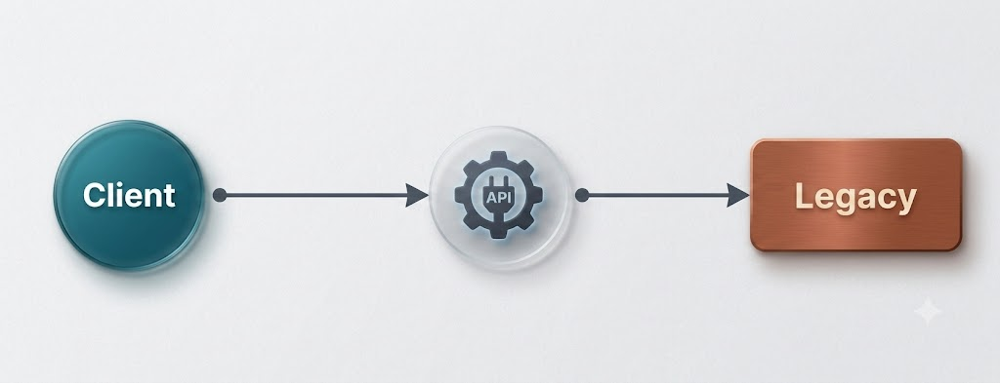
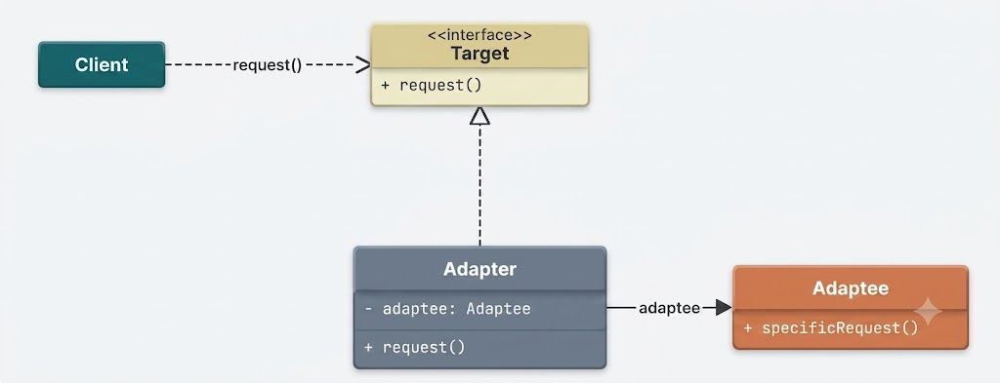
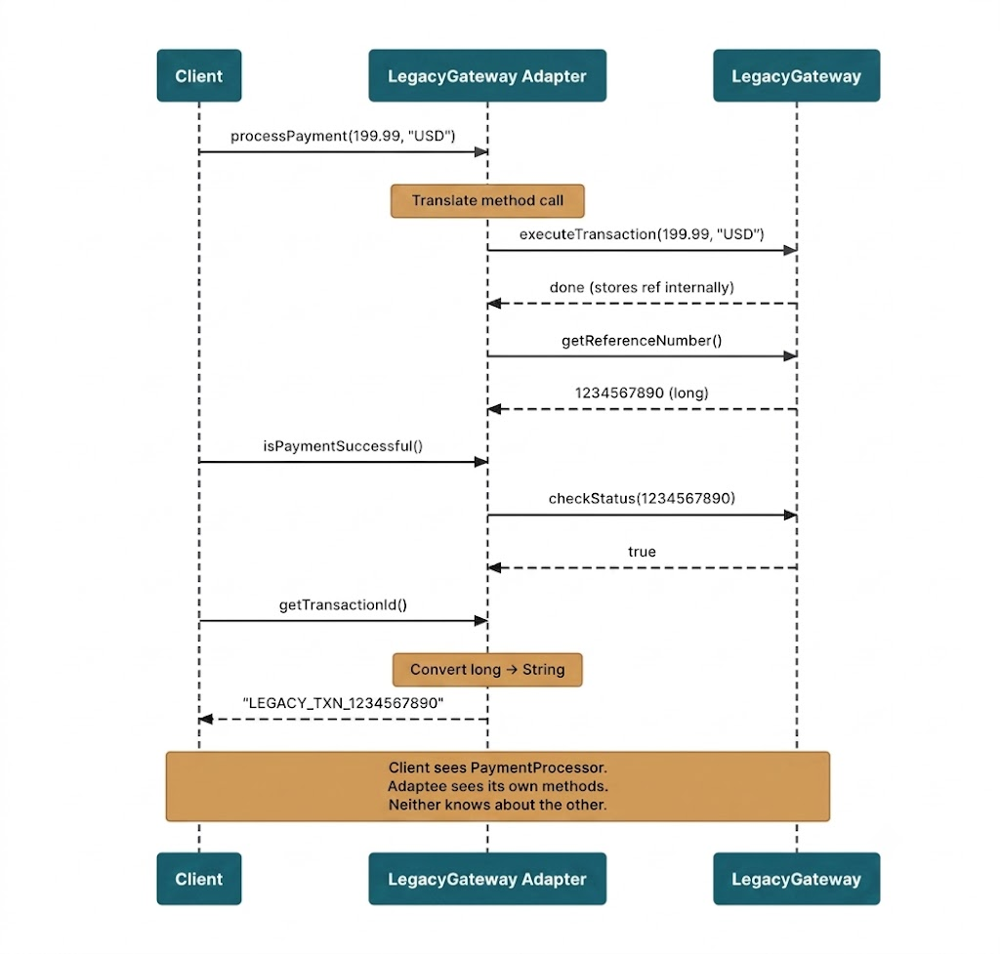
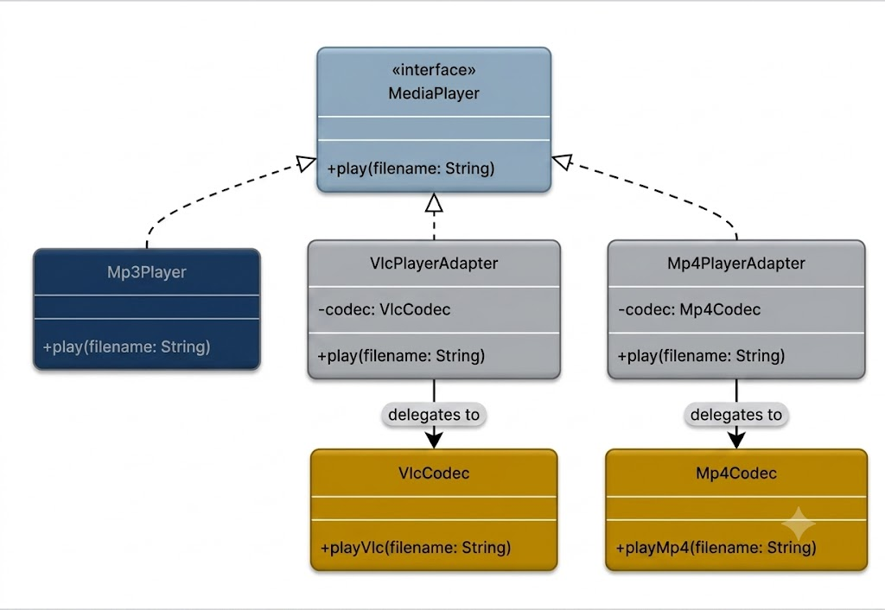

# Adapter Design Pattern

The **Adapter Design Pattern** is a structural design pattern that enables incompatible interfaces to collaborate by converting the interface of one class into another interface expected by client applications.



It is particularly valuable in situations where:
- You are integrating legacy components or 3rd-party libraries whose interfaces do not match your application's domain model.
- You want to reuse existing functionality without mutating its underlying source code.
- You need to bridge architectural gaps between legacy systems and modern service layers built with differing interface contracts.

When encountering incompatible interfaces, developers often attempt quick fixes by scattering conditional logic (e.g., `if (legacyType)`) throughout core business workflows. As additional incompatible vendors or external modules are introduced, this approach results in fragile, tightly coupled code that violates the **Open/Closed Principle (OCP)**.

The Adapter pattern addresses this by introducing a wrapper class that acts as an intermediate translator between your system and the incompatible component. It translates calls from your application's interface into method invocations understood by the target system—without modifying either side.

---

## 1. The Problem: Incompatible Payment Interfaces

Consider an e-commerce platform's checkout system designed around a standardized `PaymentProcessor` interface.

### The Expected Interface

```java
public interface PaymentProcessor {
    void processPayment(double amount, String currency);
    boolean isPaymentSuccessful();
    String getTransactionId();
}
```

This abstraction allows the application to swap payment backends seamlessly without modifying business logic.

### In-House Processor Implementation

Your internal payment gateway fits this interface natively:

```java
public class InHousePaymentProcessor implements PaymentProcessor {
    private boolean lastPaymentSuccess;
    private String lastTransactionId;

    @Override
    public void processPayment(double amount, String currency) {
        System.out.println("Processing in-house payment of " + amount + " " + currency);
        this.lastPaymentSuccess = true;
        this.lastTransactionId = "INHOUSE_TXN_" + System.currentTimeMillis();
    }

    @Override
    public boolean isPaymentSuccessful() {
        return lastPaymentSuccess;
    }

    @Override
    public String getTransactionId() {
        return lastTransactionId;
    }
}
```

### Modern Checkout Service

The core `CheckoutService` delegates payment execution through the `PaymentProcessor` contract:

```java
public class CheckoutService {
    private final PaymentProcessor paymentProcessor;

    public CheckoutService(PaymentProcessor paymentProcessor) {
        this.paymentProcessor = paymentProcessor;
    }

    public void checkout(double amount, String currency) {
        paymentProcessor.processPayment(amount, currency);
        if (paymentProcessor.isPaymentSuccessful()) {
            System.out.println("Checkout completed successfully. Transaction ID: " + 
                               paymentProcessor.getTransactionId());
        } else {
            System.out.println("Checkout failed!");
        }
    }
}
```

Executing this in-house flow works cleanly:

```java
public class ECommerceApp {
    public static void main(String[] args) {
        PaymentProcessor inHouseProcessor = new InHousePaymentProcessor();
        CheckoutService checkoutService = new CheckoutService(inHouseProcessor);
        checkoutService.checkout(199.99, "USD");
    }
}
```

### The Incompatible Legacy Gateway

Management requires integrating an external, legacy payment vendor (`LegacyGateway`). Its SDK is reliable, but its interface design differs completely:

```java
public class LegacyGateway {
    private long referenceNumber;

    public void executeTransaction(double amount, String currency) {
        System.out.println("Executing transaction via Legacy Gateway: " + amount + " " + currency);
        this.referenceNumber = (long) (Math.random() * 1000000000L);
    }

    public boolean checkStatus(long refNum) {
        return refNum > 0 && refNum == this.referenceNumber;
    }

    public long getReferenceNumber() {
        return referenceNumber;
    }
}
```

### Comparing Interface Mismatches

| Your Interface (`PaymentProcessor`) | Legacy Interface (`LegacyGateway`) | Architectural Mismatch |
| :--- | :--- | :--- |
| `processPayment(double, String)` | `executeTransaction(double, String)` | Method name mismatch |
| `isPaymentSuccessful()` | `checkStatus(long)` | Method name mismatch + parameter requirement |
| `getTransactionId()` returns `String` | `getReferenceNumber()` returns `long` | Method name mismatch + return type mismatch |

### Architectural Constraints
1. You cannot modify `CheckoutService`—it is utilized system-wide and depends strictly on `PaymentProcessor`.
2. You cannot modify `LegacyGateway`—it is supplied by an external third-party vendor.
3. Both must work together seamlessly.

The Adapter Pattern provides the necessary translation layer.

---

## 2. What is the Adapter Pattern?

The Adapter pattern converts the interface of an existing class into another interface expected by client code, enabling incompatible classes to collaborate without modification.

### Core Principles
1. **Interface Translation**: The adapter maps method calls from the target interface to the adaptee, reconciling differences in method names, signatures, parameters, and return types.
2. **Zero Code Modification**: Neither client code nor legacy code is modified. The adapter encapsulates the adaptee and presents the target interface interface to the client.

### Real-World Analogy: Travel Plug Adapter
When traveling from North America (Type A wall plugs) to Europe (Type C sockets), your electrical device plug cannot insert directly into the wall. Rather than rewiring your device or replacing foreign electrical sockets, you insert a physical **travel adapter**. The adapter accepts Type A plugs on one end and outputs Type C prongs on the other, bridging the gap between incompatible electrical standards.

### Two Types of Adapters

1. **Object Adapter (Recommended / Standard in Java)**
   - Uses **composition**: The adapter holds an internal instance reference to the adaptee object.
   - Flexible, loosely coupled, and works across class inheritance trees.
2. **Class Adapter**
   - Uses **multiple inheritance**: The adapter inherits simultaneously from both the Target interface and Adaptee class.
   - Restricted in single-inheritance languages like Java, but applicable in languages like C++.



### Participants in the Pattern

1. **Target Interface**: The interface contract expected by client applications (`PaymentProcessor`).
2. **Adaptee**: The existing, incompatible class containing core functionality (`LegacyGateway`).
3. **Adapter**: The intermediate wrapper class implementing the Target interface while delegating logic to the Adaptee instance (`LegacyGatewayAdapter`).
4. **Client**: The application logic that interacts exclusively with the Target interface (`CheckoutService`).

---

## 3. How the Adapter Pattern Works

The execution flow of an Object Adapter involves five sequential steps:



1. **Client Invokes Target Interface**: The client calls a method on the `Target` interface (e.g., `processPayment(199.99, "USD")`).
2. **Adapter Intercepts Call**: The `Adapter` receives the method call because it implements the `Target` interface.
3. **Adapter Performs Translation**: The `Adapter` maps target parameters and formats to match what the `Adaptee` expects.
4. **Adaptee Executes Logic**: The `Adaptee` executes its native method (e.g., `executeTransaction()`) and returns data in its own format.
5. **Adapter Formats & Returns Result**: The `Adapter` converts the adaptee's output into the type expected by the client interface (e.g., converting a `long` reference ID into a formatted `String` transaction ID).

---

## 4. Java Implementation Step-by-Step

Let's build an `Object Adapter` to connect `LegacyGateway` to `PaymentProcessor`.

### Step 1: Implement the Object Adapter

```java
public class LegacyGatewayAdapter implements PaymentProcessor {
    private final LegacyGateway legacyGateway;
    private long currentRefNum;

    public LegacyGatewayAdapter(LegacyGateway legacyGateway) {
        this.legacyGateway = legacyGateway;
    }

    @Override
    public void processPayment(double amount, String currency) {
        // Translate target call into legacy method invocation
        legacyGateway.executeTransaction(amount, currency);
        this.currentRefNum = legacyGateway.getReferenceNumber();
    }

    @Override
    public boolean isPaymentSuccessful() {
        // Bridge parameterless interface call to parameterized legacy check
        return legacyGateway.checkStatus(currentRefNum);
    }

    @Override
    public String getTransactionId() {
        // Convert long reference number into String transaction ID format
        return "LEGACY_TXN_" + legacyGateway.getReferenceNumber();
    }
}
```

### Step 2: Integrate with Existing Client Code

Because `CheckoutService` depends strictly on `PaymentProcessor`, we pass `LegacyGatewayAdapter` without altering `CheckoutService` code.

```java
public class AdapterDemoApp {
    public static void main(String[] args) {
        // Instantiating legacy vendor class
        LegacyGateway legacyGateway = new LegacyGateway();

        // Wrapping legacy gateway inside object adapter
        PaymentProcessor adapter = new LegacyGatewayAdapter(legacyGateway);

        // Client operates seamlessly via PaymentProcessor interface
        CheckoutService checkoutService = new CheckoutService(adapter);
        checkoutService.checkout(299.50, "EUR");
    }
}
```

### Expected Output:
```text
Executing transaction via Legacy Gateway: 299.5 EUR
Checkout completed successfully. Transaction ID: LEGACY_TXN_847291049
```

### Why This Adapter Works Cleanly
- **Composition over Inheritance**: Encapsulates `LegacyGateway` within `LegacyGatewayAdapter`, enabling runtime flexibility.
- **Transparent Translation**: Converts method names (`processPayment` -> `executeTransaction`), bridges parameters (`checkStatus(refNum)`), and converts types (`long` -> `String`).
- **Encapsulation of Legacy Quirks**: If vendor SDK APIs update, modifications remain restricted entirely to the `LegacyGatewayAdapter` class.

---

## 5. Practical Real-World Example: Media Player Adapter

Consider an audio media player that natively plays `.mp3` files via a `MediaPlayer` interface. Product requirements demand adding playback support for `.vlc` and `.mp4` formats using third-party audio codec libraries.



### Media Player Adapter Implementation

```java
// Target Interface
interface MediaPlayer {
    void play(String audioType, String fileName);
}

// Incompatible Third-Party Codec 1
class VlcCodec {
    public void playVlc(String fileName) {
        System.out.println("Playing VLC file: " + fileName);
    }
}

// Incompatible Third-Party Codec 2
class Mp4Codec {
    public void playMp4(String fileName) {
        System.out.println("Playing MP4 file: " + fileName);
    }
}

// Adapter for VLC Codec
class VlcPlayerAdapter implements MediaPlayer {
    private final VlcCodec vlcCodec;

    public VlcPlayerAdapter(VlcCodec vlcCodec) {
        this.vlcCodec = vlcCodec;
    }

    @Override
    public void play(String audioType, String fileName) {
        vlcCodec.playVlc(fileName);
    }
}

// Adapter for MP4 Codec
class Mp4PlayerAdapter implements MediaPlayer {
    private final Mp4Codec mp4Codec;

    public Mp4PlayerAdapter(Mp4Codec mp4Codec) {
        this.mp4Codec = mp4Codec;
    }

    @Override
    public void play(String audioType, String fileName) {
        mp4Codec.playMp4(fileName);
    }
}

// Main Audio Player handling native & adapted formats
class AudioPlayer implements MediaPlayer {
    @Override
    public void play(String audioType, String fileName) {
        if (audioType.equalsIgnoreCase("mp3")) {
            System.out.println("Playing MP3 file natively: " + fileName);
        } else if (audioType.equalsIgnoreCase("vlc")) {
            MediaPlayer vlcAdapter = new VlcPlayerAdapter(new VlcCodec());
            vlcAdapter.play(audioType, fileName);
        } else if (audioType.equalsIgnoreCase("mp4")) {
            MediaPlayer mp4Adapter = new Mp4PlayerAdapter(new Mp4Codec());
            mp4Adapter.play(audioType, fileName);
        } else {
            System.out.println("Invalid media format: " + audioType + " is not supported.");
        }
    }
}

public class MediaPlayerDemo {
    public static void main(String[] args) {
        AudioPlayer player = new AudioPlayer();

        player.play("mp3", "song.mp3");
        player.play("vlc", "movie.vlc");
        player.play("mp4", "video.mp4");
        player.play("avi", "clip.avi");
    }
}
```

### Output:
```text
Playing MP3 file natively: song.mp3
Playing VLC file: movie.vlc
Playing MP4 file: video.mp4
Invalid media format: avi is not supported.
```

---

## 6. Summary & Key Takeaways

- **Intent**: Converts an incompatible interface into an interface expected by clients without altering existing source code.
- **Composition over Inheritance**: Preferred Object Adapter design wraps the adaptee instance dynamically.
- **Decoupled Architecture**: Shields application core logic from third-party vendor changes and legacy quirks.
- **Open/Closed Principle**: New adapters can be introduced to support additional formats or vendors without modifying existing client code.
