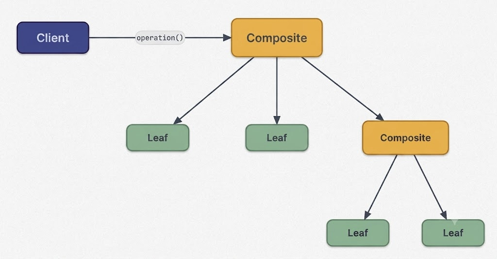
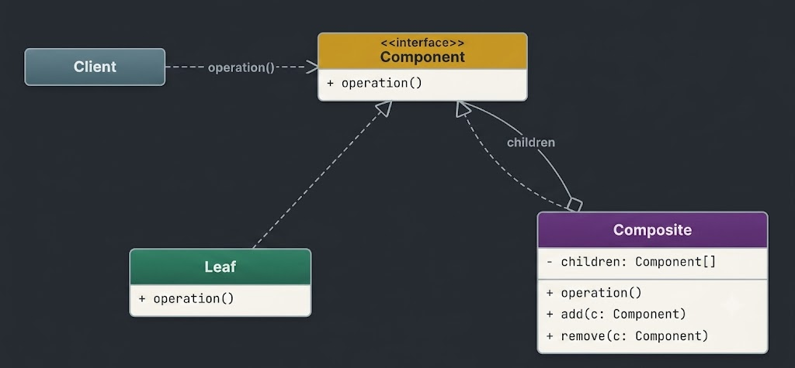
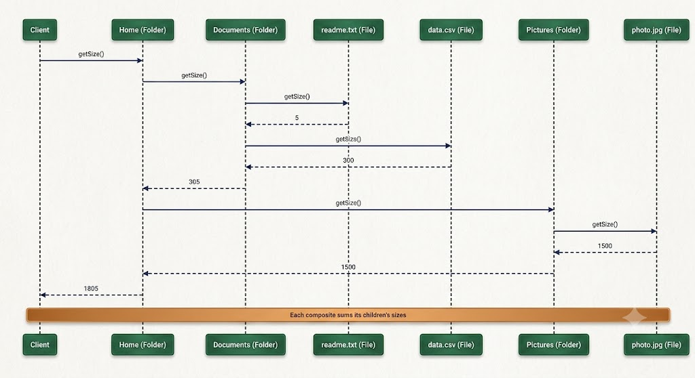
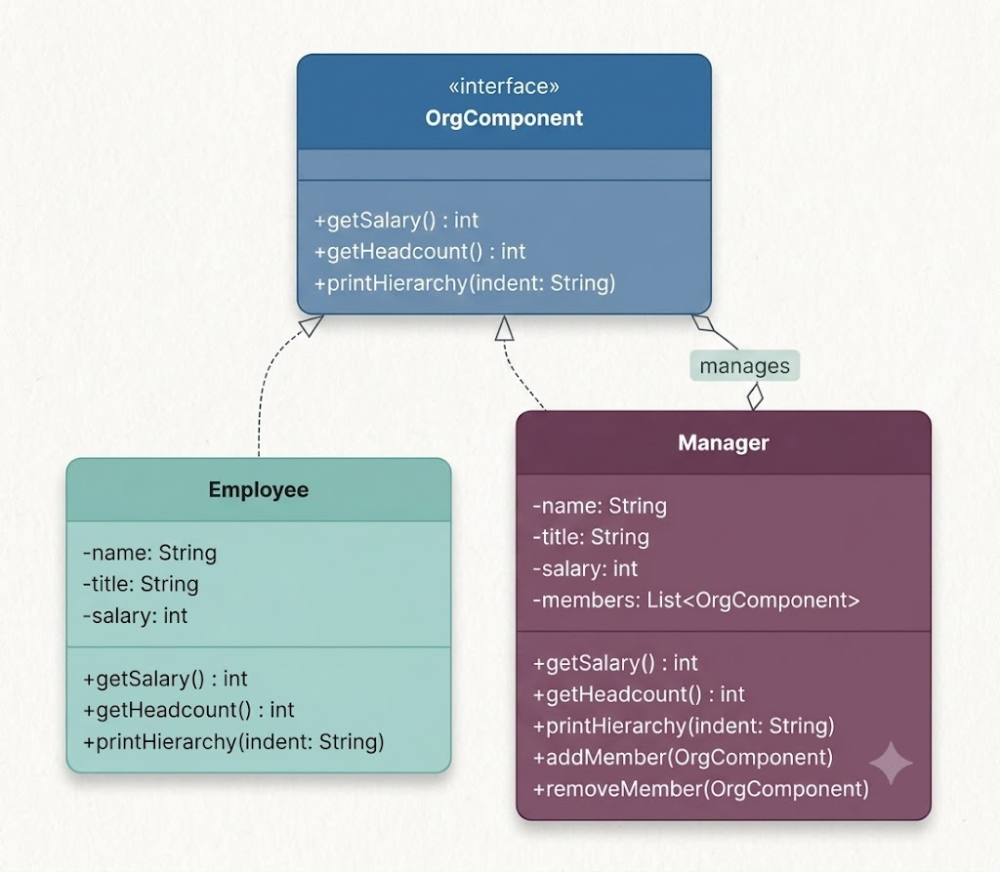

# Composite Design Pattern

The **Composite Design Pattern** is a structural design pattern that allows client code to treat individual leaf objects and compositions of objects uniformly through a shared interface.



It enables you to build tree-like object hierarchies (such as file systems, UI component trees, or corporate organizational charts) where clients operate on single elements and complex node groups using identical operations.

It is particularly valuable in situations where:
- You need to represent part-whole tree hierarchies.
- You want to perform operations on leaf nodes and container nodes consistently without type checking.
- You want to eliminate special-case logic for distinguishing between individual and aggregated objects.

---

## 1. The Problem: Modeling a File Explorer

Imagine building a desktop file explorer application (such as Finder or Windows File Explorer). The application must represent:
- **Files**: Individual items possessing a name and a file size.
- **Folders**: Containers that hold files and subfolders nested to arbitrary depths.

The application must support recursive operations such as:
- `getSize()`: Returns total storage size (summing all contents recursively for folders).
- `printStructure(String indent)`: Displays the directory tree structure formatted with indentation.
- `delete()`: Removes a file or folder along with all nested contents.

### The Naive Approach: Unrelated Classes

A common initial approach creates separate `File` and `Folder` classes without a common interface:

```java
// File Class
public class File {
    private String name;
    private long size;

    public File(String name, long size) {
        this.name = name;
        this.size = size;
    }

    public long getSize() {
        return size;
    }

    public void printDetails() {
        System.out.println("File: " + name + " (" + size + " bytes)");
    }
}
```

```java
// Folder Class with Explicit Type Checks
import java.util.ArrayList;
import java.util.List;

public class Folder {
    private String name;
    private List<Object> contents = new ArrayList<>();

    public Folder(String name) {
        this.name = name;
    }

    public void add(Object item) {
        contents.add(item);
    }

    public long getSize() {
        long totalSize = 0;
        for (Object item : contents) {
            if (item instanceof File) {
                totalSize += ((File) item).getSize();
            } else if (item instanceof Folder) {
                totalSize += ((Folder) item).getSize();
            }
        }
        return totalSize;
    }
}
```

### Why This Approach Fails at Scale
1. **Repetitive Type Checks**: Every operation (`getSize()`, `printStructure()`, `delete()`) requires `instanceof` checks and downcasting across the tree structure.
2. **Lack of Shared Abstraction**: Without a common interface (such as `FileSystemItem`), client code cannot write generic collection handlers.
3. **Violates Open/Closed Principle**: Adding new node types (e.g., `Shortcut` or `Archive`) forces modifications to type-checking conditionals across all `Folder` operations.
4. **Fragile Recursion**: Deeply nested trees become cluttered with complex conditional loops, making bug tracking difficult.

---

## 2. The Composite Design Pattern

The Composite pattern organizes objects into tree hierarchies where leaf objects (individual nodes) and composite objects (container nodes) implement the same component interface.

### Key Characteristics
1. **Uniform Interface**: Leaf and composite nodes expose the same method contracts.
2. **Recursive Composition**: Composite objects hold collections of components, which can themselves be composite containers.



### Participants in the Pattern
- **Component Interface** (`FileSystemItem`): Declares shared operations for both leaves and composites (`getSize()`, `printStructure()`, `delete()`).
- **Leaf** (`File`): Represents leaf nodes with no children. Implements Component methods directly.
- **Composite** (`Folder`): Represents container nodes holding child Components. Implements Component methods by delegating recursively to child elements.
- **Client**: Interacts with elements exclusively through the Component interface.

---

## 3. How the Composite Pattern Works

The execution flow of a Composite tree structure follows a recursive delegation model:



1. **Construct Tree Hierarchy**: Client builds a tree by adding leaf objects (`File`) and composite objects (`Folder`) to parent containers.
2. **Client Invokes Root Operation**: The client calls `getSize()` on the root folder without needing to inspect its internal depth or node types.
3. **Composite Delegates to Children**: The composite iterates over its child items, invoking `getSize()` on each.
4. **Leaves Return Direct Values**: Leaf objects return their file size directly without delegation.
5. **Sub-Containers Recurse**: Subfolder composites recursively trigger `getSize()` across their own children.
6. **Results Aggregate Upward**: Returned sizes aggregate at each level, returning the grand total to the client.

---

## 4. Java Implementation Step-by-Step

Let's build a clean, production-ready file system explorer using the Composite pattern.

### Step 1: Define Component Interface

```java
public interface FileSystemItem {
    long getSize();
    void printStructure(String indent);
    void delete();
}
```

### Step 2: Implement Leaf Class (File)

```java
public class File implements FileSystemItem {
    private final String name;
    private final long size;

    public File(String name, long size) {
        this.name = name;
        this.size = size;
    }

    @Override
    public long getSize() {
        return size;
    }

    @Override
    public void printStructure(String indent) {
        System.out.println(indent + "- File: " + name + " (" + size + " bytes)");
    }

    @Override
    public void delete() {
        System.out.println("Deleting file: " + name);
    }
}
```

### Step 3: Implement Composite Class (Folder)

```java
import java.util.ArrayList;
import java.util.List;

public class Folder implements FileSystemItem {
    private final String name;
    private final List<FileSystemItem> children = new ArrayList<>();

    public Folder(String name) {
        this.name = name;
    }

    public void add(FileSystemItem item) {
        children.add(item);
    }

    public void remove(FileSystemItem item) {
        children.remove(item);
    }

    @Override
    public long getSize() {
        long totalSize = 0;
        for (FileSystemItem child : children) {
            totalSize += child.getSize(); // Polymorphic recursion (no instanceof!)
        }
        return totalSize;
    }

    @Override
    public void printStructure(String indent) {
        System.out.println(indent + "+ Folder: " + name);
        for (FileSystemItem child : children) {
            child.printStructure(indent + "  ");
        }
    }

    @Override
    public void delete() {
        for (FileSystemItem child : children) {
            child.delete();
        }
        System.out.println("Deleting folder: " + name);
    }
}
```

### Step 4: Client Demonstration Code

```java
public class CompositeFileSystemDemo {
    public static void main(String[] args) {
        // Create files (Leaves)
        File file1 = new File("readme.txt", 500);
        File file2 = new File("config.json", 1200);
        File file3 = new File("logo.png", 45000);
        File file4 = new File("data.csv", 180000);

        // Create subfolders (Composites)
        Folder docsFolder = new Folder("Documents");
        docsFolder.add(file1);
        docsFolder.add(file2);

        Folder imgFolder = new Folder("Images");
        imgFolder.add(file3);

        // Create root folder
        Folder rootFolder = new Folder("Root");
        rootFolder.add(docsFolder);
        rootFolder.add(imgFolder);
        rootFolder.add(file4);

        // Perform uniform operations across the tree
        System.out.println("--- Directory Structure ---");
        rootFolder.printStructure("");

        System.out.println("\nTotal Storage Size: " + rootFolder.getSize() + " bytes");

        System.out.println("\n--- Deleting Entire Tree ---");
        rootFolder.delete();
    }
}
```

### Expected Output:
```text
--- Directory Structure ---
+ Folder: Root
  + Folder: Documents
    - File: readme.txt (500 bytes)
    - File: config.json (1200 bytes)
  + Folder: Images
    - File: logo.png (45000 bytes)
  - File: data.csv (180000 bytes)

Total Storage Size: 226700 bytes

--- Deleting Entire Tree ---
Deleting file: readme.txt
Deleting file: config.json
Deleting folder: Documents
Deleting file: logo.png
Deleting folder: Images
Deleting file: data.csv
Deleting folder: Root
```

---

## 5. Practical Real-World Example: Corporate Organization Hierarchy

Consider an enterprise organization hierarchy system where `Employee` (leaf) and `Manager` (composite) implement a shared `OrgComponent` interface.



### Organization Hierarchy Composite Implementation

```java
import java.util.ArrayList;
import java.util.List;

// Component Interface
interface OrgComponent {
    int getSalary();
    int getHeadcount();
    void printHierarchy(String indent);
}

// Leaf Class: Employee
class Employee implements OrgComponent {
    private final String name;
    private final String title;
    private final int salary;

    public Employee(String name, String title, int salary) {
        this.name = name;
        this.title = title;
        this.salary = salary;
    }

    @Override
    public int getSalary() {
        return salary;
    }

    @Override
    public int getHeadcount() {
        return 1;
    }

    @Override
    public void printHierarchy(String indent) {
        System.out.println(indent + "- " + name + " (" + title + ") [$" + salary + "]");
    }
}

// Composite Class: Manager
class Manager implements OrgComponent {
    private final String name;
    private final String title;
    private final int salary;
    private final List<OrgComponent> teamMembers = new ArrayList<>();

    public Manager(String name, String title, int salary) {
        this.name = name;
        this.title = title;
        this.salary = salary;
    }

    public void addMember(OrgComponent member) {
        teamMembers.add(member);
    }

    public void removeMember(OrgComponent member) {
        teamMembers.remove(member);
    }

    @Override
    public int getSalary() {
        int totalSalary = this.salary;
        for (OrgComponent member : teamMembers) {
            totalSalary += member.getSalary();
        }
        return totalSalary;
    }

    @Override
    public int getHeadcount() {
        int totalCount = 1; // Manager counts as 1
        for (OrgComponent member : teamMembers) {
            totalCount += member.getHeadcount();
        }
        return totalCount;
    }

    @Override
    public void printHierarchy(String indent) {
        System.out.println(indent + "+ Manager: " + name + " (" + title + ") [$" + salary + "]");
        for (OrgComponent member : teamMembers) {
            member.printHierarchy(indent + "  ");
        }
    }
}

// Demonstration Client
public class OrgHierarchyDemo {
    public static void main(String[] args) {
        // Individual Engineers (Leaves)
        Employee dev1 = new Employee("Alice", "Backend Engineer", 120000);
        Employee dev2 = new Employee("Bob", "Frontend Engineer", 110000);
        Employee dev3 = new Employee("Charlie", "QA Engineer", 95000);

        // Engineering Manager (Composite)
        Manager engManager = new Manager("Diana", "Engineering Manager", 160000);
        engManager.addMember(dev1);
        engManager.addMember(dev2);
        engManager.addMember(dev3);

        // Sales Lead and Representatives
        Employee salesRep1 = new Employee("Eve", "Sales Representative", 80000);
        Manager salesManager = new Manager("Frank", "Sales Manager", 140000);
        salesManager.addMember(salesRep1);

        // Executive VP (Root Composite)
        Manager vpExec = new Manager("Grace", "VP of Operations", 220000);
        vpExec.addMember(engManager);
        vpExec.addMember(salesManager);

        // Uniform Operation Invocations
        System.out.println("=== Corporate Organization Hierarchy ===");
        vpExec.printHierarchy("");

        System.out.println("\nTotal Organization Payroll: $" + vpExec.getSalary());
        System.out.println("Total Organization Headcount: " + vpExec.getHeadcount() + " employees");
    }
}
```

### Output:
```text
=== Corporate Organization Hierarchy ===
+ Manager: Grace (VP of Operations) [$220000]
  + Manager: Diana (Engineering Manager) [$160000]
    - Alice (Backend Engineer) [$120000]
    - Bob (Frontend Engineer) [$110000]
    - Charlie (QA Engineer) [$95000]
  + Manager: Frank (Sales Manager) [$140000]
    - Eve (Sales Representative) [$80000]

Total Organization Payroll: $925000
Total Organization Headcount: 7 employees
```

---

## 6. Summary & Key Takeaways

- **Part-Whole Representation**: Models tree hierarchies naturally using a single unified component interface.
- **Polymorphic Uniformity**: Eliminates `instanceof` checks and downcasting when processing composite structures.
- **Clean Recursive Delegation**: Operations automatically cascade down tree branches without complex conditional branching.
- **Extensibility**: New leaf or composite types (e.g., `Contractor`, `Archive`) can be introduced without modifying existing client code.
