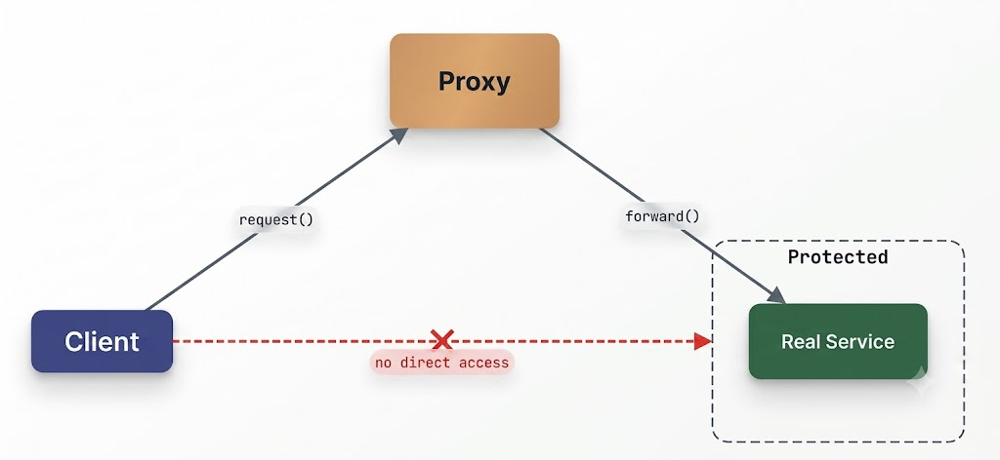
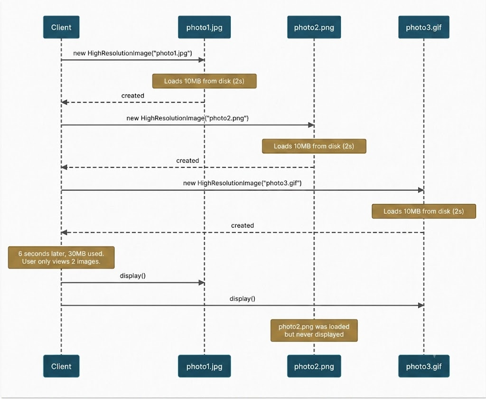
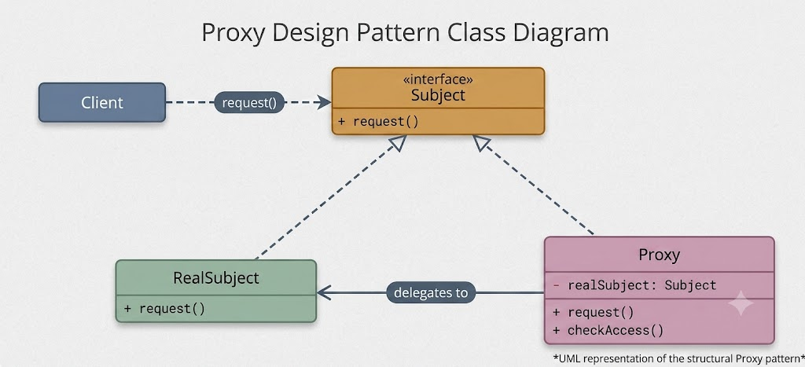
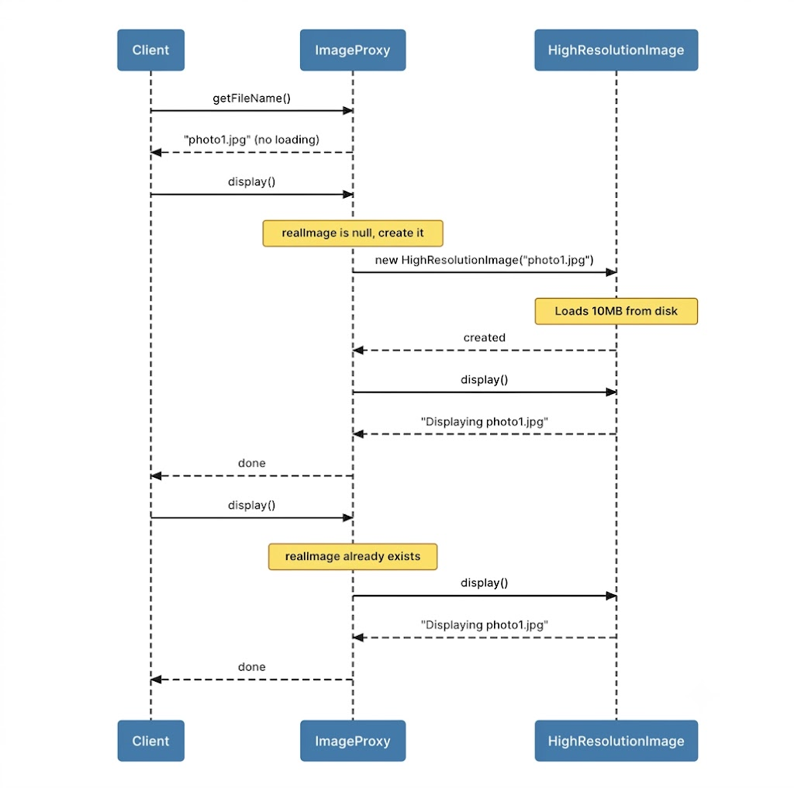
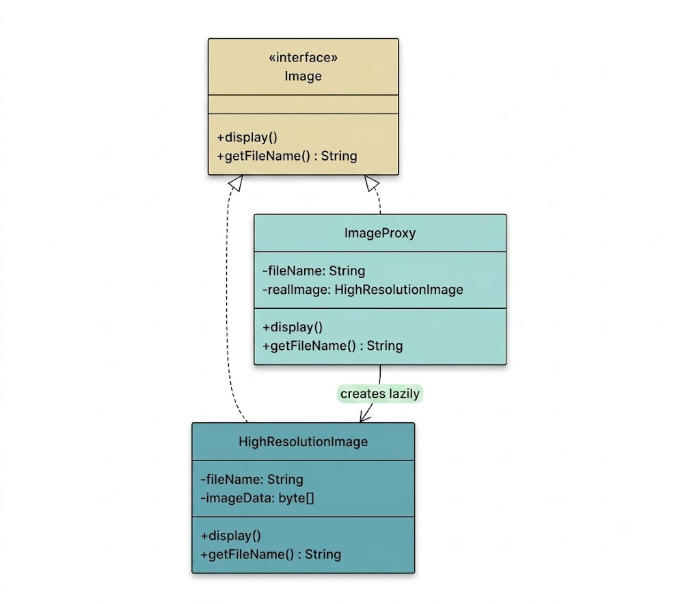
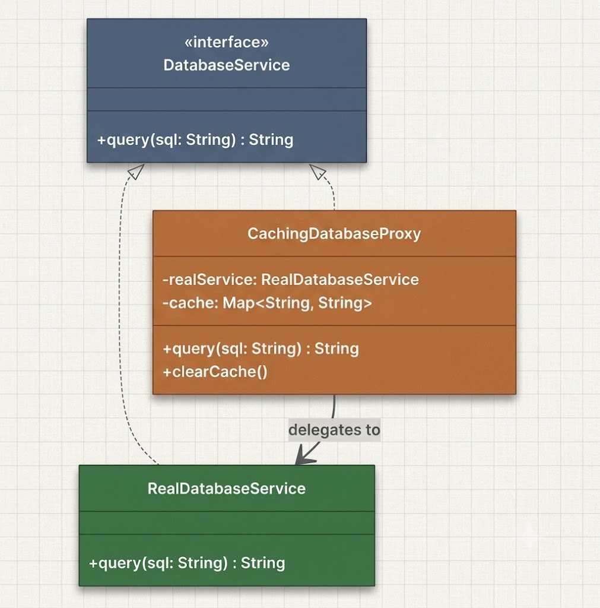

# Proxy Design Pattern

The **Proxy Design Pattern** is a structural design pattern that provides a surrogate or placeholder for another object, enabling controlled access to it.



In real-world systems, objects interacting with clients are frequently resource-heavy, remote, or sensitive. Common examples include database connections, remote API endpoints, file systems, or large in-memory data structures. Direct client interaction with these resources is not always desirable.

A proxy is helpful when you want to:
- **Defer creation or initialization** until an object is strictly required (lazy initialization).
- **Restrict or regulate access** using authentication, authorization, or rate-limiting rules.
- **Inject cross-cutting logic** like logging, caching, retry mechanisms, or telemetry without modifying the underlying class.

The proxy positions itself between the client and the target service object, intercepting incoming invocations to determine whether to forward them directly, block execution, or enhance them with supplementary logic.

Below is a detailed walk-through of a real-world scenario demonstrating how to use the Proxy Pattern to build safer, smarter, and controlled interactions with expensive or sensitive components.

---

## 1. The Problem: Eager Initialization

Imagine building an image viewer application. Users scroll through a grid of thumbnail images; when selecting a thumbnail, the full high-resolution image renders on screen.

A naive implementation instantiates all high-resolution images upfront. Here is how that code looks without a proxy:

```java
public interface Image {
    void display();
    String getFileName();
}

public class HighResolutionImage implements Image {
    private String fileName;

    public HighResolutionImage(String fileName) {
        this.fileName = fileName;
        loadFromDisk();
    }

    private void loadFromDisk() {
        System.out.println("Loading 10MB image file from disk: " + fileName + " (2s)");
    }

    @Override
    public void display() {
        System.out.println("Displaying high-resolution image: " + fileName);
    }

    @Override
    public String getFileName() {
        return fileName;
    }
}
```

```java
public class ImageGalleryApp {
    public static void main(String[] args) {
        // Eagerly loading images during initialization
        Image photo1 = new HighResolutionImage("photo1.jpg");
        Image photo2 = new HighResolutionImage("photo2.png");
        Image photo3 = new HighResolutionImage("photo3.gif");

        // User interacts with only two images
        photo1.display();
        photo3.display();
    }
}
```

Every image payload gets read during object creation.



### Issues with the Eager Approach

1. **Resource-Heavy Startup**  
   Every `HighResolutionImage` loads raw data during instantiation even if never requested by the user. This causes startup delays, excessive memory allocation, and wasted I/O operations. When handling dozens or hundreds of items, this creates severe performance bottlenecks.

2. **Lack of Access Controls**  
   If you need to log when an image renders, enforce authorization checks for sensitive images, or cache previously loaded assets, you would have to modify `HighResolutionImage` directly—mixing unrelated responsibilities.

3. **Violation of Single Responsibility Principle**  
   `HighResolutionImage` handles both data management and loading strategy. Execution policies (eager vs. lazy, cached vs. fresh, authorized vs. blocked) should remain separate from the core domain object.

### Requirements for a Better Design
We require an architecture that can:
- Postpone costly image loading until actively invoked.
- Introduce features like logging, security filters, or caching without editing `HighResolutionImage`.
- Retain the existing interface contract so client code remains unaffected.

This is where the **Proxy Design Pattern** fits in.

---

## 2. The Proxy Design Pattern

The Proxy pattern supplies a surrogate object that manages access to the real service object. Rather than communicating directly with the actual instance, clients invoke the proxy via a shared interface. The proxy determines when and how calls are dispatched to the underlying object.

Key attributes of the pattern:
- **Interface Conformance**: The proxy implements the exact interface as the target subject, making it transparent to the client.
- **Interception & Regulation**: The proxy intercepts method invocations to execute pre-processing, post-processing, or blocking logic prior to or instead of delegating calls.

### Class Diagram



### Pattern Participants

1. **Subject (`Image`)**  
   The common interface implemented by both the target subject and proxy. In our example, `Image` defines `display()` and `getFileName()`.

2. **RealSubject (`HighResolutionImage`)**  
   The primary object performing the actual heavy lifting (e.g., loading large disk files upon creation).

3. **Proxy (`ImageProxy`)**  
   The lightweight surrogate implementing `Subject`. It retains metadata (like the filename) and avoids instantiating `HighResolutionImage` until `display()` is invoked.

4. **Client (`ImageGalleryApp`)**  
   The consumer interacting with objects through the `Subject` interface, unaware whether it holds a proxy or a real instance.

### Primary Types of Proxies

- **Virtual Proxy (Lazy Loading)**: Defers heavy object creation until explicitly needed.
- **Protection Proxy (Security)**: Performs authorization checks before granting access to operations.
- **Remote Proxy**: Handles remote communication over a network transparently.
- **Caching Proxy**: Stores expensive result sets to avoid redundant target invocations.
- **Smart Reference Proxy**: Integrates ancillary logic like logging, reference counts, or auditing around method calls.

---

## 3. How It Works

Here is the operational sequence for our image gallery proxy:



1. **Instantiation**: The client creates an `ImageProxy("photo1.jpg")`. The proxy stores the filename string without triggering heavy file reads. Instantiation is virtually instantaneous.
2. **Idle State**: The real `HighResolutionImage` is not constructed yet. Zero disk I/O and memory overhead are incurred.
3. **Cheap Operations**: Calling `getFileName()` on the proxy returns the stored string directly, bypassing the real service object.
4. **First Expensive Operation**: When `display()` is called, the proxy checks if the underlying instance exists. Finding `null`, it instantiates `HighResolutionImage`, triggering the disk read.
5. **Delegation**: Once instantiated, the proxy delegates the `display()` invocation to `HighResolutionImage`.
6. **Subsequent Calls**: Repeated calls to `display()` reuse the stored `HighResolutionImage` reference, running instantly without re-loading.

---

## 4. Implementing the Proxy Pattern

Refactoring the image gallery using the Proxy pattern ensures loading occurs strictly on demand.



### Step 1: Define the Proxy Class

`ImageProxy` implements `Image`, holding a filename string and maintaining an initially null reference to `HighResolutionImage`.

```java
public class ImageProxy implements Image {
    private String fileName;
    private HighResolutionImage realImage;

    public ImageProxy(String fileName) {
        this.fileName = fileName;
    }

    @Override
    public void display() {
        if (realImage == null) {
            realImage = new HighResolutionImage(fileName); // Lazy initialization
        }
        realImage.display();
    }

    @Override
    public String getFileName() {
        return fileName;
    }
}
```

### Step 2: Client Execution

```java
public class ImageGalleryApp {
    public static void main(String[] args) {
        // Create lightweight proxies upfront
        Image photo1 = new ImageProxy("photo1.jpg");
        Image photo2 = new ImageProxy("photo2.png");
        Image photo3 = new ImageProxy("photo3.gif");

        System.out.println("Gallery initialized instantly.\n");

        // Display photo1 (triggers lazy load)
        photo1.display();
        System.out.println();

        // Display photo1 again (uses cached instance)
        photo1.display();
        System.out.println();

        // Display photo3 (triggers lazy load)
        photo3.display();
        
        // photo2 was never displayed and thus never loaded into memory.
    }
}
```

### Console Output
```text
Gallery initialized instantly.

Loading 10MB image file from disk: photo1.jpg (2s)
Displaying high-resolution image: photo1.jpg

Displaying high-resolution image: photo1.jpg

Loading 10MB image file from disk: photo3.gif (2s)
Displaying high-resolution image: photo3.gif
```

### Summary of Benefits Achieved
- **Lazy Initialization**: Files load only when viewed, drastically shortening startup time.
- **Memory Efficiency**: Unrendered items (like `photo2.png`) consume negligible memory.
- **Interface Consistency**: The client uses `Image` abstractions seamlessly.
- **Decoupled Real Subject**: `HighResolutionImage` requires no changes.
- **Reusability**: Repeated invocations reuse loaded instances efficiently.

---

## 5. Extending the Design: Additional Proxy Variations

The Proxy pattern easily adapts to various software architectural requirements without mutating the primary service or breaking interface contracts.

### 1. Protection Proxy (Access Control)

A protection proxy evaluates authorization credentials before delegating execution. For instance, restrictive image files might require an `ADMIN` role.

Rather than altering `display()` signatures, user context is injected into the proxy via constructor:

```java
public class ProtectionImageProxy implements Image {
    private String fileName;
    private String userRole;
    private ImageProxy realProxy;

    public ProtectionImageProxy(String fileName, String userRole) {
        this.fileName = fileName;
        this.userRole = userRole;
        this.realProxy = new ImageProxy(fileName);
    }

    @Override
    public void display() {
        if (fileName.contains("secret") && !"ADMIN".equalsIgnoreCase(userRole)) {
            System.out.println("Access Denied: You do not have permission to view " + fileName);
            return;
        }
        realProxy.display();
    }

    @Override
    public String getFileName() {
        return fileName;
    }
}
```

### 2. Logging Proxy (Auditing)

A logging proxy records invocation details for metrics or diagnostic tracking:

```java
public class LoggingImageProxy implements Image {
    private Image targetImage;

    public LoggingImageProxy(Image targetImage) {
        this.targetImage = targetImage;
    }

    @Override
    public void display() {
        System.out.println("[LOG] Initiating display for: " + targetImage.getFileName());
        long startTime = System.currentTimeMillis();
        
        targetImage.display();
        
        long endTime = System.currentTimeMillis();
        System.out.println("[LOG] Display completed in " + (endTime - startTime) + " ms");
    }

    @Override
    public String getFileName() {
        return targetImage.getFileName();
    }
}
```

Proxies can also be chained: `new LoggingImageProxy(new ImageProxy("photo1.jpg"))`. The logging wrapper captures execution metrics while delegating to the virtual proxy for lazy loading.

---

## 6. Practical Scenario: Database Query Caching Proxy

Beyond graphical interfaces, proxies excel at query caching layers. Here, an interface defines a query operation, a real service simulates database latency, and a proxy caches SQL results.



### Implementation

```java
import java.util.HashMap;
import java.util.Map;

// Subject
public interface DatabaseService {
    String query(String sql);
}

// RealSubject
public class RealDatabaseService implements DatabaseService {
    @Override
    public String query(String sql) {
        System.out.println("Executing query on remote database: " + sql);
        try {
            Thread.sleep(100); // Simulate network and database latency
        } catch (InterruptedException e) {
            Thread.currentThread().interrupt();
        }
        return "ResultSet for [" + sql + "]";
    }
}

// Caching Proxy
public class CachingDatabaseProxy implements DatabaseService {
    private RealDatabaseService realService;
    private Map<String, String> cache;

    public CachingDatabaseProxy() {
        this.realService = new RealDatabaseService();
        this.cache = new HashMap<>();
    }

    @Override
    public String query(String sql) {
        if (cache.containsKey(sql)) {
            System.out.println("Returning cached result for query: " + sql);
            return cache.get(sql);
        }
        String result = realService.query(sql);
        cache.put(sql, result);
        return result;
    }

    public void clearCache() {
        cache.clear();
        System.out.println("Cache cleared.");
    }
}
```

```java
public class ClientApp {
    public static void main(String[] args) {
        DatabaseService db = new CachingDatabaseProxy();

        // First query (Hits real database with 100ms latency)
        System.out.println(db.query("SELECT * FROM users WHERE id = 1"));
        System.out.println();

        // Second query (Returns immediately from cache)
        System.out.println(db.query("SELECT * FROM users WHERE id = 1"));
        System.out.println();

        // Clear cache and re-query (Hits real database again)
        ((CachingDatabaseProxy) db).clearCache();
        System.out.println(db.query("SELECT * FROM users WHERE id = 1"));
    }
}
```

The initial request incurs full database execution latency (100 ms). Subsequent identical queries evaluate immediately via the proxy cache. The client maintains complete interface abstraction throughout.
