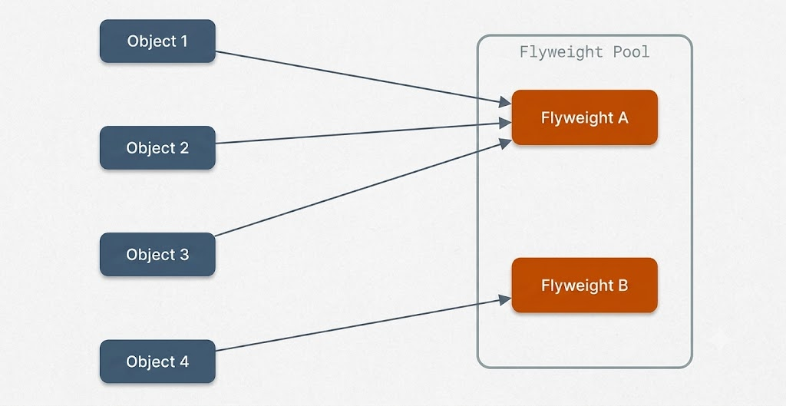
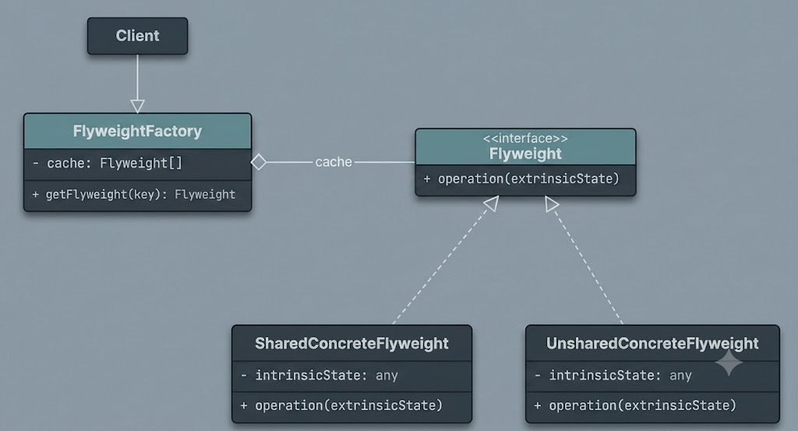
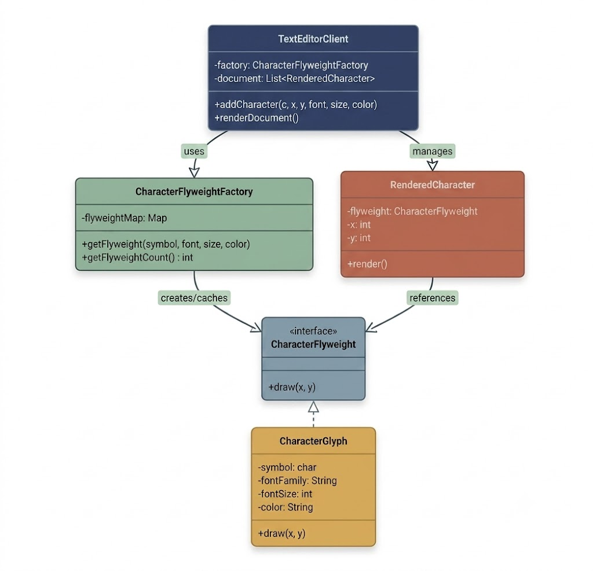
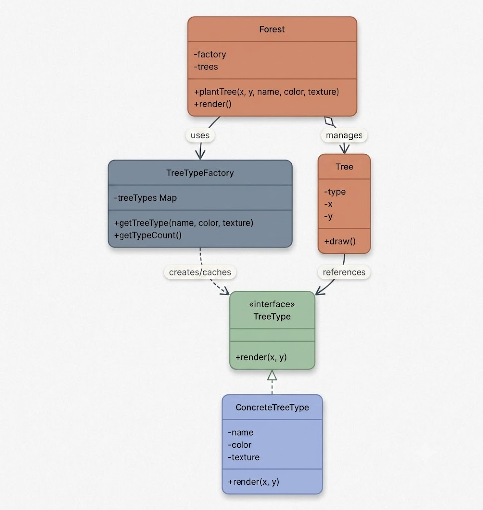

# Flyweight Design Pattern

The **Flyweight Design Pattern** is a structural design pattern focused on efficiently sharing common parts of object state across many similar objects to reduce memory footprint and improve performance.



It is particularly valuable in situations where:
- You need to instantiate a large number of fine-grained objects, but most of their internal data is repeated.
- Storing all object properties individually leads to high memory consumption and GC overhead.
- You can separate **intrinsic state** (shared, immutable context) from **extrinsic state** (unique context passed at runtime).

The Flyweight pattern divides object state into two distinct categories:
- **Intrinsic State**: Constant, invariant data stored inside the shared flyweight instance.
- **Extrinsic State**: Dynamic, contextual data managed externally by client objects and passed into flyweight methods when invoked.

Below is a detailed walk-through of how to apply the Flyweight Pattern to minimize memory usage in object-heavy applications.

---

## 1. The Problem: Rendering Characters

Imagine building a rich text document editor (such as Google Docs or Microsoft Word).

Every individual character on the page (*a*, *b*, *c*, etc.) must be rendered with formatting attributes: font family, font size, and color. Additionally, each character instance possesses a specific position on the document canvas (*x* and *y* coordinates).

A naive implementation bundles all attributes into a dedicated object for every character:

```java
public class Character {
    private char symbol;
    private String fontFamily;
    private int fontSize;
    private String color;
    private int x;
    private int y;

    public Character(char symbol, String fontFamily, int fontSize, String color, int x, int y) {
        this.symbol = symbol;
        this.fontFamily = fontFamily;
        this.fontSize = fontSize;
        this.color = color;
        this.x = x;
        this.y = y;
    }

    public void draw() {
        System.out.println("Rendering '" + symbol + "' in " + fontFamily + " " + fontSize + "px (" + color + ") at position (" + x + "," + y + ")");
    }
}
```

Now imagine rendering a 10-page document containing 500,000 characters. Even though the vast majority of characters share identical fonts, sizes, and colors, the application allocates half a million individual objects—each carrying its own duplicated copy of formatting metadata.

### Why This Is Problematic

1. **High Memory Overhead**  
   Every character object duplicates font family, font size, and color values. If each object consumes ~100 bytes of memory, a 500,000-character document wastes approximately 50 MB on duplicate formatting strings.

2. **Garbage Collection Bottlenecks**  
   Allocating half a million individual objects places heavy pressure on the JVM heap and Garbage Collector (GC), leading to CPU cache misses and UI latency during scrolling.

3. **Poor Scalability**  
   Opening multiple documents simultaneously causes memory usage to scale linearly with total character counts, quickly exhausting available RAM.

4. **Entangled State**  
   Intrinsic properties (font formatting) and extrinsic properties (canvas coordinates) are lumped together, making every instance unique even when formatting is identical.

### Desired Architecture
We require a design that:
- Shares formatting objects across characters using identical styles.
- Stores only position metadata per rendered occurrence.
- Uses a centralized factory to cache and manage shared flyweight instances.

This is the exact problem solved by the **Flyweight Pattern**.

---

## 2. The Flyweight Design Pattern

The Flyweight pattern minimizes memory footprint by sharing invariant state across a large number of similar objects.

Two primary mechanisms define the pattern:
1. **Intrinsic / Extrinsic State Separation**: Intrinsic state is shared and immutable, stored within the flyweight. Extrinsic state is context-specific and passed as parameters during method execution.
2. **Factory-Managed Caching**: A factory manages flyweight creation, maintaining an internal pool to reuse existing instances instead of instantiating duplicate objects.

### Class Diagram



### Pattern Participants

1. **Flyweight (`CharacterFlyweight`)**  
   Defines the interface through which flyweights receive extrinsic state parameters (e.g., `draw(int x, int y)`).

2. **ConcreteFlyweight (`CharacterGlyph`)**  
   Implements `Flyweight` and stores intrinsic state (symbol, font, size, color). Instances must be immutable.

3. **FlyweightFactory (`CharacterFlyweightFactory`)**  
   Creates and manages flyweight objects, maintaining a lookup cache to guarantee reuse.

4. **Client (`TextEditorClient`)**  
   Maintains references to flyweights alongside extrinsic position state.

---

## 3. Implementing the Flyweight Pattern

Let's refactor the text editor using the Flyweight pattern.



### Step 1: Define the Flyweight Interface

The interface accepts extrinsic coordinates (`x`, `y`) as method arguments.

```java
public interface CharacterFlyweight {
    void draw(int x, int y);
}
```

### Step 2: Implement Concrete Flyweight

The concrete flyweight stores immutable intrinsic state: character symbol, font family, font size, and color.

```java
public class CharacterGlyph implements CharacterFlyweight {
    private final char symbol;
    private final String fontFamily;
    private final int fontSize;
    private final String color;

    public CharacterGlyph(char symbol, String fontFamily, int fontSize, String color) {
        this.symbol = symbol;
        this.fontFamily = fontFamily;
        this.fontSize = fontSize;
        this.color = color;
    }

    @Override
    public void draw(int x, int y) {
        System.out.println("Rendering '" + symbol + "' [" + fontFamily + ", " + fontSize + "px, " + color + "] at position (" + x + ", " + y + ")");
    }
}
```

### Step 3: Create the Flyweight Factory

The factory maintains a map of flyweight instances keyed by a unique composite string of intrinsic properties.

```java
import java.util.HashMap;
import java.util.Map;

public class CharacterFlyweightFactory {
    private final Map<String, CharacterFlyweight> flyweightMap = new HashMap<>();

    public CharacterFlyweight getFlyweight(char symbol, String fontFamily, int fontSize, String color) {
        String key = symbol + ":" + fontFamily + ":" + fontSize + ":" + color;
        if (!flyweightMap.containsKey(key)) {
            flyweightMap.put(key, new CharacterGlyph(symbol, fontFamily, fontSize, color));
        }
        return flyweightMap.get(key);
    }

    public int getFlyweightCount() {
        return flyweightMap.size();
    }
}
```

### Step 4: Create the Client Wrapper and Orchestrator

`RenderedCharacter` pairs a shared flyweight with extrinsic coordinates. `TextEditorClient` orchestrates document creation.

```java
import java.util.ArrayList;
import java.util.List;

public class RenderedCharacter {
    private final CharacterFlyweight flyweight;
    private final int x;
    private final int y;

    public RenderedCharacter(CharacterFlyweight flyweight, int x, int y) {
        this.flyweight = flyweight;
        this.x = x;
        this.y = y;
    }

    public void render() {
        flyweight.draw(x, y);
    }
}

public class TextEditorClient {
    private final CharacterFlyweightFactory factory = new CharacterFlyweightFactory();
    private final List<RenderedCharacter> document = new ArrayList<>();

    public void addCharacter(char c, int x, int y, String font, int size, String color) {
        CharacterFlyweight flyweight = factory.getFlyweight(c, font, size, color);
        document.add(new RenderedCharacter(flyweight, x, y));
    }

    public void renderDocument() {
        for (RenderedCharacter rc : document) {
            rc.render();
        }
    }

    public int getUniqueFlyweightsCount() {
        return factory.getFlyweightCount();
    }

    public int getTotalCharactersCount() {
        return document.size();
    }
}
```

### Client Execution & Verification

```java
public class FlyweightDemo {
    public static void main(String[] args) {
        TextEditorClient editor = new TextEditorClient();

        // Render "Hello" in Arial 14 black
        editor.addCharacter('H', 10, 50, "Arial", 14, "#000000");
        editor.addCharacter('e', 25, 50, "Arial", 14, "#000000");
        editor.addCharacter('l', 40, 50, "Arial", 14, "#000000");
        editor.addCharacter('l', 55, 50, "Arial", 14, "#000000");
        editor.addCharacter('o', 70, 50, "Arial", 14, "#000000");

        // Render "World" in Times New Roman 14 blue
        editor.addCharacter('W', 100, 50, "Times New Roman", 14, "#3333FF");
        editor.addCharacter('o', 120, 50, "Times New Roman", 14, "#3333FF");
        editor.addCharacter('r', 135, 50, "Times New Roman", 14, "#3333FF");
        editor.addCharacter('l', 150, 50, "Times New Roman", 14, "#3333FF");
        editor.addCharacter('d', 165, 50, "Times New Roman", 14, "#3333FF");

        editor.renderDocument();

        System.out.println("\nTotal rendered characters: " + editor.getTotalCharactersCount());
        System.out.println("Total flyweight objects in memory: " + editor.getUniqueFlyweightsCount());
    }
}
```

### Console Output
```text
Rendering 'H' [Arial, 14px, #000000] at position (10, 50)
Rendering 'e' [Arial, 14px, #000000] at position (25, 50)
Rendering 'l' [Arial, 14px, #000000] at position (40, 50)
Rendering 'l' [Arial, 14px, #000000] at position (55, 50)
Rendering 'o' [Arial, 14px, #000000] at position (70, 50)
Rendering 'W' [Times New Roman, 14px, #3333FF] at position (100, 50)
Rendering 'o' [Times New Roman, 14px, #3333FF] at position (120, 50)
Rendering 'r' [Times New Roman, 14px, #3333FF] at position (135, 50)
Rendering 'l' [Times New Roman, 14px, #3333FF] at position (150, 50)
Rendering 'd' [Times New Roman, 14px, #3333FF] at position (165, 50)

Total rendered characters: 10
Total flyweight objects in memory: 9
```

10 characters were rendered using only 9 flyweight instances because the repeated letter 'l' in "Hello" reused the same flyweight.

### Key Benefits Achieved
- **Memory Efficiency**: Eliminates redundant string allocations across character instances.
- **Lower GC Pressure**: Significantly reduces heap object allocations.
- **Decoupled State**: Position changes do not invalidate formatting instances.
- **Flat Memory Footprint**: 500,000 document characters consume only a few hundred flyweights in memory.

---

## 4. Practical Example: Game Forest Rendering

Consider a 2D game rendering a forest scene with thousands of tree instances.

- **Intrinsic State (Shared)**: Species name, color, and 3D texture mesh.
- **Extrinsic State (Unique)**: Canvas coordinates (*x*, *y*).



### Implementation

```java
import java.util.ArrayList;
import java.util.HashMap;
import java.util.List;
import java.util.Map;

// Flyweight Interface
public interface TreeType {
    void render(int x, int y);
}

// Concrete Flyweight
public class ConcreteTreeType implements TreeType {
    private final String name;
    private final String color;
    private final String texture;

    public ConcreteTreeType(String name, String color, String texture) {
        this.name = name;
        this.color = color;
        this.texture = texture;
    }

    @Override
    public void render(int x, int y) {
        System.out.println("Rendering " + name + " tree [" + color + ", " + texture + "] at coordinates (" + x + ", " + y + ")");
    }
}

// Flyweight Factory
public class TreeTypeFactory {
    private static final Map<String, TreeType> treeTypes = new HashMap<>();

    public static TreeType getTreeType(String name, String color, String texture) {
        String key = name + ":" + color + ":" + texture;
        if (!treeTypes.containsKey(key)) {
            treeTypes.put(key, new ConcreteTreeType(name, color, texture));
        }
        return treeTypes.get(key);
    }

    public static int getTypeCount() {
        return treeTypes.size();
    }
}

// Context Class (Extrinsic Holder)
public class Tree {
    private final int x;
    private final int y;
    private final TreeType type;

    public Tree(int x, int y, TreeType type) {
        this.x = x;
        this.y = y;
        this.type = type;
    }

    public void draw() {
        type.render(x, y);
    }
}

// Client Class
public class Forest {
    private final List<Tree> trees = new ArrayList<>();

    public void plantTree(int x, int y, String name, String color, String texture) {
        TreeType type = TreeTypeFactory.getTreeType(name, color, texture);
        trees.add(new Tree(x, y, type));
    }

    public void render() {
        for (Tree tree : trees) {
            tree.draw();
        }
    }
}

// Game Forest Client Demo
public class GameForestDemo {
    public static void main(String[] args) {
        Forest forest = new Forest();

        forest.plantTree(10, 20, "Oak", "Green", "OakTexture.png");
        forest.plantTree(15, 40, "Oak", "Green", "OakTexture.png");
        forest.plantTree(100, 200, "Pine", "Dark Green", "PineTexture.png");
        forest.plantTree(120, 250, "Pine", "Dark Green", "PineTexture.png");
        forest.plantTree(300, 500, "Birch", "Yellow", "BirchTexture.png");

        forest.render();

        System.out.println("\nTotal trees planted: 5");
        System.out.println("Total TreeType flyweights created: " + TreeTypeFactory.getTypeCount());
    }
}
```

### Summary
Five trees rendered on map coordinates consume only 3 `TreeType` flyweight instances. In a game with 100,000 trees across 15 species, 100,000 lightweight `Tree` coordinate objects point to only 15 heavy `TreeType` instances, drastically cutting memory usage and maintaining smooth frame rates.
