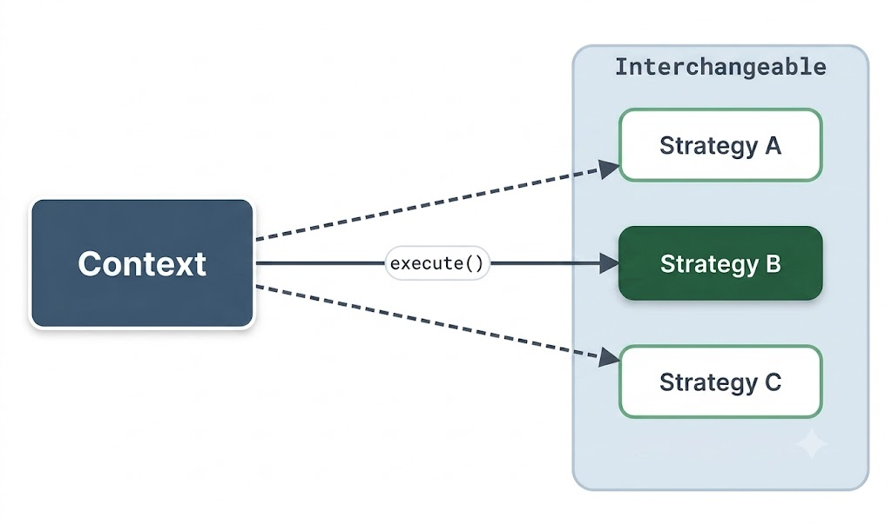
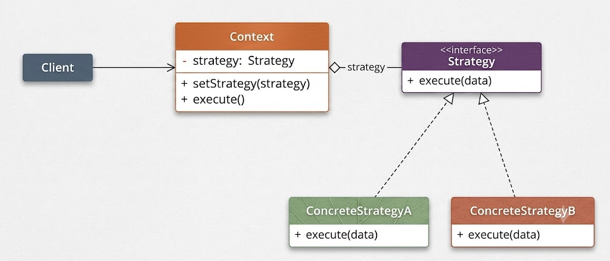
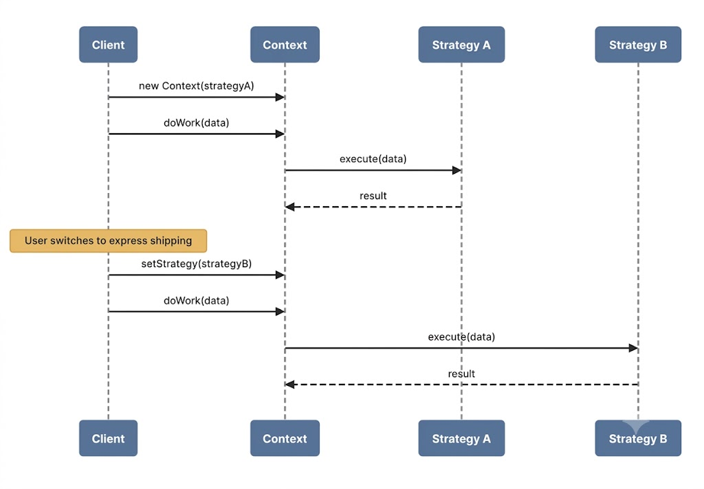
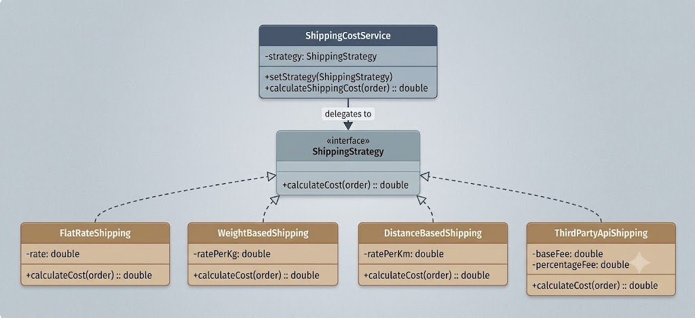
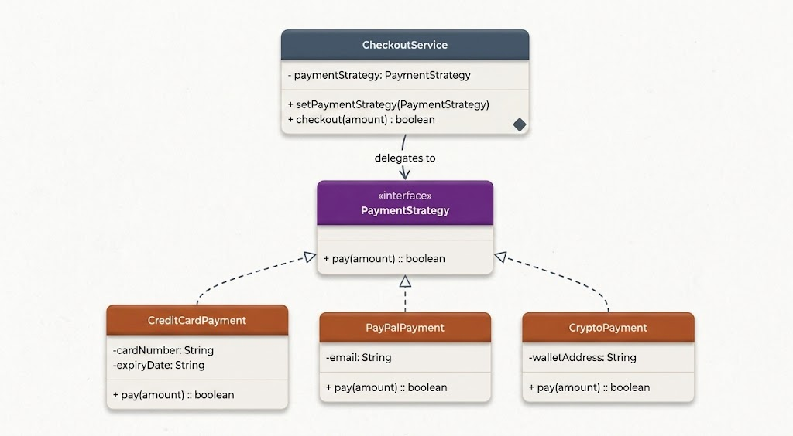

# Strategy Design Pattern

The **Strategy Design Pattern** is a behavioral design pattern that enables you to define a family of algorithms, encapsulate each one inside a dedicated class, and make them interchangeable at runtime.



At its core, the Strategy pattern separates *"what varies"* from *"what stays the same."*

Instead of embedding multiple algorithm implementations inside a single monolithic class controlled by conditional statements (`if-else` or `switch`), each algorithm is extracted into its own strategy class. The primary host class (Context) delegates tasks to whichever strategy object is currently injected.

This pattern is particularly valuable when:
- You have multiple variations of an operation, and the selection choice may change dynamically at runtime.
- You want to eliminate bloated conditional statements that select between different behaviors.
- You need to isolate algorithm-specific data structures and business logic from consumer code.
- Different client contexts require distinct execution algorithms for the same underlying task.

Below is a detailed walk-through of how the Strategy Pattern transforms rigid conditional logic into a clean, extensible, and decoupled design.

---

## 1. The Problem: Shipping Cost Calculation

Imagine building an e-commerce platform that calculates shipping fees. Shipping costs vary based on distinct business rules:
- **Flat Rate**: A fixed fee regardless of parcel weight or delivery distance.
- **Weight-Based**: Fee scales dynamically based on package mass.
- **Distance-Based**: Rates vary depending on geographical delivery zones.
- **Third-Party API**: Dynamic real-time carrier quotes (e.g., FedEx or UPS).

A initial implementation might centralize all shipping logic inside a single calculator class:

```java
public class Order {
    private double weight;
    private double distance;
    private double itemTotal;

    public Order(double weight, double distance, double itemTotal) {
        this.weight = weight;
        this.distance = distance;
        this.itemTotal = itemTotal;
    }

    public double getWeight() { return weight; }
    public double getDistance() { return distance; }
    public double getItemTotal() { return itemTotal; }
}

public class ShippingCalculator {
    public double calculateCost(Order order, String shippingMethod) {
        if ("FLAT_RATE".equalsIgnoreCase(shippingMethod)) {
            return 10.0;
        } else if ("WEIGHT_BASED".equalsIgnoreCase(shippingMethod)) {
            return order.getWeight() * 2.5;
        } else if ("DISTANCE_BASED".equalsIgnoreCase(shippingMethod)) {
            return order.getDistance() * 0.75;
        } else if ("EXPRESS".equalsIgnoreCase(shippingMethod)) {
            return 25.0 + (order.getWeight() * 1.5);
        } else {
            throw new IllegalArgumentException("Unknown shipping method: " + shippingMethod);
        }
    }
}
```

### Client Usage
```java
public class ClientApp {
    public static void main(String[] args) {
        Order order = new Order(5.0, 120.0, 150.0);
        ShippingCalculator calculator = new ShippingCalculator();

        double cost = calculator.calculateCost(order, "WEIGHT_BASED");
        System.out.println("Shipping cost: $" + cost);
    }
}
```

### Why This Approach Fails at Scale

1. **Violation of Open/Closed Principle**  
   Introducing a new shipping algorithm requires editing `ShippingCalculator`. Constantly modifying a stable class increases regression risks.

2. **Bloated Conditional Chains**  
   As shipping strategies expand, `if-else` blocks grow long and unreadable, obscuring core orchestration logic.

3. **Difficult Unit Testing**  
   Testing individual calculation rules requires invoking the entire calculator method with string tags, making isolated testing harder.

4. **Low Cohesion**  
   `ShippingCalculator` performs too many jobs: managing flat rates, weight multipliers, zone lookups, and API integrations.

### Desired Architecture
We require a solution where:
- Each shipping algorithm lives in an independent, single-responsibility class.
- Adding a new algorithm requires zero changes to existing classes.
- Algorithms can be swapped dynamically at runtime based on user configuration.
- Each calculation rule can be unit tested in isolation.

This is precisely what the **Strategy Design Pattern** provides.

---

## 2. The Strategy Design Pattern

The Strategy Pattern defines a family of algorithms, encapsulates each one, and makes them interchangeable. Strategy enables algorithms to vary independently from clients consuming them.

Key characteristics:
- **Algorithm Encapsulation**: Each algorithm resides in a dedicated class conforming to a shared interface.
- **Runtime Interchangeability**: The Context class maintains a reference to the strategy interface rather than concrete classes, allowing dynamic swapping at runtime.

### Real-World Analogy

Consider traveling to an airport. Options include:
- **Personal Vehicle**: Flexible schedule, requires long-term parking fees.
- **Rideshare / Taxi**: Door-to-door convenience, variable pricing.
- **Public Transit**: Economical, bound to fixed schedules.

Each option is a travel strategy. The traveler (Context) chooses a strategy based on time, budget, and preference. The overall goal ("reach the airport") remains constant while the execution algorithm varies.

### Class Diagram



### Pattern Participants

1. **Strategy Interface (`ShippingStrategy`)**  
   Declares the common interface implemented by all supported algorithms.

2. **Concrete Strategies (`FlatRateShipping`, `WeightBasedShipping`)**  
   Implements specific algorithm logic according to the strategy interface contract.

3. **Context Class (`ShippingCostService`)**  
   Maintains a reference to a `Strategy` instance and delegates execution to it. The Context remains agnostic of concrete strategy details.

---

## 3. How It Works

The operational sequence for the Strategy pattern follows these steps:



1. **Instantiate Strategy**: The client creates a concrete strategy instance (e.g., `FlatRateShipping`).
2. **Inject Strategy**: The client passes the strategy object into the context via constructor or setter (`setStrategy`).
3. **Execute Operation**: When calculations are needed, the context calls `strategy.calculateCost(order)`.
4. **Dynamic Swapping**: To switch behavior, the client injects a different concrete strategy into the context without modifying context implementation.

---

## 4. Implementing the Strategy Pattern

Refactoring the shipping calculation service using the Strategy pattern decouples calculation rules from context orchestration.



### Step 1: Define the Strategy Interface (`ShippingStrategy`)

```java
public interface ShippingStrategy {
    double calculateCost(Order order);
}
```

### Step 2: Implement Concrete Strategies

#### Flat Rate Shipping
```java
public class FlatRateShipping implements ShippingStrategy {
    private final double flatRate;

    public FlatRateShipping(double flatRate) {
        this.flatRate = flatRate;
    }

    @Override
    public double calculateCost(Order order) {
        return flatRate;
    }
}
```

#### Weight-Based Shipping
```java
public class WeightBasedShipping implements ShippingStrategy {
    private final double ratePerKg;

    public WeightBasedShipping(double ratePerKg) {
        this.ratePerKg = ratePerKg;
    }

    @Override
    public double calculateCost(Order order) {
        return order.getWeight() * ratePerKg;
    }
}
```

#### Distance-Based Shipping
```java
public class DistanceBasedShipping implements ShippingStrategy {
    private final double ratePerKm;

    public DistanceBasedShipping(double ratePerKm) {
        this.ratePerKm = ratePerKm;
    }

    @Override
    public double calculateCost(Order order) {
        return order.getDistance() * ratePerKm;
    }
}
```

#### Third-Party API Shipping
```java
public class ThirdPartyApiShipping implements ShippingStrategy {
    private final double baseFee;
    private final double percentageFee;

    public ThirdPartyApiShipping(double baseFee, double percentageFee) {
        this.baseFee = baseFee;
        this.percentageFee = percentageFee;
    }

    @Override
    public double calculateCost(Order order) {
        return baseFee + (order.getItemTotal() * percentageFee);
    }
}
```

### Step 3: Create the Context Class (`ShippingCostService`)

```java
public class ShippingCostService {
    private ShippingStrategy strategy;

    public ShippingCostService(ShippingStrategy strategy) {
        this.strategy = strategy;
    }

    public void setStrategy(ShippingStrategy strategy) {
        this.strategy = strategy;
    }

    public double calculateShippingCost(Order order) {
        if (strategy == null) {
            throw new IllegalStateException("Shipping strategy not configured.");
        }
        return strategy.calculateCost(order);
    }
}
```

### Step 4: Client Code & Verification

```java
public class StrategyPatternDemo {
    public static void main(String[] args) {
        Order order = new Order(10.0, 150.0, 200.0); // 10kg, 150km, $200 order

        // Configure context with FlatRateShipping strategy
        ShippingCostService shippingService = new ShippingCostService(new FlatRateShipping(15.0));
        System.out.println("Flat Rate Shipping: $" + shippingService.calculateShippingCost(order));

        // Dynamically switch to WeightBasedShipping strategy
        shippingService.setStrategy(new WeightBasedShipping(2.5));
        System.out.println("Weight-Based Shipping (10kg): $" + shippingService.calculateShippingCost(order));

        // Dynamically switch to DistanceBasedShipping strategy
        shippingService.setStrategy(new DistanceBasedShipping(0.5));
        System.out.println("Distance-Based Shipping (150km): $" + shippingService.calculateShippingCost(order));

        // Dynamically switch to ThirdPartyApiShipping strategy
        shippingService.setStrategy(new ThirdPartyApiShipping(5.0, 0.05));
        System.out.println("Third-Party Carrier Quote: $" + shippingService.calculateShippingCost(order));
    }
}
```

### Console Output
```text
Flat Rate Shipping: $15.0
Weight-Based Shipping (10kg): $25.0
Distance-Based Shipping (150km): $75.0
Third-Party Carrier Quote: $15.0
```

### Summary of Architectural Gains
- **Open/Closed Principle**: Adding new shipping rules (e.g., `PrimeFreeShipping`) requires writing a new class without editing `ShippingCostService`.
- **Single Responsibility**: Each strategy class handles one specific calculation formula.
- **Type Safety**: Type-safe strategy instances replace fragile string tags.
- **Isolated Testing**: Strategies can be unit tested without initializing complex context state.

---

## 5. Practical Example: Payment Processing System

Consider a checkout service supporting multiple payment gateways: Credit Card, PayPal, and Cryptocurrency.



### Implementation

#### Strategy Interface & Concrete Implementations
```java
// Strategy Interface
public interface PaymentStrategy {
    boolean pay(double amount);
}

// Concrete Strategy 1: Credit Card
public class CreditCardPayment implements PaymentStrategy {
    private final String cardNumber;
    private final String expiryDate;

    public CreditCardPayment(String cardNumber, String expiryDate) {
        this.cardNumber = cardNumber;
        this.expiryDate = expiryDate;
    }

    @Override
    public boolean pay(double amount) {
        System.out.println("Processing Credit Card payment of $" + amount + " [Card: ****" + cardNumber.substring(cardNumber.length() - 4) + "]");
        return true;
    }
}

// Concrete Strategy 2: PayPal
public class PayPalPayment implements PaymentStrategy {
    private final String email;

    public PayPalPayment(String email) {
        this.email = email;
    }

    @Override
    public boolean pay(double amount) {
        System.out.println("Processing PayPal payment of $" + amount + " [Account: " + email + "]");
        return true;
    }
}

// Concrete Strategy 3: Crypto
public class CryptoPayment implements PaymentStrategy {
    private final String walletAddress;

    public CryptoPayment(String walletAddress) {
        this.walletAddress = walletAddress;
    }

    @Override
    public boolean pay(double amount) {
        System.out.println("Processing Crypto payment of $" + amount + " [Wallet: " + walletAddress + "]");
        return true;
    }
}
```

#### Context Class & Client Execution
```java
// Context Class
public class CheckoutService {
    private PaymentStrategy paymentStrategy;

    public void setPaymentStrategy(PaymentStrategy paymentStrategy) {
        this.paymentStrategy = paymentStrategy;
    }

    public boolean checkout(double amount) {
        if (paymentStrategy == null) {
            throw new IllegalStateException("Payment strategy not set.");
        }
        return paymentStrategy.pay(amount);
    }
}

// Client Demo
public class PaymentStrategyDemo {
    public static void main(String[] args) {
        CheckoutService checkout = new CheckoutService();

        // Pay via Credit Card
        checkout.setPaymentStrategy(new CreditCardPayment("1234567890123456", "12/28"));
        checkout.checkout(149.99);

        // Switch to PayPal
        checkout.setPaymentStrategy(new PayPalPayment("user@example.com"));
        checkout.checkout(49.50);

        // Switch to Crypto
        checkout.setPaymentStrategy(new CryptoPayment("0x71C7656EC7ab88b098defB751B7401B5f6d8976F"));
        checkout.checkout(300.00);
    }
}
```

### Summary
`CheckoutService` remains completely decoupled from transaction processing mechanics. Adding new payment processors (e.g., Apple Pay, Bank Transfer) requires instantiating a single new class conforming to `PaymentStrategy` without altering checkout workflow logic.
