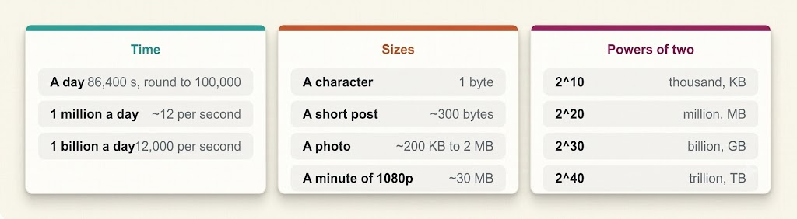
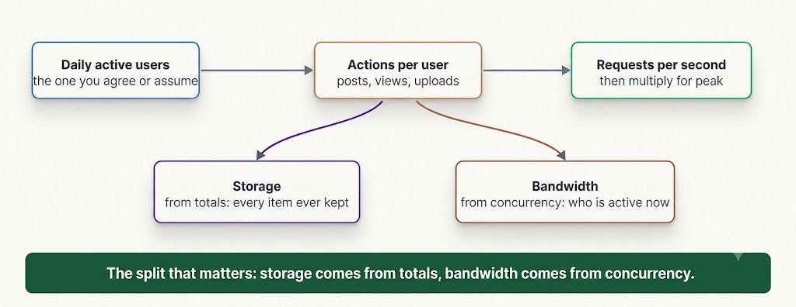
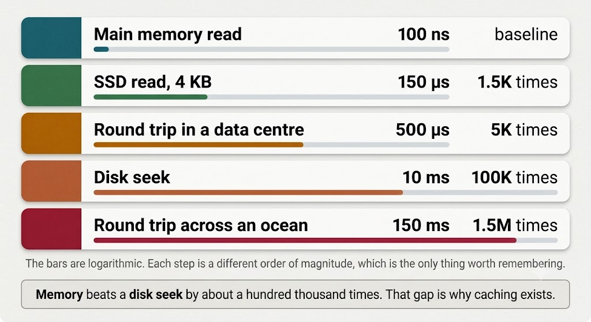

# Back-of-the-Envelope Estimations

Midway through a system design session, the interviewer asks: *"Roughly how much storage will this application require?"*

They are not evaluating your precise arithmetic. They are testing whether you recognize the difference between an architecture that fits on a single node and one requiring a hundred-node cluster. Those represent fundamentally different system designs, and you must know which one you are creating.

That is the purpose of back-of-the-envelope estimation. You are solving for the **order of magnitude**, not an exact decimal value. Ten terabytes and forty terabytes result in virtually the same architectural blueprint; ten terabytes and ten petabytes do not.

---

## Anchor Numbers Worth Memorizing

You cannot perform estimations without base values. A concise set of anchor constants allows you to derive almost any metric on the fly.

---

---

Two fundamental constants are particularly vital:

1. **1 Day ≈ 100,000 Seconds**: A solar day actually contains 86,400 seconds. Rounding up to 100,000 simplifies all subsequent mental divisions. The ~14% error margin is negligible compared to other high-level assumptions.
2. **1 Million Requests/Day ≈ 12 Requests/Second (QPS)**: With this benchmark, calculating throughput becomes simple multiplication:
   - **1 Billion requests/day** ≈ **12,000 QPS**
   - **100 Million requests/day** ≈ **1,200 QPS**

---

## The Four Essential Estimation Techniques

Execute these four steps out loud during your calculations:

1. **Round Early and Aggressively**: Convert 86,400 to 100,000 and 1,024 to 1,000 at the start of your math. Early rounding keeps mental arithmetic simple so you do not stumble while speaking. A calculation error hurts your evaluation far more than a minor loss in precision.
2. **Deconstruct the Problem into Components**: Avoid guessing global totals. Calculate storage for media files, then metadata, then user profiles, and sum them up. Each component yields a clear justification, and if one assumption shifts, you can update just that component without restarting.
3. **Utilize Powers of Ten (10ⁿ)**: Keep magnitudes separate from base digits. Calculating **2 × 10⁹** across multiple steps is much easier to track than managing `2,000,000,000`, making unit conversions obvious.
4. **Sanity Check the Result**: Verify whether the final figure is realistic before designing around it. If your math suggests profile text storage consumes 40 petabytes annually, catch the misplaced decimal immediately rather than building unnecessary storage tiering on top of it.

---

## Deriving System Requirements

Nearly all interview estimations flow from a single starting parameter: **user count**.

---

---

> [!IMPORTANT]
> **Key Distinction**: Storage is derived from **cumulative totals**, whereas Bandwidth is derived from **peak concurrency**.

### 1. Load Estimation
*Scenario*: A social media application with 100 million Daily Active Users (DAU) publishing 10 posts daily per user.

$$\text{Total Posts} = 100\text{M users} \times 10\text{ posts/day} = 1\text{B posts/day}$$

$$\text{Average Write QPS} = \frac{1\text{B posts}}{100,000\text{ seconds}} \approx 10,000\text{ writes/second (average)}$$

Systems are designed for peak load rather than averages. Applying a standard 2x–3x peak factor:

$$\text{Peak Write QPS} = 10,000 \times 3 = 30,000\text{ writes/second (peak)}$$

Next, incorporate the **read-to-write ratio**. With a 100:1 read-to-write ratio:

$$\text{Peak Read QPS} = 30,000 \times 100 = 3,000,000\text{ reads/second}$$

This 3M QPS figure immediately justifies introducing multi-tier caching, read replicas, and a CDN.

---

### 2. Storage Estimation
*Scenario*: A photo sharing app with 500 million active users uploading 2 photos daily at an average size of 2 MB per photo.

$$\text{Daily Storage} = 500\text{M users} \times 2\text{ uploads} \times 2\text{ MB} = 2\text{ PB/day}$$

$$\text{Annual Storage} = 2\text{ PB/day} \times 365\text{ days} \approx 730\text{ PB/year}$$

Adjust for operational factors:
- **Replication**: 3x replication triples the footprint (**730 PB × 3 ≈ 2.2 EB**).
- **Thumbnails & Metadata**: Adds ~10–20% overhead.

The raw metric of 2 PB/day instantly clarifies that media assets must reside in cloud object storage (e.g., AWS S3) rather than a relational database.

---

### 3. Bandwidth Estimation
*Scenario*: A video streaming platform serving 10 million daily active users watching 1 hour of 1080p video daily at 4 Mbps.

> [!CAUTION]
> **Common Pitfall**: Multiplying 10M users directly by 4 Mbps yields 40 Tbps, incorrectly assuming all users stream simultaneously. You must calculate **peak concurrent viewers** first.

$$\text{Total Viewing Hours} = 10\text{M users} \times 1\text{ hour} = 10\text{M viewing-hours/day}$$

$$\text{Average Concurrent Viewers} = \frac{10\text{M hours}}{24\text{ hours}} \approx 420,000\text{ active streams}$$

$$\text{Peak Concurrent Viewers} = 420,000 \times 3 \approx 1.25\text{M concurrent streams}$$

$$\text{Peak Egress Bandwidth} = 1.25\text{M viewers} \times 4\text{ Mbps} \approx 5\text{ Tbps (peak)}$$

This 5 Tbps throughput demonstrates that serving video directly from origin servers is unviable, mandating a globally distributed CDN.

---

## Latency: Reasoning with Ratios Rather than Exact Values

Memorizing raw hardware latency tables line-by-line is unnecessary. Interviewers rarely ask for exact L1 cache timing. What truly drives architectural decisions is understanding the **order-of-magnitude gaps** between storage and network tiers.

---

---

Three essential latency ratios to keep in mind:

1. **RAM vs. Disk Seek (~100,000× difference)**: In-memory access is roughly 100,000 times faster than disk I/O. This massive gap is why caching delivers the highest performance improvement in system design.
2. **SSD vs. HDD Seek (~100× difference)**: Solid-State Drive (SSD) reads are roughly 100 times faster than mechanical spinning disk seeks. This ratio dictates database storage engine selection under heavy read operations.
3. **Cross-Ocean Network Round-Trip (~100 ms)**: Transatlantic/transpacific network round-trips take ~100 ms due to the speed of light in fiber optic cables. No amount of software tuning can bypass physical distance, making multi-region deployments and edge CDNs essential for global users.

Applying this reasoning allows you to state:
> *"Since disk reads take milliseconds rather than microseconds, I am introducing an in-memory caching layer in front of the database."*

---

## Handling Missing or Ambiguous Metrics

Interviewers frequently omit scale metrics to observe how you handle ambiguity.

- **Incorrect approach**: Guessing silently or stalling the conversation.
- **Effective approach**: Declare explicit numerical assumptions out loud and invite feedback:

> *"Since traffic numbers were not specified, I will assume 100 million Daily Active Users and approximately 500,000 peak read QPS. Please let me know if you would like me to adjust these assumptions."*

Declaring assumptions establishes a concrete baseline to design against and allows the interviewer to guide you. If scaling up by **10×** alters the architecture, state that explicitly:
> *"If traffic increases tenfold, the dataset will exceed single-node capacity, requiring database sharding."*

---

### 💡 System Design Interview Strategy

> Spend 3 to 4 minutes on estimations while verbalizing your math out loud:
> 1. **Round hard at the start** rather than at the end to prevent verbal calculation mistakes.
> 2. **Conclude every estimation with the architectural choice it dictates**:
>    - *Avoid*: "This requires roughly 2 PB of storage per year."
>    - *Prefer*: "This requires ~2 PB of storage annually, which means using cloud object storage backed by a CDN, with the relational database storing only file metadata paths."
> 
> An estimation that does not directly influence an architectural decision is a wasted effort.

---

## Key Takeaway

- **Focus on order of magnitude**: Estimation determines architectural boundaries rather than precise decimal calculations.
- **Remember key anchor numbers**: 1 day ≈ 100,000 seconds; 1M requests/day ≈ 12 QPS.
- **Apply the four estimation moves**: Round early, deconstruct into components, track powers of 10, and perform a sanity check.
- **Derive metrics correctly**: Compute QPS from user actions, Storage from total data volumes, and Bandwidth from peak concurrent users.
- **Evaluate latency as ratios**: Recognize order-of-magnitude gaps between RAM, SSD, disk I/O, and cross-region RTT.
- **Declare ambiguous inputs out loud**: State assumptions explicitly to guide the architectural design.
