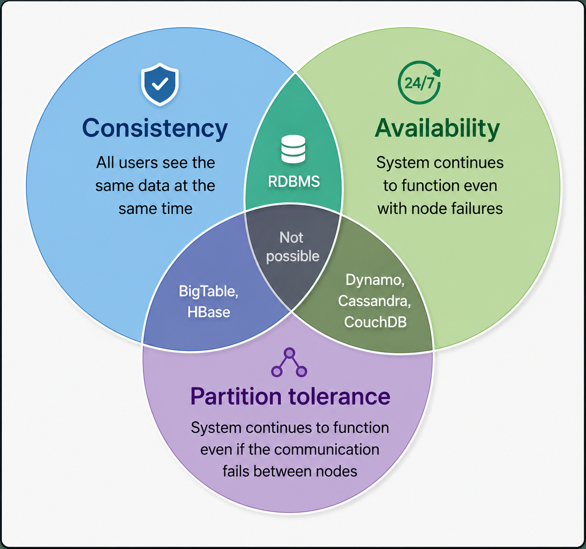

# CAP Theorem

## Background
In distributed computing systems, various failure modes can occur. For instance, physical servers may crash or suffer permanent hardware failures, storage disks can degrade causing data corruption, or network links can drop, rendering portions of the cluster isolated. How can a distributed architecture be designed to maximize utility and resilience across these available resources?

---

## Solution & Core Definition

The **CAP Theorem** (also known as Brewer's Theorem) states that it is impossible for any distributed data store to simultaneously provide all three of the following desirable properties:

- **Consistency ( C )**: Every node in the system sees the exact same data at the same time. Clients can read or write from/to any node in the cluster and receive identical data, equivalent to maintaining a single unified copy of the dataset.
- **Availability ( A )**: Every non-failing node in the system returns a non-error response for every request received. Even in the event of network degradation or node outages, all operational nodes remain accessible and process client requests successfully.
- **Partition Tolerance ( P )**: A network partition occurs when communication breaks between nodes while the nodes themselves remain active. A partition-tolerant system continues operating despite these communication interruptions, sustaining arbitrary network failures that do not take down the entire network. Data is sufficiently replicated across node combinations to withstand intermittent connection drops.

---

## Understanding System Trade-offs

According to the CAP Theorem, a distributed system must choose at most two out of the three properties, yielding three theoretical combinations: **CA**, **CP**, and **AP**.

However, **CA** is not a viable real-world architecture because network partitions are inevitable in distributed environments. A system that lacks partition tolerance will fail or become inconsistent whenever a network partition happens. 

Therefore, the CAP theorem is practically stated as: **In the presence of a network partition, a distributed system must choose between Consistency or Availability.**

- **CP Systems (Consistency + Partition Tolerance)**: Prioritize strict consistency. If a network partition occurs, isolated nodes stop serving or accepting requests to prevent stale or conflicting reads/writes, sacrificing availability.
- **AP Systems (Availability + Partition Tolerance)**: Prioritize high availability. Nodes in partitioned sub-networks continue serving requests locally, accepting temporary data inconsistency until the network reconciles.
- **CA Systems (Consistency + Availability)**: Assume zero network partitions. Since real-world physical networks experience latency and connectivity losses, pure CA models cannot be maintained across distributed networks.

---

## Summary

We cannot build a general-purpose distributed data store that remains continuously available, strictly consistent, and tolerant to arbitrary network partitions simultaneously.

To maintain consistency, all cluster nodes must observe the exact same sequence of updates. If a network partition occurs, updates made in one partition cannot propagate to isolated nodes. If a client reads from an isolated node after another client writes to an updated node, the isolated node would return stale data. To prevent this inconsistency, the system must reject requests from the isolated node—meaning the service is no longer 100% available.
