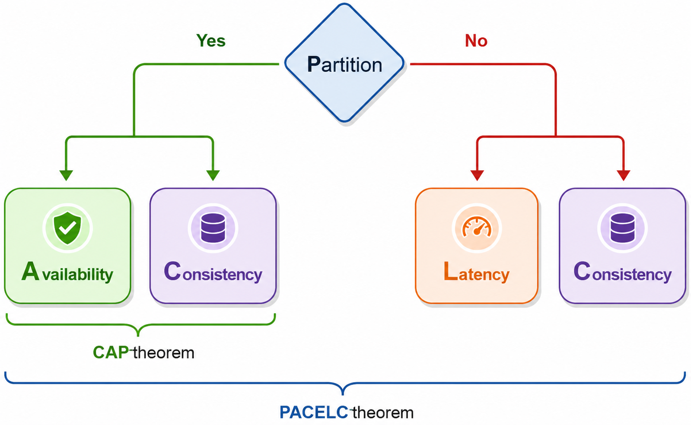

# PACELC Theorem

## Background

Network partitions are inevitable in distributed systems. According to the **CAP Theorem**, a distributed data store must choose between **Consistency** and **Availability** whenever a network partition occurs:

- **ACID Databases**: Traditional relational database management systems (RDBMS) like MySQL, Oracle, and Microsoft SQL Server prioritize consistency. If a node cannot verify state with its peers during a partition, it refuses client requests.
- **BASE Databases**: NoSQL systems such as MongoDB, Cassandra, and Redis generally prioritize availability. During a network partition, they respond to requests using local data without ensuring it is fully synchronized with peers.

However, the CAP theorem only addresses system behavior during network failures. It leaves an important question unanswered: **What choices does a distributed system have when operating normally without a network partition?**

---

## Solution: The PACELC Theorem

The **PACELC Theorem** extends the CAP theorem to account for trade-offs during normal, unpartitioned operation. It states that in any replicated data system:

- If there is a **Partition (`P`)**, the system must trade off between **Availability (`A`)** and **Consistency (`C`)**.
- **Else (`E`)**, when the system is running normally in the absence of partitions, it must trade off between **Latency (`L`)** and **Consistency (`C`)**.

The first part of the theorem (**PAC**) mirrors the CAP theorem, while the second part (**ELC**) is the extension. The theorem assumes that high availability is maintained through data replication. 

When a failure occurs, the CAP theorem governs the trade-offs. However, during normal execution, a replicated system must still balance response latency against consistency constraints.

---

## Real-World Examples & Classifications

Based on the PACELC theorem, distributed databases are classified according to their choices during partitions and normal operations:

| Classification | Partition Choice (P) | Normal Operation Choice (E) | Systems |
| :--- | :--- | :--- | :--- |
| **PA/EL** | Availability over Consistency | Lower Latency over Consistency | Dynamo, Cassandra |
| **PC/EC** | Consistency over Availability | Consistency over Lower Latency | BigTable, HBase |
| **PA/EC** | Availability over Consistency | Consistency over Lower Latency | MongoDB *(default configuration)* |
| **PC/EC** | Consistency over Availability | Consistency over Lower Latency | MongoDB *(majority write/read)* |

### Detailed Breakdown

1. **Dynamo & Cassandra (`PA/EL`)**:
   - **Partition (`PA`)**: Prioritize availability over consistency during network splits.
   - **Normal (`EL`)**: Prioritize low latency over strict consistency by using asynchronous replication.

2. **BigTable & HBase (`PC/EC`)**:
   - **Partition (`PC`)**: Choose strict consistency over availability during network splits.
   - **Normal (`EC`)**: Choose consistency over lower latency, requiring synchronous coordination before acknowledging operations.

3. **MongoDB (`PA/EC` or `PC/EC`)**:
   - **Default Setup (`PA/EC`)**: Operates in a primary/secondaries configuration where all reads and writes are directed to the primary node. Replication to secondaries occurs asynchronously. If a network partition isolates the primary, unreplicated data may be lost if a new primary is elected, resulting in a loss of consistency during partitions (`PA`). Under normal operation, reading and writing on the primary guarantees consistency (`EC`).
   - **Majority Configuration (`PC/EC`)**: When configured to require majority write acknowledgments and read from the primary node, MongoDB acts as a `PC/EC` system by refusing operations that cannot achieve majority consensus during network partitions.
