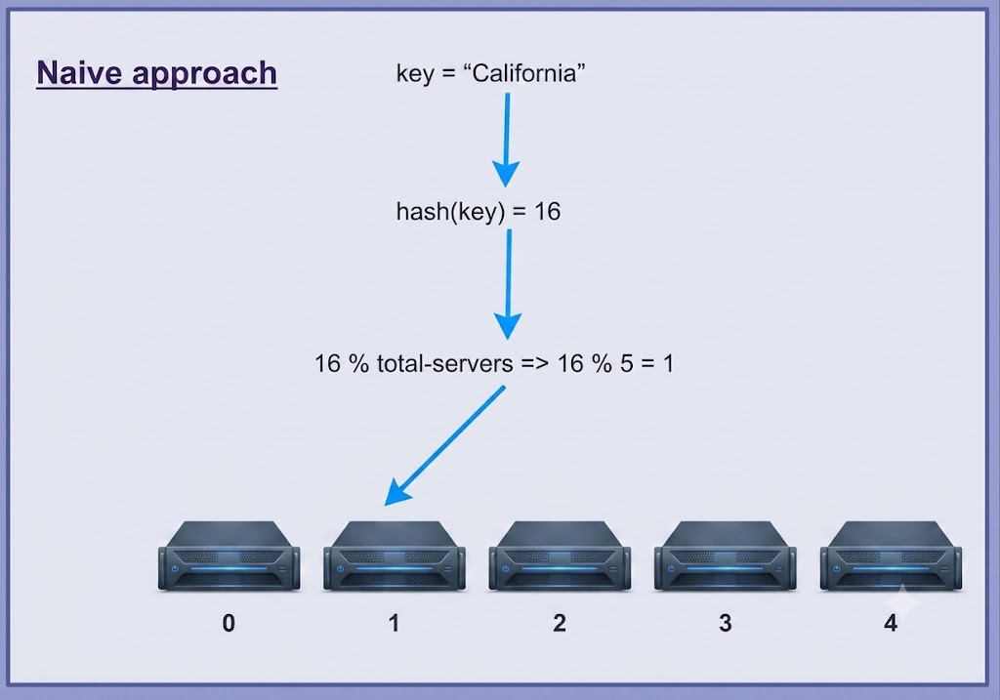
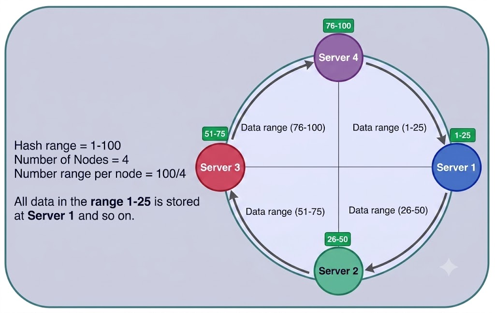
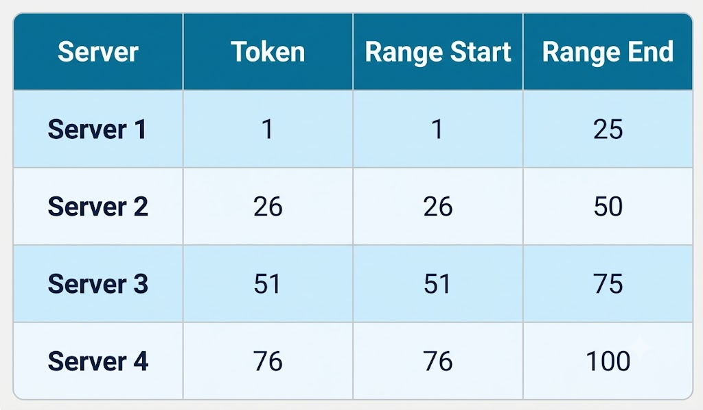
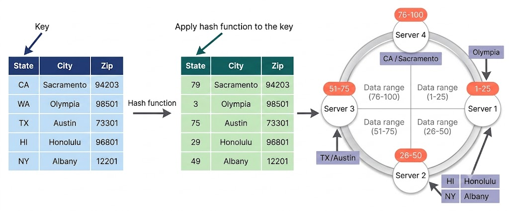
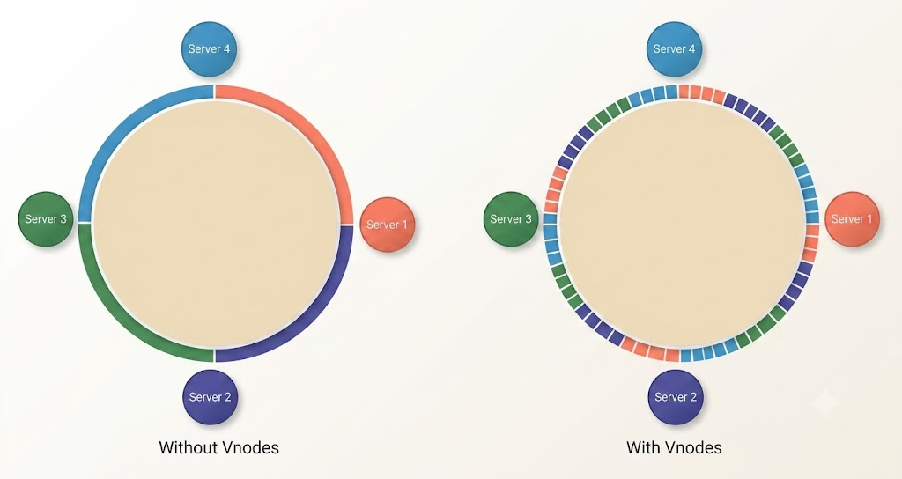
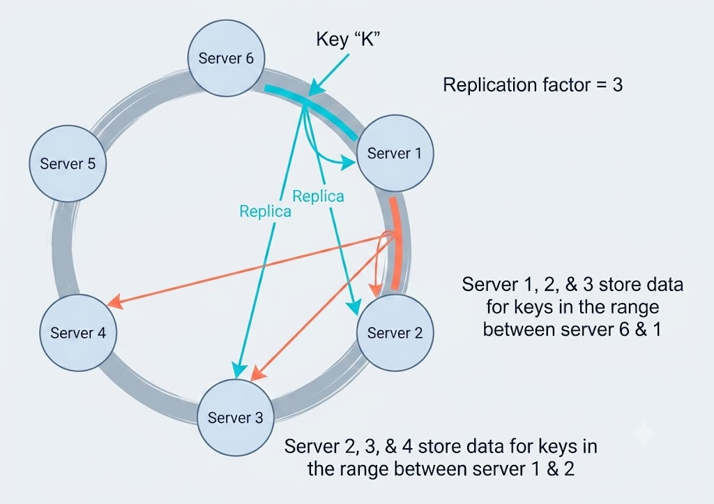

# Consistent Hashing

## Background

When designing a scalable distributed system, one of the most critical considerations is defining how data is partitioned and replicated across cluster nodes.

- **Data Partitioning**: The process of dividing and distributing data across multiple servers. Proper partitioning enhances overall system performance and scalability.
- **Data Replication**: The process of creating multiple copies of data and storing them on different servers. Replication improves data availability, fault tolerance, and durability across the system.

Data partitioning and replication strategies form the core backbone of any distributed architecture. A well-crafted partitioning and replication scheme boosts system performance, availability, and reliability while establishing how seamlessly the system scales up or down.

Consistent Hashing was first introduced by David Karger et al. in their 1997 research paper as a technique for distributed web caching. It was subsequently adapted and enhanced across numerous modern distributed databases and caching platforms.

---

## What is Data Partitioning?

As defined above, data partitioning involves spreading datasets across a cluster of server nodes. When attempting to distribute data effectively, two major challenges arise:

1. **Location Resolution**: How do clients or nodes determine which specific server holds a particular data item?
2. **Cluster Topology Changes**: When nodes are added or removed, how is data rebalanced across existing and new nodes? Furthermore, how can data movement be minimized during server joins or departures?

### The Naive Modulo Hashing Approach

A naive implementation calculates a hash value for a given data key using a hash function, then computes the target server index using the modulo operator against the total count of operational servers ($N$):

$$\text{Server Index} = \text{Hash}(\text{Key}) \pmod N$$

While simple hashing resolves the problem of mapping keys to servers under a static configuration, it breaks down when the cluster size changes. Adding or removing a single server alters the total server count $N$, invalidating nearly all existing key-to-server mappings. Re-establishing cluster mapping requires re-hashing and migrating almost the entire dataset, leading to severe network and computational overhead.

---

## Consistent Hashing to the Rescue

Distributed architectures employ **Consistent Hashing** to distribute keys across nodes while ensuring that adding or removing servers causes only a minimal fraction of keys to be relocated.

Consistent Hashing arranges the entire hash range into an abstract circular structure known as a **hash ring**. Each node in the cluster is assigned a specific position or range on this ring.

In Consistent Hashing, the hash ring's integer range is partitioned into predefined segments. Each physical node is assigned an initial position called a **token**. The range of keys owned by a node is bounded as follows:

- **Range Start**: Node Token Value
- **Range End**: (Next Node Token Value) - 1

### Key Placement and Lookup Process

When the system processes a read or write operation, it first hashes the target key (commonly using MD5 or SHA-1 algorithms). The resulting hash value falls at a specific point on the ring. The system moves clockwise along the ring from that position to locate the first node whose assigned token range covers the key hash.

When a node is added or removed, only keys belonging to the immediate neighboring range need to be migrated. For example, if a node leaves the ring, its clockwise neighbor assumes responsibility for its key range. All other nodes and key mappings remain completely unaffected.

---

## Virtual Nodes (Vnodes)

Although basic Consistent Hashing limits data migration during topology changes, assigning a single fixed token per physical node can lead to data imbalance and uneven load distribution.

### Drawbacks of Single-Token Assignments

- **Administrative Overhead**: Manually computing and reassigning tokens when scaling large clusters creates operational complexity.
- **Hotspots**: If data distribution is skewed, a single node responsible for a large continuous token range can experience disproportionate traffic load (hotspots).
- **Rebuild Pressure**: When a failed node needs to be rebuilt from scratch, only its immediate replica neighbors supply the data, potentially overloading those specific nodes.

### Introducing Virtual Nodes

To resolve these issues, Consistent Hashing decouples physical hardware nodes from token assignments by introducing **Virtual Nodes (Vnodes)**.

Instead of mapping a physical node to a single continuous range, the hash space is partitioned into many smaller sub-ranges. Each physical server is assigned multiple non-contiguous Vnodes across the ring.

### Advantages of Vnodes

- **Uniform Load Distribution**: Dividing the hash ring into smaller Vnodes spreads data and request loads evenly across all physical servers. When a new node joins, it acquires Vnodes from multiple existing servers, accelerating rebalancing. Similarly, node rebuilding draws data from many cluster members simultaneously rather than a single replica pair.
- **Heterogeneous Hardware Support**: Vnodes enable handling servers with varying capacity. Powerful hardware can be assigned a higher quantity of Vnodes, while less capable machines receive fewer Vnodes.
- **Hotspot Reduction**: Distributing smaller sub-ranges across the ring lowers the probability of any single range accumulating a disproportionate traffic load.

---

## Data Replication in Consistent Hashing

To maintain **high availability** and **durability**, Consistent Hashing replicates each data item across $N$ distinct nodes, where $N$ represents the configured **replication factor**.

Under a replication factor of $N$, the system creates $N$ copies of each key-value pair and stores them on distinct physical servers.

When a write operation occurs, the key is routed to its primary **coordinator node** (the first node encountered on the ring). The coordinator node stores the data locally and then asynchronously or synchronously replicates the write to the next $N-1$ distinct clockwise successor nodes along the hash ring.

In eventually consistent models, secondary replicas receive updates asynchronously in the background. Data copies may temporarily diverge across nodes, but they eventually converge to a uniform state to guarantee continuous read/write availability.

---

## Real-World Applications

Consistent Hashing is fundamental for any distributed system requiring dynamic scaling, load balancing, or replicated data storage:

- **Distributed NoSQL Databases**: Systems such as **Amazon DynamoDB** and **Apache Cassandra** rely on Consistent Hashing to partition and replicate data across node clusters.
- **Distributed Caching Platforms**: Systems like **Memcached** leverage Consistent Hashing to dynamically add or remove cache servers based on traffic demands without invalidating the whole cache.
- **Dynamic Sharding Services**: Storage layers that require continuous scaling during peak traffic events (such as holiday shopping spikes) use Consistent Hashing to rebalance shards cleanly.
