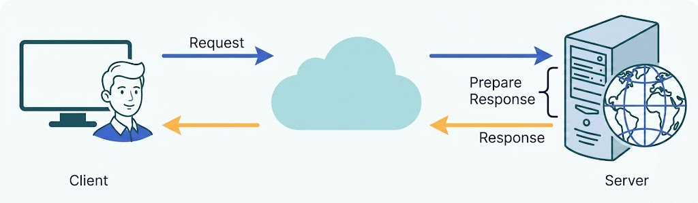
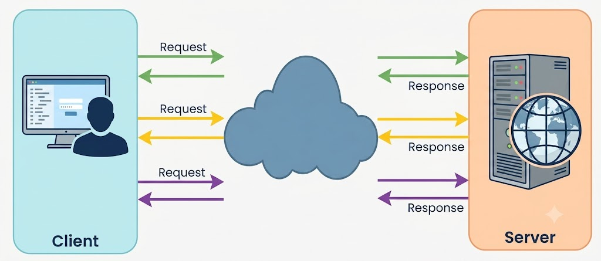
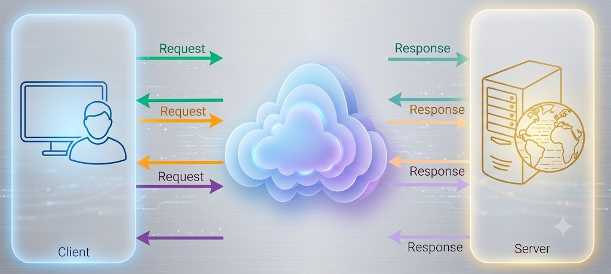
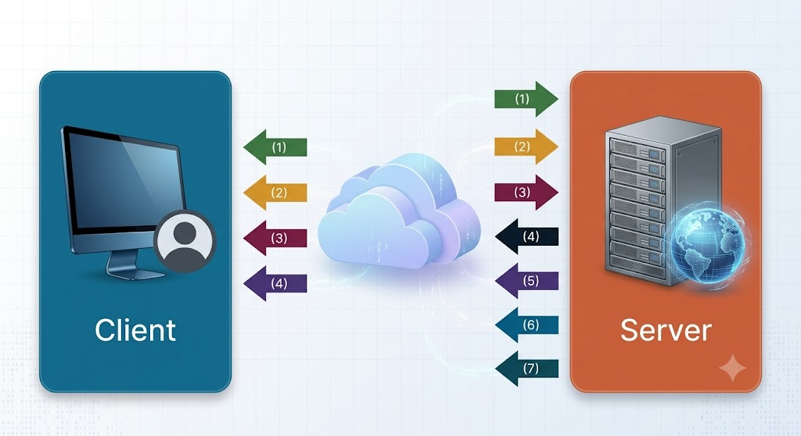
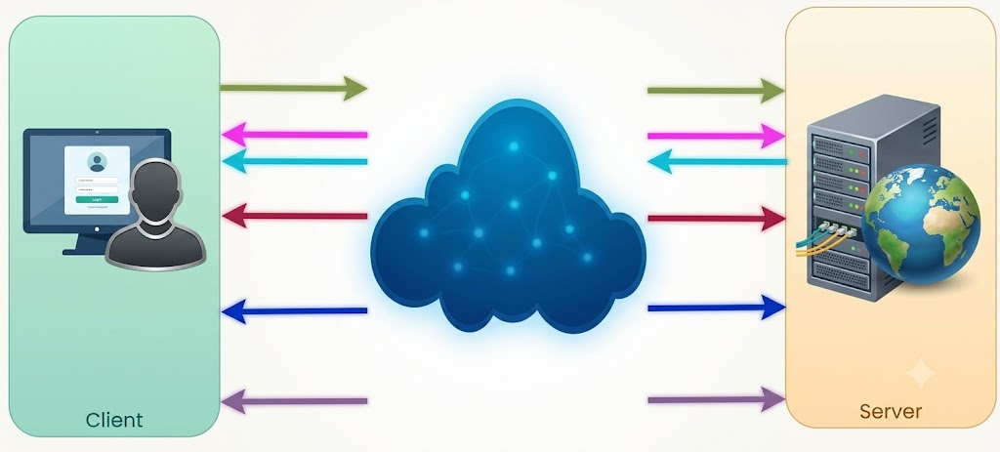

# Long-Polling vs WebSockets vs Server-Sent Events

Long-Polling, WebSockets, and Server-Sent Events (SSE) represent the primary communication patterns for client-server interaction in modern web applications. 

To understand these real-time communication techniques, it is helpful to first review the workflow of a standard HTTP request-response cycle.

---

## Standard HTTP Protocol

In a conventional HTTP architecture, communication follows a strict client-initiated request-response pattern:

1. **Connection & Request**: The client opens a TCP connection and transmits an HTTP request to the server.
2. **Processing**: The server processes the request and computes the corresponding response.
3. **Response**: The server sends the response payload back to the client over the opened connection and closes or reuses the connection.

---

## Ajax Polling

Traditional AJAX Polling is a client-driven technique where the web application repeatedly sends HTTP requests at fixed time intervals to check if new data is available on the server.

### Workflow

1. The client opens a connection and requests data from the server using standard HTTP.
2. The client application dispatches requests at regular intervals (e.g., every 0.5 or 1 second).
3. The server processes each incoming request and returns updated data if present, or an empty response if no changes occurred.
4. The client repeats this polling loop continuously to obtain updates.

### Limitations
The primary drawback of short polling is network and server overhead. Because the client queries the server regardless of whether data has changed, a high percentage of requests return empty responses, resulting in unnecessary HTTP header overhead, latency, and wasted bandwidth.

---

## HTTP Long-Polling

HTTP Long-Polling (often referred to as a "Hanging GET") is a variation of traditional polling designed to allow servers to push data to clients as soon as it becomes available, minimizing redundant empty responses.

With Long-Polling, the client requests information from the server similarly to standard polling, but the server holds the request open if no immediate updates exist.

### Workflow

1. **Initial Request**: The client sends an HTTP request to the server and waits for a response.
2. **Server Holding**: If no data is currently available, the server delays its response, holding the request open until an update occurs or a timeout threshold is reached.
3. **Data Delivery**: When new data becomes available, the server completes the request and sends a full HTTP response to the client.
4. **Re-connection**: Upon receiving the response (or if the connection times out), the client immediately dispatches a new long-poll request to maintain continuous readiness for future server events.

---

## WebSockets

The **WebSocket** protocol provides full-duplex, bidirectional communication channels established over a single persistent TCP connection. Both the client and the server can independently send data packets at any time without waiting for explicit requests.

### Workflow

1. **Handshake**: The client initiates a WebSocket connection using a standard HTTP request containing an `Upgrade: websocket` header.
2. **Persistent Connection**: Once the server accepts the handshake, the underlying TCP connection remains open.
3. **Bi-directional Data Exchange**: Both parties can stream text or binary frames back and forth in real time with minimal frame overhead.

### Advantages
WebSockets eliminate HTTP request-response overhead for subsequent messages, providing extremely low latency suitable for real-time applications such as collaborative editors, online multiplayer games, and live chat platforms.

---

## Server-Sent Events (SSEs)

**Server-Sent Events (SSE)** enable a server to stream real-time event updates to a client over a persistent HTTP connection. Unlike WebSockets, SSE is **unidirectional**—data flows strictly from the server to the client.

If the client needs to send data back to the server, it uses standard HTTP methods (such as `POST` or `PUT`) over separate HTTP requests.

### Workflow

1. **Client Subscription**: The client requests a stream connection using standard HTTP with the `Accept: text/event-stream` header.
2. **Persistent Stream**: The server leaves the connection open and streams new data events to the client whenever updates occur.
3. **Automatic Reconnection**: Built-in browser APIs (`EventSource`) handle automatic reconnection and event tracking if the network drops.

### Best Use Cases
SSE is optimal for applications that require continuous server-to-client updates without needing upstream client-to-server real-time messaging, such as live stock tickers, news feeds, system monitoring dashboards, and notification systems.
