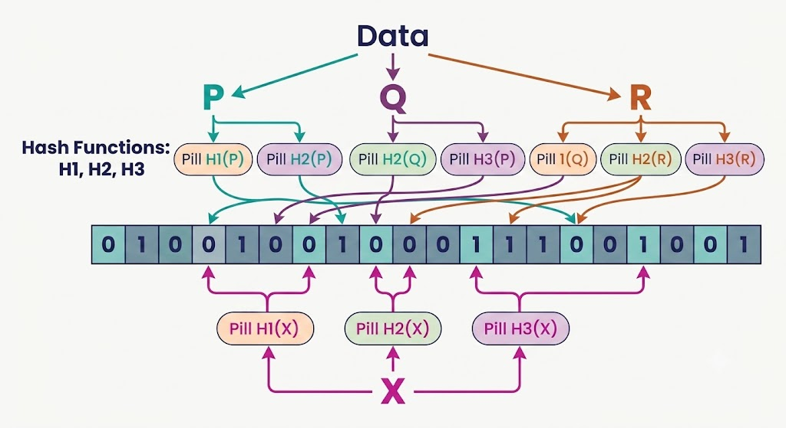

# Bloom Filters

## Background

Imagine needing to check if an item exists within a massive data collection without storing the entire dataset in memory. **Bloom filters** offer an elegant, highly space-efficient solution to this challenge.

A Bloom filter is a probabilistic data structure designed for fast set membership queries. It provides two definitive types of answers:
- **Definitely not in the set**
- **Probably in the set**

Crucially, **false negatives are impossible** (if an item was added, the filter will never claim it is missing). However, it can occasionally yield a **false positive** (claiming an item is present when it was never added). In real-world distributed applications where memory is constrained and an occasional extra lookup is tolerable, trading a minor error rate for huge memory and speed gains is an advantageous compromise.

Invented by Burton Howard Bloom in 1970, Bloom filters remain vital in modern data-intensive architecture. They excel in scenarios where maintaining full hash sets or indexes in RAM would be prohibitively expensive. By using a fixed-size bit array as a compact "fingerprint" of the set alongside multiple hash functions, Bloom filters perform constant-time membership checks whose space requirements do not grow linearly with element count.

---

## What Exactly Is a Bloom Filter?

At its core, a Bloom filter acts as a fast membership check answering: *"Have we encountered this item before?"*

It consists of two main components:
1. **Bit Array**: A fixed-length array of $N$ bits, initially initialized to all `0`s.
2. **Hash Functions**: A set of $k$ independent, uniform hash functions. Each hash function maps an input item to an array index ranging from $0$ to $N - 1$.

```
Item Key ---> [ Hash 1 ] ---> Index A  \
         ---> [ Hash 2 ] ---> Index B   |---> Set corresponding bits to 1 in Bit Array
         ---> [ Hash k ] ---> Index C  /
```

### Core Operations

- **Insertion**: An item is passed through all $k$ hash functions to generate $k$ array indices. The bits at all $k$ calculated positions in the bit array are set to `1`.
- **Query**: An item is passed through the same $k$ hash functions to obtain $k$ indices:
  - If **any** of the checked bits is `0`, the item is **definitely not in the set**.
  - If **all** checked bits are `1`, the item is **probably in the set**.

### Why Use Multiple Hash Functions?

Using multiple hash functions spreads each item's presence across different array locations. This redundancy prevents false negatives: an item cannot lose its set bits unless bits are cleared. Conversely, as more items populate the bit array, overlapping bit positions can cause an unadded item to coincidently have all its target bits set to `1`, creating a false positive.

---

## How Bloom Filters Work (Step by Step)

The diagram below illustrates a Bloom filter operating with $k=3$ hash functions for items ($P, Q, R$). Each item is hashed to specific positions in the bit array, which are marked as `1`. When querying a new element $X$, if any hash index points to a `0` bit, $X$ is confirmed absent.



### Step-by-Step Execution

1. **Initialization**: Allocate a bit array of size $N$ with all bits set to `0`. Select $k$ independent hash functions mapping inputs into $[0, N-1]$.
2. **Adding an Element**:
   - Compute $k$ indices by evaluating $k(\text{item})$.
   - Set the array bit at each index to `1` (if already `1`, leave it unchanged).
3. **Querying an Element**:
   - Compute $k$ indices using the same $k$ hash functions.
   - Inspect the bits at all $k$ positions:
     - If at least one bit is `0` $\rightarrow$ Return **"Definitely Not Present"**.
     - If all $k$ bits are `1` $\rightarrow$ Return **"Probably Present"**.
4. **Handling False Positives**: If the filter reports "probably present," the system can optionally double-check against primary storage (such as a database or disk lookup). The primary goal of the Bloom filter is to immediately eliminate unnecessary, expensive lookups for items that definitely do not exist.

### Algorithmic Complexity

- **Time Complexity**: $O(k)$ for both insertions and queries. Because $k$ is a small fixed constant (typically 3 to 10), operations run in $O(1)$ constant time regardless of how many millions of items are indexed.
- **Space Complexity**: Fixed bit-array size $N$, consuming significantly less RAM than storing raw keys or pointers.

### Can Items Be Deleted?

Standard Bloom filters **do not support deletion**. Clearing a bit to `0` could inadvertently remove bits shared by other stored items. Advanced variants such as **Counting Bloom Filters** replace single bits with integer counters to allow deletions, though at the cost of increased memory usage.

---

## Understanding False Positives

Bloom filters trade exact certainty for massive resource savings.

### Analogy: Fingerprints on a Shared Logbook

Imagine recording visitors on a single sheet of paper. Instead of writing names, each visitor presses their thumb on $k$ predetermined spots on the sheet determined by a rule (hash function).

- To check if a person previously visited, you inspect those specific $k$ spots on the sheet.
- If **any** of those spots is clean (unmarked), the person has **definitely never visited**.
- If **all** $k$ spots are smudged with ink, the person **might have visited**. However, those smudges could have been left by a combination of other visitors whose fingerprints overlapped those exact spots.

### What Causes False Positives?

False positives occur due to bit overlap. As the number of inserted elements grows, more bits in the array transition from `0` to `1`. Eventually, an unadded query item may happen to target a set of bits that were collectively set by other stored items.

### Controlling the False Positive Rate

The false-positive probability ($p$) can be controlled by tuning parameters:
- **Bit Array Size ($N$)**: Larger arrays reduce bit density for a given item count, lowering collision risk.
- **Number of Hash Functions ($k$)**: Too few hash functions reduce item differentiation; too many fill the array rapidly. The optimal number of hash functions is given by:

$$k = \frac{N}{n} \ln(2)$$

*(where $n$ is the expected number of inserted items)*.

Real-world databases like **Apache Cassandra** allow tuning the Bloom filter false-positive probability parameter (e.g., $0.01$ or $0.001$), allocating more RAM to achieve lower error rates.

---

## Real-World Applications

- **Database Query Optimization**: Systems like **Apache Cassandra**, **RocksDB**, and **Google BigTable** use Bloom filters to prevent costly disk reads for non-existent keys.
- **Web Crawlers**: Search engines use Bloom filters to check if a URL has already been crawled.
- **Malicious URL Detection**: Web browsers like Chrome use Bloom filters to quickly screen URLs against known malicious site lists without storing full URL databases locally.
- **Cache Filtering**: CDN edge servers use Bloom filters to prevent one-off requests ("one-hit wonders") from polluting high-speed cache storage.
