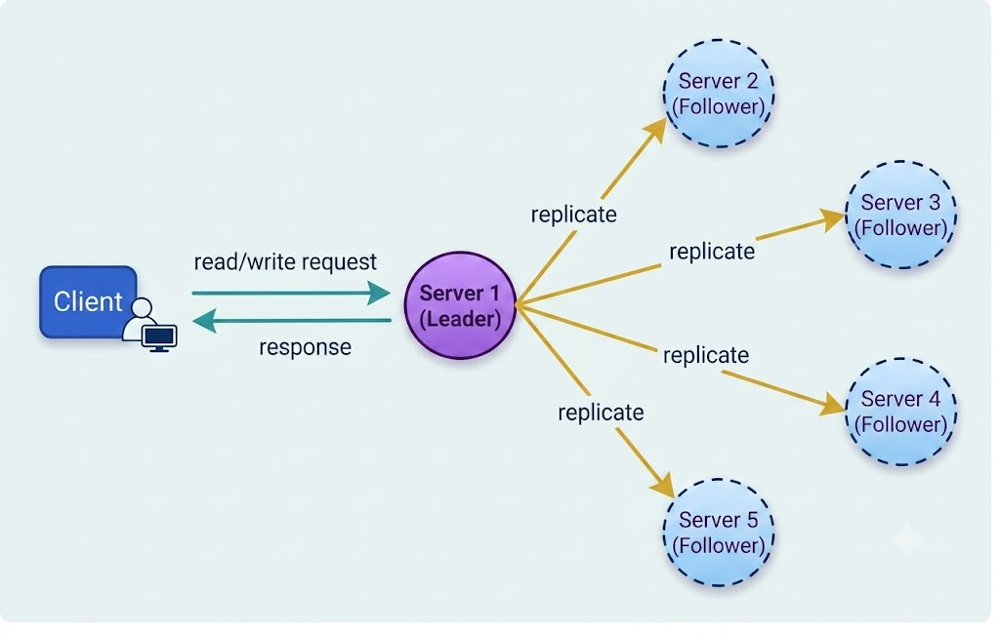

# Leader and Follower

## Background

Distributed systems maintain multiple data replicas across distinct nodes to achieve fault tolerance and high availability.

While a quorum-based model ensures consistency by requiring a majority of nodes to acknowledge operations, it can introduce availability challenges: if a majority of nodes become unreachable or offline simultaneously, write or read operations will fail. Additionally, quorum alone does not resolve all edge-case race conditions where clients might observe temporary data inconsistencies.

---

## Solution

To simplify coordination and maintain consistency, systems adopt a **Leader and Follower** architecture (also known as Master-Slave or Primary-Secondary replication).

In this design, a single node is designated as the **Leader** (Primary), responsible for coordinating write operations and managing data replication across the cluster. The remaining nodes act as **Followers** (Secondaries).

- **Leader**: Receives write requests from clients, processes state changes locally, and coordinates data replication to all follower nodes.
- **Followers**: Accept write updates exclusively from the leader and serve as redundant backups. If the leader fails, one of the followers can be promoted to become the new leader (via leader election). In read-heavy systems, followers can also process read queries to scale throughput.

---

## Core Characteristics

1. **Centralized Write Coordination**: All write traffic routes through the elected leader node, preventing write-write conflicts across replicas.
2. **Replication Mechanisms**:
   - **Synchronous Replication**: The leader waits for follower acknowledgments before confirming write success to the client, guaranteeing strong consistency.
   - **Asynchronous Replication**: The leader confirms write success immediately after updating local state and streams updates to followers in the background, optimizing write latency.
3. **Failover & Leader Election**: If heartbeat signals from the leader cease, followers initiate consensus protocols (such as Raft or Paxos) to elect a new leader automatically.
