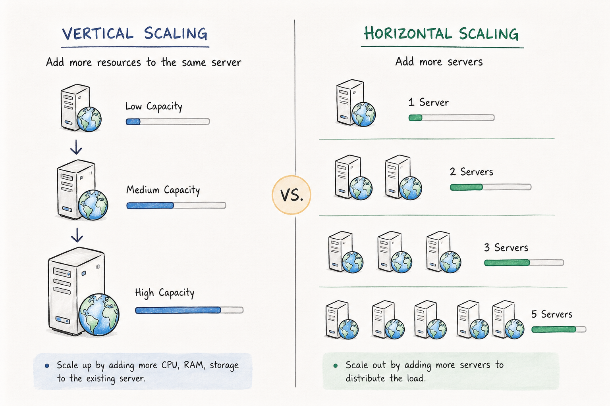

# Key Characteristics of Distributed Systems

Key characteristics of a distributed system include **Scalability**, **Reliability**, **Availability**, **Efficiency**, and **Manageability**. Let's briefly examine each of them:

## Scalability
Scalability is the capacity of a system, process, or network to grow and handle increasing demand. Any distributed system capable of expanding continuously to accommodate a growing workload is considered scalable.

A system may need to scale for several reasons, such as larger data volumes or a higher volume of work (e.g., transaction count). A well-designed scalable system aims to achieve this growth without suffering a loss in performance.

In practice, the performance of a system—even one designed or claimed to be scalable—tends to decline as system size increases due to management overhead or environmental factors. For instance, network throughput may drop when machines are located further apart. Additionally, certain tasks cannot be distributed easily, either because of their atomic nature or due to design constraints. Over time, such non-distributable tasks can limit the performance gains achieved through distribution. A scalable architecture works around this by striving to distribute the workload evenly across all participating nodes.

### Horizontal vs. Vertical Scaling
- **Horizontal Scaling:** Scaling by adding more servers into your pool of resources.
- **Vertical Scaling:** Scaling by adding more power (CPU, RAM, Storage, etc.) to an existing server.

With horizontal scaling, it is generally simpler to scale dynamically by adding new instances into the existing pool. Conversely, vertical scaling is constrained by the capacity limit of a single server; expanding beyond that threshold usually requires downtime and comes with an upper limit.

**Cassandra** and **MongoDB** serve as good examples of horizontal scaling, as both provide straightforward mechanisms to scale horizontally by adding more machines as demands increase. Similarly, **MySQL** illustrates vertical scaling, allowing systems to upgrade from smaller to larger instances, though this transition typically involves system downtime.

---

## Reliability
Reliability refers to a system's ability to remain operational, accurate, and effective even in the presence of faults, errors, or component failures. Simply put, a distributed system is reliable if it continues delivering services even when one or several of its software or hardware components fail. Reliability represents one of the primary characteristics of any distributed system, because a failing machine can always be replaced by another healthy one to ensure completion of the requested task.

Consider a large e-commerce platform (like Amazon), where a core requirement is that user transactions must never be canceled due to a machine failure during processing. If a user adds an item to their shopping cart, the system must guarantee that cart data is preserved. A reliable distributed system achieves this through redundancy in both software components and data. If the server carrying the user's shopping cart fails, another server with an exact replica of the shopping cart takes over.

Naturally, redundancy incurs a cost, and a reliable system accepts this cost to achieve service resilience by eliminating single points of failure.

A closely related concept is **Fault Tolerance**, which is the system's ability to continue operating (possibly at a reduced level) even when one or more of its components fail. In other words, it is the property that allows a system to absorb or recover from faults without total breakdown.

### Difference Between Reliability and Fault Tolerance
Although these terms often overlap, the main differences can be summarized as follows:

- **Scope:** Reliability focuses on the end-to-end correctness and consistency of the entire system’s operation over time. Fault tolerance focuses on the system’s ability to continue operating when individual components fail.
- **Perspective:** Reliability is primarily a user-centric concept (can the system consistently meet user expectations over time?). Fault tolerance is more system-centric (how does the system handle internal failures or component breakdowns?).
- **Measurement:** Reliability is often measured in terms of uptime, error rates, or mean time between failures (MTBF). Fault tolerance is often measured by how quickly and effectively the system detects, isolates, and recovers from failures (e.g., failover times).

---

## Availability
By definition, availability is the time a system remains operational to perform its required function within a specific period. It is a simple measure of the percentage of time that a system, service, or machine remains operational under normal conditions. An aircraft that can be flown for many hours a month without much downtime can be said to have high availability. Availability accounts for maintainability, repair time, spare parts availability, and logistics considerations. If an aircraft is down for maintenance, it is considered not available during that time.

Reliability is availability over time considering the full range of possible real-world conditions that can occur. An aircraft that can navigate through any possible weather safely is more reliable than one vulnerable to specific conditions.

### Reliability vs. Availability
If a system is reliable, it is available. However, if it is available, it is not necessarily reliable. In other words, high reliability contributes to high availability, but high availability can still be achieved even with an unreliable product by minimizing repair time and ensuring spare parts are always available when needed.

For example, consider an online retail store that maintains 99.99% availability during its first two years after launch. However, if the system was launched without security testing, customers may be happy with performance while remaining unaware that the system is vulnerable to risks. In the third year, the system experiences a series of security incidents that suddenly result in extremely low availability for extended periods, causing reputational and financial damage.

---

## Efficiency
To understand how to measure the efficiency of a distributed system, assume we have an operation that runs in a distributed manner and delivers a set of items as a result. Two standard measures of efficiency are:

1. **Latency (Response Time):** The delay to obtain the first item.
2. **Throughput (Bandwidth):** The number of items delivered in a given time unit (e.g., per second).

These two measures correspond to the following unit costs:
- **Message Count:** The number of messages globally sent by system nodes, regardless of message size.
- **Message Size:** The size of messages representing the volume of data exchanges.

The complexity of operations supported by distributed data structures (e.g., searching for a specific key in a distributed index) can be characterized as a function of one of these cost units. Generally speaking, analyzing a distributed structure solely in terms of 'number of messages' is over-simplistic because it ignores network topology, network load variations, and hardware/software heterogeneity. However, developing a precise cost model accounting for all factors is difficult, so system design relies on rough but robust estimates of system behavior.

---

## Serviceability or Manageability
Another important consideration when designing a distributed system is how easy it is to operate and maintain. Serviceability or manageability is the simplicity and speed with which a system can be repaired or maintained; if the time to fix a failed system increases, availability decreases. Key factors to consider for manageability include:

- Ease of diagnosing and understanding problems when they occur.
- Ease of making updates or architectural modifications.
- Operational simplicity (i.e., whether the system routinely operates without failure or exceptions).

Early fault detection can decrease or prevent system downtime. For example, some enterprise systems can automatically call a service center (without human intervention) when experiencing a fault.
