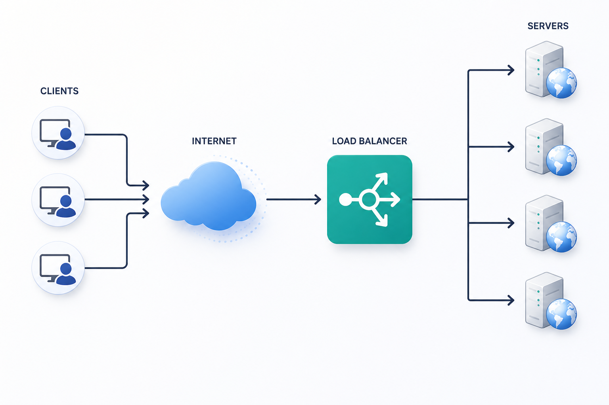
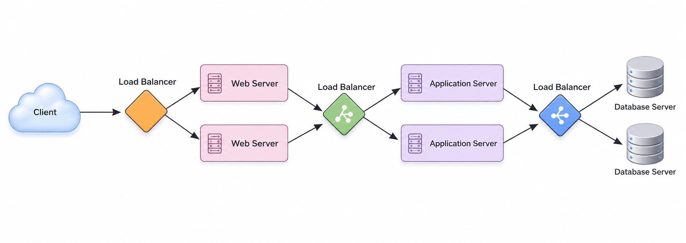
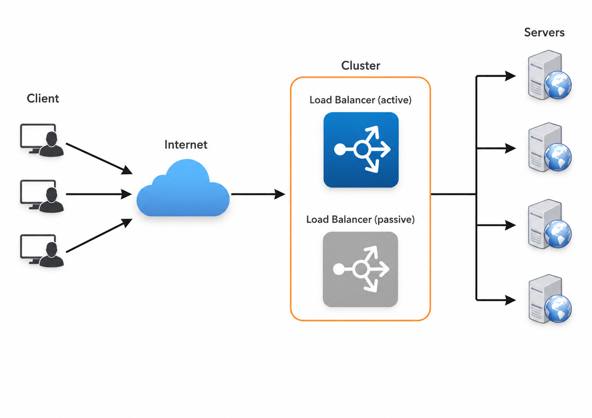

# Load Balancing

A **Load Balancer (LB)** is another essential building block in any distributed architecture. It helps distribute incoming traffic across a pool of servers to optimize responsiveness and improve the availability of applications, websites, or databases. The LB continuously tracks the health and status of backend resources while routing requests. If a server becomes unresponsive, experiences an elevated error rate, or cannot handle new traffic, the load balancer stops directing requests to that instance.

Typically, a load balancer acts as a proxy positioned between clients and backend servers. It accepts incoming network and application traffic and routes it across multiple server nodes using specialized load balancing algorithms. By distributing requests across multiple machines, a load balancer prevents any single server from becoming overwhelmed and eliminates single points of failure, thereby enhancing overall system availability and responsiveness.

## Where to Place Load Balancers
To achieve maximum scalability and fault tolerance, load balancing can be implemented at every architectural tier. Load balancers are typically placed at three primary locations:

1. **Between Users and Web Servers:** To distribute initial incoming client traffic among frontend web servers.
2. **Between Web Servers and Application/Cache Tier:** To balance requests between frontend web servers and internal application or caching nodes.
3. **Between Application Tier and Database Layer:** To manage database queries and read requests across multiple database nodes.

## Benefits of Load Balancing
- **Faster, Uninterrupted User Experience:** Users receive prompt responses without waiting for a heavily loaded server. Requests are dynamically routed to available nodes.
- **Reduced Downtime and Higher Throughput:** Even if a server node suffers a total failure, end-users remain unaffected as the load balancer seamlessly routes traffic around the faulty server to healthy nodes.
- **Simplified Operations for Administrators:** Managing incoming traffic becomes more manageable while significantly lowering latency for end-users.
- **Predictive Insights with Smart Load Balancers:** Intelligent load balancers can incorporate predictive analytics to identify traffic bottlenecks before they impact performance. These insights support automated scaling and data-driven infrastructure decisions.
- **Decreased Component Stress:** Rather than placing heavy execution demands on a single device, load balancing distributes work across multiple machines, reducing hardware stress and failure rates.

---

## Redundant Load Balancers
A load balancer itself can become a single point of failure if not configured redundantly. To mitigate this risk, a secondary load balancer can be paired with the primary LB to form a cluster. Each load balancer continuously monitors the health of the other. Because both are capable of serving traffic and detecting failures, if the primary load balancer fails, the secondary load balancer automatically takes over traffic routing.

