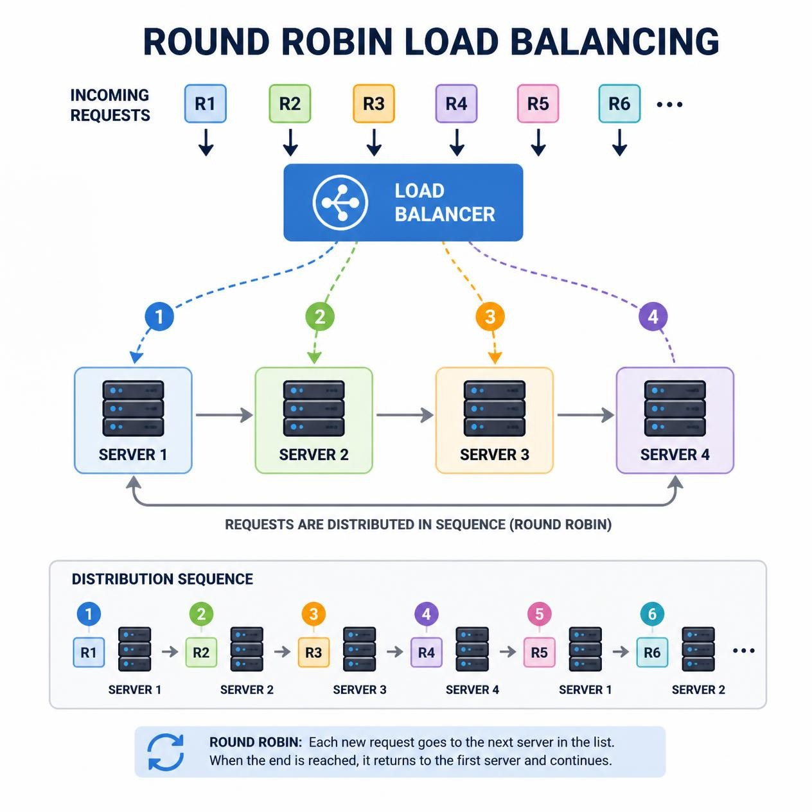
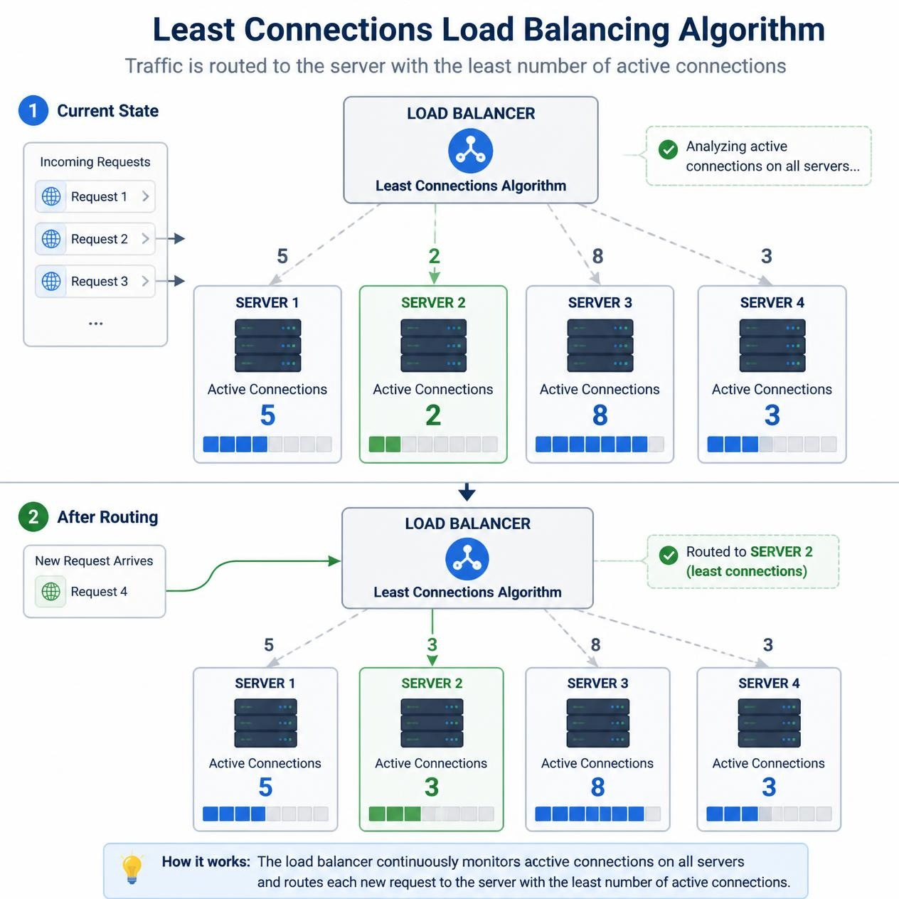
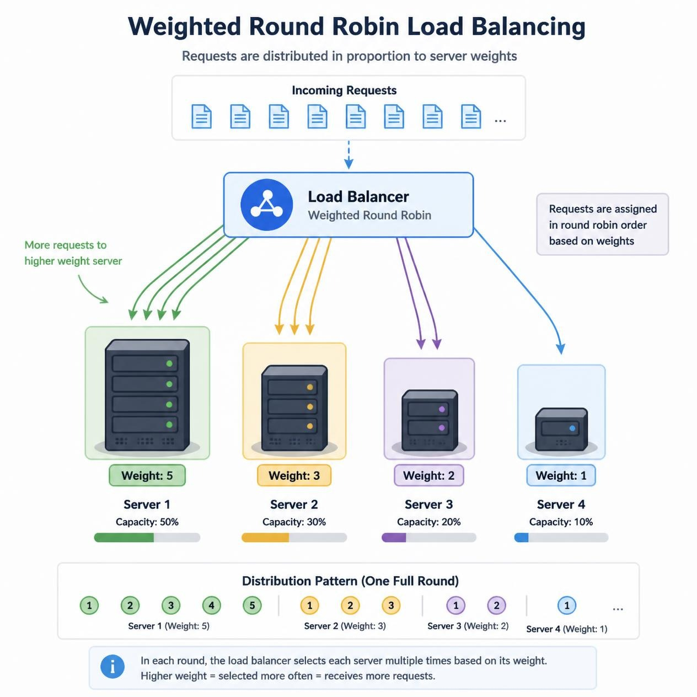
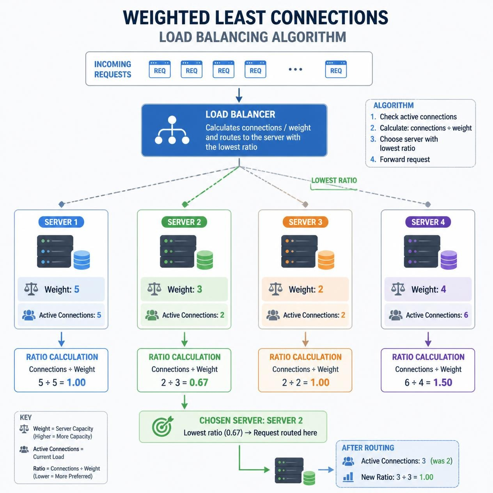
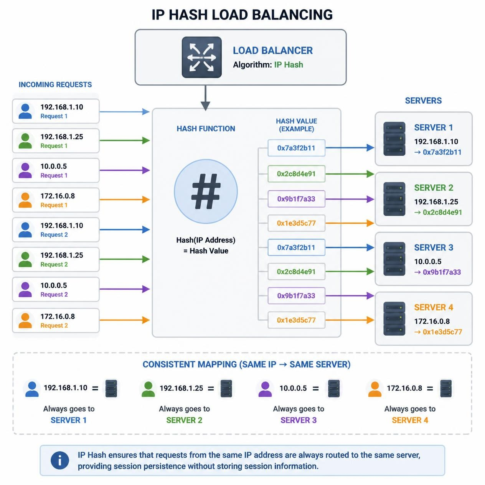
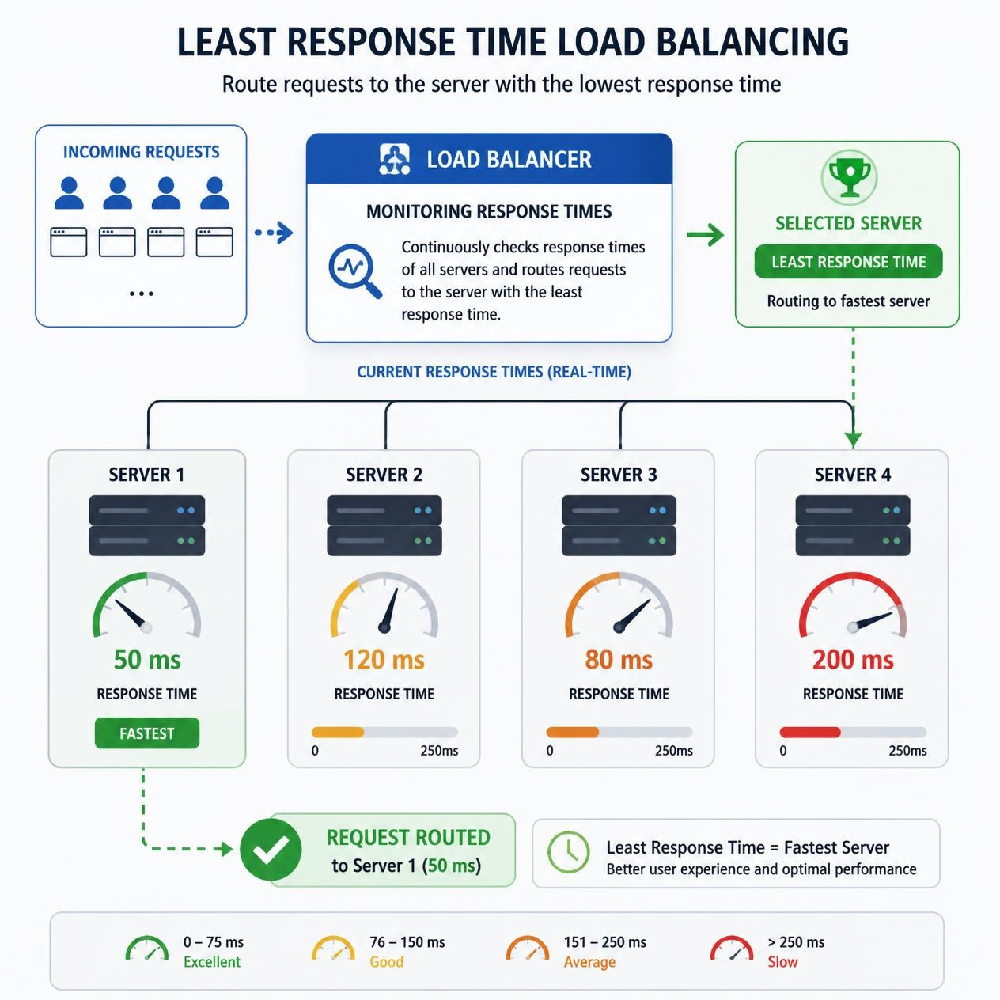
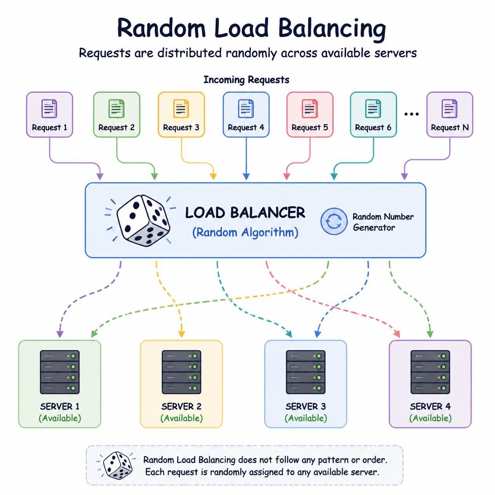
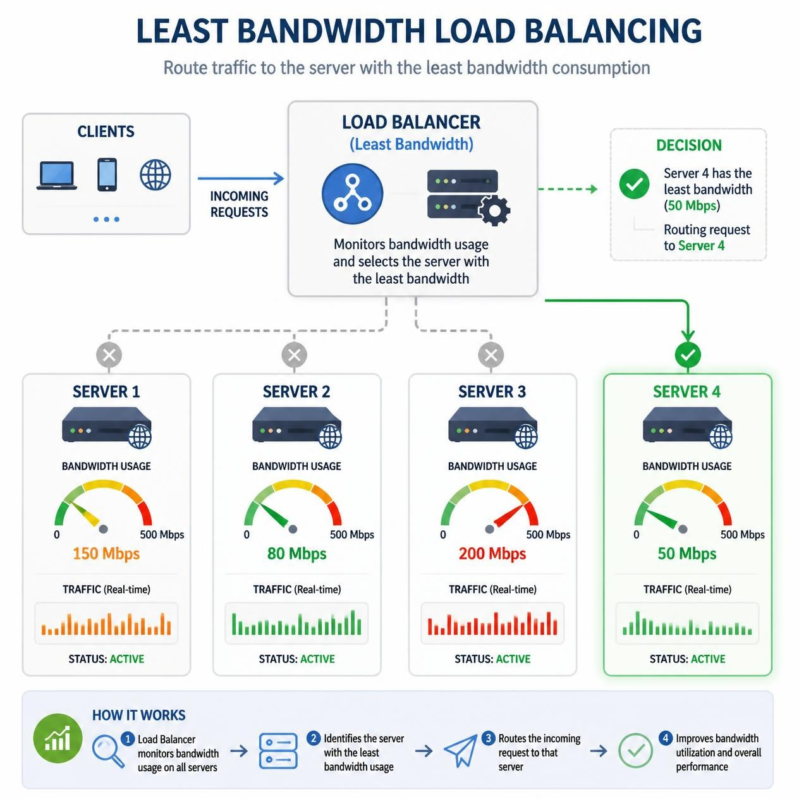

# Load Balancing Algorithms

A load balancing algorithm is a technique used by a load balancer to distribute incoming traffic and user requests among multiple backend servers or computing resources. The primary objective of a load balancing algorithm is to ensure optimal utilization of resources, maximize throughput, minimize response times, and maintain high availability and reliability across the system.

By preventing any single server from becoming overwhelmed, load balancing algorithms mitigate performance degradation and single-point failures. Algorithms evaluate parameters such as server capacity, current active connection counts, average response times, and node health status to make intelligent routing decisions.

---

## Key Load Balancing Algorithms

### 1. Round Robin
The Round Robin algorithm distributes incoming requests to servers in a sequential, cyclic order. It assigns the first request to Server 1, the second to Server 2, and continues sequentially through all available servers before wrapping around to Server 1.

#### Pros
- **Equal Distribution:** Ensures a uniform distribution of requests, as each server gets a turn in a fixed order.
- **Simplicity:** Very easy to configure, implement, and comprehend.
- **Optimal for Homogeneous Clusters:** Performs well when all servers possess identical processing power.

#### Cons
- **No Load Awareness:** Does not evaluate current CPU/memory load or server health; treats all nodes equally.
- **No Session Affinity:** Subsequent requests from the same client may be routed to different servers, which can disrupt stateful applications.
- **Suboptimal in Heterogeneous Environments:** Struggles when servers have varying performance capabilities or uneven workloads.
- **Predictable Patterns:** The static sequence can be predictable, potentially making it easier for malicious traffic patterns to target specific servers.

#### Use Cases
- **Homogeneous Environments:** Environments where all servers feature identical capacity and hardware specifications.
- **Stateless Applications:** Ideal for stateless services where every request can be handled independently by any node.

---

### 2. Least Connections
The Least Connections algorithm is a dynamic load balancing strategy that routes incoming requests to the server with the fewest active connections at the moment of request arrival. This ensures a balanced distribution when handling unpredictable traffic spikes or requests with varying processing durations.

#### Pros
- **Load Awareness:** Considers active connection counts, leading to better resource utilization.
- **Dynamic Adaptability:** Adapts to fluctuating traffic patterns, preventing individual servers from becoming bottlenecks.
- **Effective for Heterogeneous Hardware:** Handles clusters with mixed server performance well by shifting traffic to less busy machines.

#### Cons
- **Higher Complexity:** Requires continuous monitoring of active connection counts across all nodes.
- **State Overhead:** The load balancer must track connection state in real time, increasing overhead.
- **Potential Connection Spikes:** Short-lived connections may cause rapid fluctuations in connection counts, leading to frequent rebalancing.

#### Use Cases
- **Heterogeneous Environments:** Server pools with different hardware specifications where load needs to be distributed dynamically.
- **Variable Traffic & Long Sessions:** Applications with unpredictable traffic patterns or long-lived connections (e.g., streaming or persistent web sockets).
- **Stateful Applications:** Helps distribute active user sessions more evenly across servers.

#### Comparison to Round Robin
- **Round Robin:** Uses a fixed, cyclic routing sequence regardless of real-time server load.
- **Least Connections:** Dynamically routes requests based on active connection counts at request time.

---

### 3. Weighted Round Robin
Weighted Round Robin (WRR) builds upon the standard Round Robin algorithm by assigning a numerical weight to each server according to its processing capacity. Incoming requests are distributed proportionally based on these weights, ensuring that more powerful servers handle a larger share of the traffic.

#### Pros
- **Capacity-Based Load Distribution:** Allocates traffic in proportion to server capability, preventing weaker machines from getting overwhelmed.
- **Flexibility:** Allows administrators to easily adjust server weights when scaling hardware up or down.
- **Improved Performance:** Enhances overall cluster throughput by matching workload to server capacity.

#### Cons
- **Weight Assignment Challenge:** Determining precise weight values requires accurate baseline performance metrics.
- **Management Overhead:** Maintaining and updating static weights adds overhead, especially as server performance fluctuates.
- **Lacks Real-Time Load Tracking:** Does not account for sudden real-time spikes on specific nodes, as routing is still governed by pre-assigned static weights.

#### Use Cases
- **Heterogeneous Server Pools:** Environments with mixed hardware generations or varying CPU/RAM configurations.
- **Scalable Web Applications:** Web systems where backend servers have distinct performance tiers.
- **Database Clusters:** Database read-replicas where specific nodes have higher hardware specifications.

---

### 4. Weighted Least Connections
Weighted Least Connections combines the dynamic load tracking of Least Connections with the capacity awareness of Weighted Round Robin. The load balancer calculates a ratio of active connections relative to assigned server weights, directing new requests to the server with the lowest connection-to-weight ratio.

#### Pros
- **Dynamic & Capacity-Aware:** Considers both real-time active connections and relative server capacity for optimal distribution.
- **High Resource Efficiency:** Prevents powerful servers from remaining underutilized while protecting weaker servers.
- **Flexible for Complex Workloads:** Excels in environments with variable traffic patterns and mixed hardware nodes.

#### Cons
- **Higher Implementation Complexity:** Requires tracking both connection state and static server weights simultaneously.
- **Increased Tracking Overhead:** Real-time state management adds processing overhead to the load balancer.
- **Weight Estimation Effort:** Requires careful tuning and empirical testing to assign appropriate weight values.

#### Use Cases
- **Heterogeneous High-Traffic Platforms:** Large-scale systems with diverse hardware and unpredictable request processing times.
- **High-Demand Web Services:** Applications where long-running and short-running requests arrive concurrently.
- **Database Read Clusters:** Replicas handling queries of widely varying complexity and computational cost.

---

### 5. IP Hash
IP Hash load balancing uses a hash function to map a client's IP address to a specific server within the pool. By hashing the client IP address (e.g., `hash(IP) % server_count`), the load balancer guarantees that requests from the same client IP address are consistently routed to the same backend server.

#### Example
Consider three servers (Server A, Server B, Server C) and a client with IP address `192.168.1.10`. The load balancer hashes the IP address to yield a numeric value (e.g., 2). Using modulo 3 arithmetic (`2 % 3 = 2`), the request is routed to Server C every time.

#### Pros
- **Session Persistence (Sticky Sessions):** Guarantees that a client consistently connects to the same server, ideal for stateful applications without distributed session caching.
- **Low Overhead:** Simple hash computation without requiring connection state tracking.
- **Deterministic Routing:** Provides predictable request routing based on client IP.

#### Cons
- **Uneven Distribution:** If client IP addresses originate heavily from behind NAT gateways or proxies, specific servers may receive disproportionate traffic.
- **Hash Disruption on Server Changes:** Adding or removing servers alters the hash mapping ring, invalidating session stickiness for many clients.
- **No Real-Time Load Awareness:** Ignores current server CPU or connection load.

#### Use Cases
- **Stateful Applications:** Web applications relying on local server session state (e.g., shopping carts, login sessions).
- **Geographically Fixed Routing:** Scenarios where requests from specific IP ranges need to stick to dedicated server nodes.

---

### 6. Least Response Time
Least Response Time (or Least Latency) is a dynamic load balancing algorithm that routes requests to the server with the lowest current response time and fewest active connections. It continuously measures the latency of backend nodes to direct traffic to the fastest responding server.

#### How It Works
1. **Monitor Latency:** The load balancer continuously tracks response times for each server (measured from request transmission to response receipt).
2. **Evaluate Connections:** Combines average response times with active connection counts to select the best server.
3. **Dynamic Routing:** Routes new incoming requests to the node demonstrating the lowest latency.

#### Pros
- **Optimized User Experience:** Directs traffic to the fastest responding node, minimizing end-to-end latency.
- **Real-Time Responsiveness:** Adapts dynamically to transient network congestion or temporary server slowness.
- **Efficient Resource Utilization:** Protects degraded servers from taking on new requests until their latency normalizes.

#### Cons
- **High Monitoring Overhead:** Requires continuous latency measurements and health checks.
- **Short-Term Fluctuation:** Temporary network spikes can lead to rapid route re-calculations and frequent rebalancing.
- **Implementation Complexity:** Harder to configure and tune compared to static algorithms.

#### Use Cases
- **Latency-Sensitive Systems:** Real-time applications, financial trading platforms, online gaming, or video streaming.
- **Dynamic API Gateways:** Web services requiring low latency SLAs.

---

### 7. Random
The Random algorithm selects a backend server at random for each incoming request. While simple, uniform random selection mathematically distributes traffic evenly across servers over a large sample of requests.

#### Example
If a pool contains Server A, Server B, and Server C, every incoming request randomly selects one of the three nodes. Over thousands of requests, each server receives approximately 33.3% of the workload.

#### Pros
- **Extreme Simplicity:** Requires minimal configuration and zero complex state tracking.
- **Zero State Tracking:** Minimal memory footprint and high execution speed on the load balancer.
- **Uniform Distribution Over Time:** Provides near-equal traffic distribution over large request volumes.

#### Cons
- **No Load or Capacity Awareness:** Can send traffic to heavily loaded or low-capacity servers.
- **Short-Term Imbalance:** Small request bursts can randomly hit a single server repeatedly.
- **No Session Affinity:** Requests from the same user are sent to arbitrary servers.

#### Use Cases
- **Stateless & Homogeneous Systems:** Clusters with identical hardware handling independent stateless requests.
- **Lightweight Load Balancers:** Microservices or simple proxy deployments where minimal overhead is critical.

---

### 8. Least Bandwidth
The Least Bandwidth algorithm measures current network bandwidth usage (measured in Mbps or Gbps) across backend servers and routes incoming requests to the server currently consuming the least amount of bandwidth.

#### Pros
- **Prevents Network Bottlenecks:** Prevents network interface saturation on heavily utilized nodes.
- **Optimal Data Distribution:** Ideal for environments transferring large payloads of varying sizes.
- **Enhanced Stability:** Reduces packet drops and queue congestion at the network layer.

#### Cons
- **Monitoring Overhead:** Requires real-time traffic monitoring across network interfaces.
- **Does Not Track CPU/Memory:** A server with low network bandwidth usage might still be experiencing high CPU or memory pressure.
- **Bandwidth Fluctuation:** Rapid changes in transfer rates can trigger frequent rebalancing.

#### Use Cases
- **High-Bandwidth Applications:** Video streaming, file hosting, large data transfers, and media downloads.
- **Content Delivery Networks (CDNs):** Edge servers managing data-heavy asset distribution.

---

### 9. Custom Load
Custom Load load balancing allows administrators to define custom metrics, formulas, or rules for routing decisions rather than relying solely on built-in criteria like connection counts or latency.

#### How It Works
1. **Define Custom Metrics:** Identify relevant telemetry (e.g., CPU utilization, memory pressure, disk I/O, custom application metrics).
2. **Implement Telemetry Agents:** Deploy monitoring scripts or telemetry tools to collect metrics from backend nodes.
3. **Formulate Routing Rules:** Establish weighted formulas or conditional logic within the load balancer.
4. **Dynamic Traffic Allocation:** Route requests according to the evaluated custom health scores.

#### Pros
- **Maximum Flexibility:** Tailored precisely to unique application architectures and resource bottlenecks.
- **Comprehensive Load Tracking:** Can combine CPU, RAM, disk I/O, and custom app metrics into a single health score.
- **Adaptable:** Easily adjusted as application behavior and infrastructure evolve.

#### Cons
- **High Complexity:** Demands custom telemetry setup, maintenance, and integration testing.
- **Risk of Misconfiguration:** Incorrect weighting algorithms can cause routing oscillations or server overload.
- **Telemetry Overhead:** Frequent metric gathering adds minor processing overhead on backend servers.

#### Use Cases
- **Complex Enterprise Platforms:** Systems where request cost depends on complex multi-resource interactions.
- **Dynamic Multi-Tier Architectures:** Environments requiring custom health scores to balance specialized workloads.

