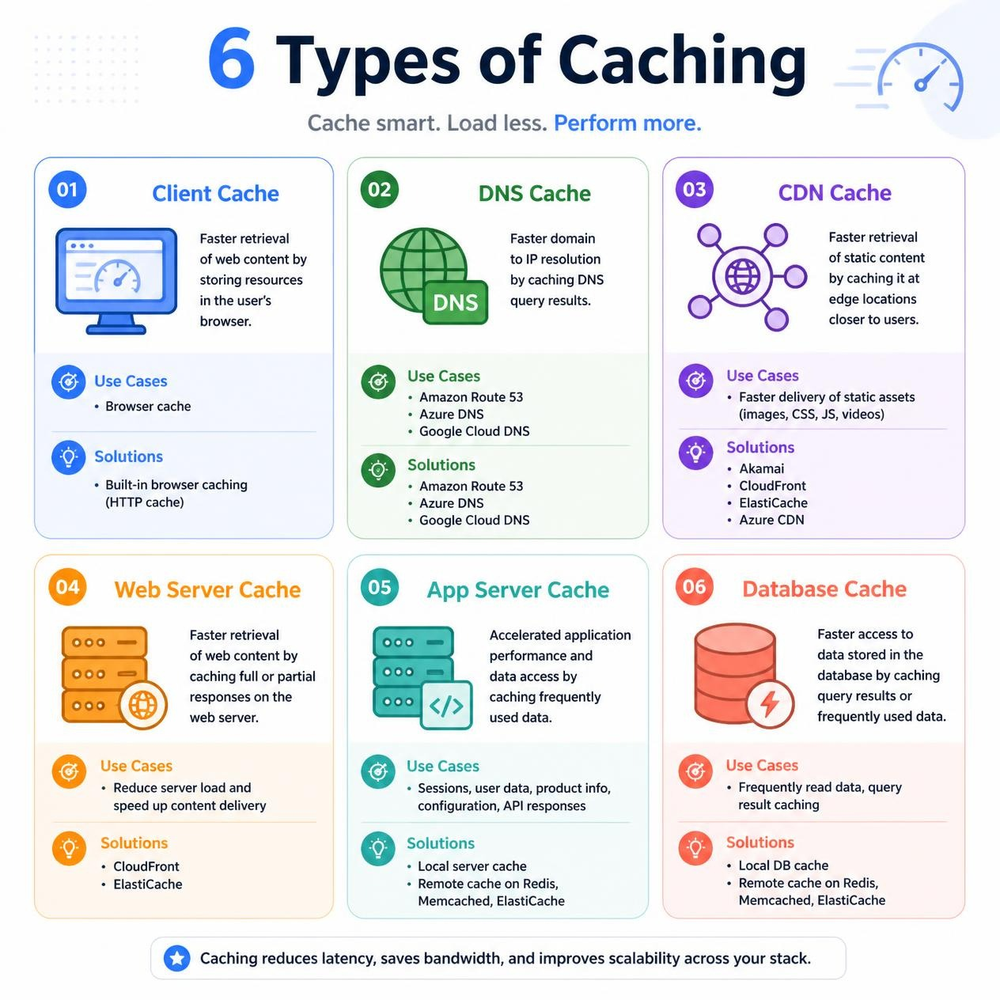
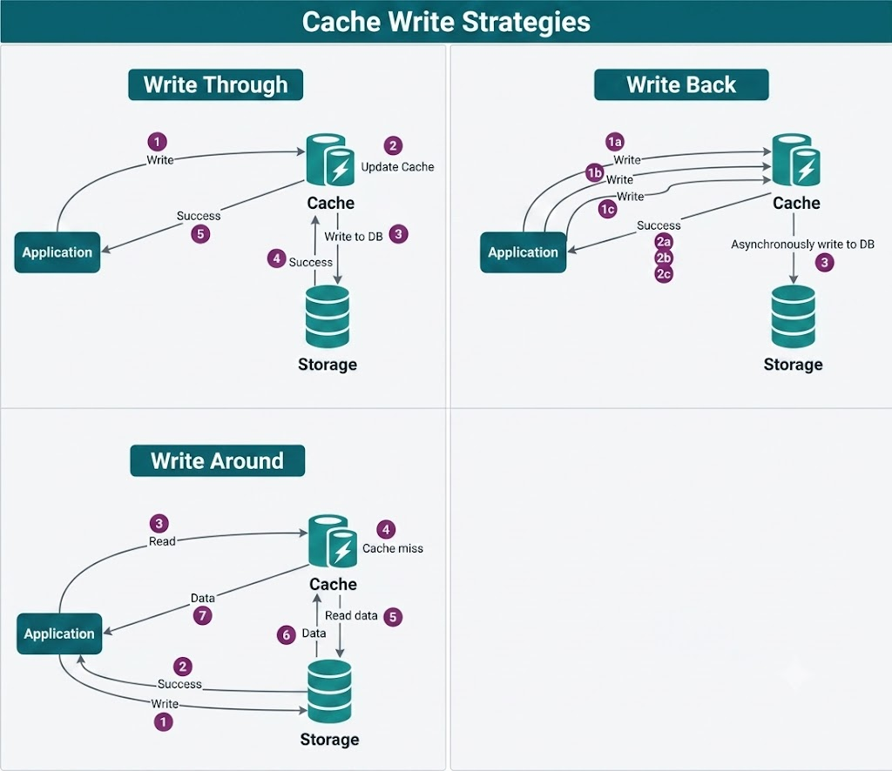
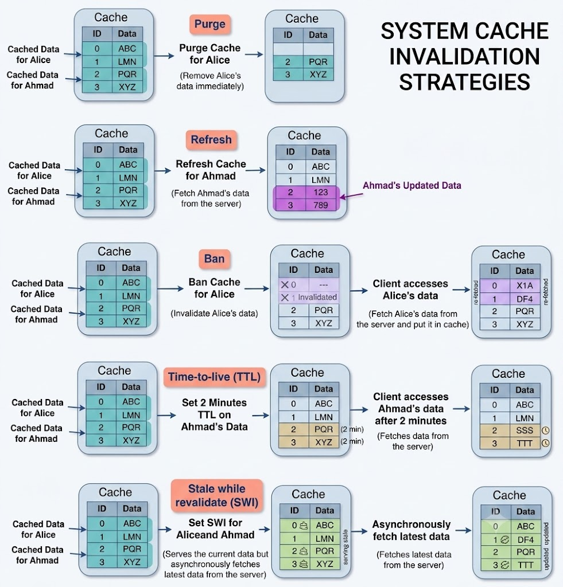
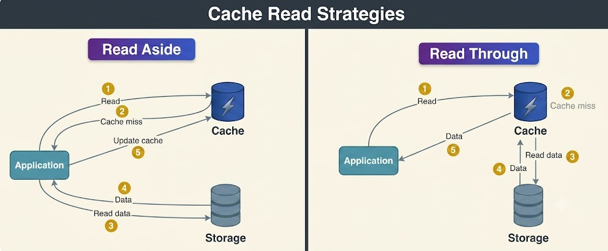

# Caching

While load balancing helps scale applications horizontally across multiple servers, caching optimizes the performance of existing resources and makes demanding latency requirements feasible. Caches capitalize on the **locality of reference** principle: data accessed recently is very likely to be requested again soon. Caching is employed at nearly every level of modern computing, including hardware CPUs, operating systems, web browsers, databases, and application backends.

---

## What is Caching?
A **cache** is a high-speed temporary storage layer positioned between an application and the primary data storage (such as a database, disk file system, or remote API). When an application requests data:
1. It first queries the cache.
2. If the data is found in the cache (**cache hit**), it is returned immediately to the application.
3. If the data is absent from the cache (**cache miss**), it is retrieved from the primary source, saved in the cache for future requests, and returned to the application.

Caching applies to diverse data types, including rendered web pages, database query results, API responses, user session states, images, and videos. The core goal of caching is to minimize expensive round-trips to the primary storage, reducing latency and hardware load while speeding up system responsiveness.

---

## Key Terminology and Concepts

1. **Cache:** A temporary, high-speed storage layer designed for rapid data retrieval.
2. **Cache Hit:** Occurs when requested data or a computed result is successfully found in the cache.
3. **Cache Miss:** Occurs when requested data is not present in the cache, requiring a fetch from the primary storage layer or recalculation.
4. **Cache Eviction:** The process of removing entries from the cache to free up memory for new items according to an eviction policy.
5. **Cache Staleness:** A state where cached data is outdated compared to the current state in the primary data source.

---

## Types of Caching

Caching can be implemented across multiple layers depending on application architecture and data access patterns:

### 1. In-Memory Caching
In-memory caching stores data in RAM, offering near-instantaneous access compared to disk storage. It is ideal for frequently accessed data that fits within allocated memory limits, such as API responses, session states, and rendered template fragments. Popular tools include **Memcached** and **Redis**.

### 2. Disk Caching
Disk caching stores data on local storage drives (SSDs or HDDs), which is slower than system RAM but significantly faster than fetching data over a network or querying remote databases. It is suited for persistent datasets or datasets too large for RAM.

### 3. Database Caching
Database caching stores frequently queried results directly within the database management system (DBMS), bypassing disk scans and complex SQL execution pipelines. Techniques include query result caching and buffer pool optimization.

### 4. Client-Side Caching
Operates directly on user devices (such as web browsers or mobile apps). Client-side caching stores static assets (CSS, JavaScript, images) in local storage or browser cache, eliminating redundant network calls to backend servers.

### 5. Server-Side Caching
Implemented on application backends to retain frequently requested data, precompiled objects, or intermediate computation results. Common patterns include object caching, fragment caching, and full-page caching.

### 6. CDN Caching
Content Delivery Networks (CDNs) cache static and dynamic assets on a globally distributed network of edge servers. CDN caching reduces access latency for geographically dispersed users by serving content from an edge node closest to the client.

### 7. DNS Caching
DNS caches temporarily store Domain Name System resolution records (domain-to-IP mappings) on operating systems, routers, and recursive resolver servers. When a user requests a domain, the system checks local DNS cache first, resolving addresses instantly without querying authoritative name servers.

---

## Cache Invalidation

While caching improves performance, ensuring data accuracy is critical. Serving outdated (stale) cache entries creates system inconsistencies. **Cache invalidation** is the mechanism used to remove or update stale cached entries when underlying data changes.

### Why Cache Invalidation Matters
- **Data Freshness:** When a database record changes (e.g., a product price update), the corresponding cached entry must be invalidated or updated to prevent users from seeing obsolete information.
- **System Consistency:** Multi-tiered architectures often maintain caches across multiple layers. Proper invalidation guarantees data consistency across all layers.
- **Performance vs. Accuracy:** Invalidation strategies balance the overhead of cache updates with the speed advantages of serving pre-cached data.
- **Error Reduction:** Timely invalidation prevents state mismatches, such as allowing users to purchase out-of-stock items.

### Cache Write Strategies

#### 1. Write-Through Cache
Data is written simultaneously to the cache and the primary database before the write operation is confirmed to the client.
- **Pros:** Guarantees complete consistency between cache and storage; data is preserved if the cache crashes.
- **Cons:** Higher write latency, as every write operation involves two synchronous writes.

#### 2. Write-Around Cache
Data is written directly to the primary database, bypassing the cache entirely.
- **Pros:** Prevents flooding the cache with write-only data that may not be read soon.
- **Cons:** Subsequent read requests for recently written data result in a cache miss and higher initial read latency.

#### 3. Write-Back (Write-Behind) Cache
Data is written immediately to the cache and success is returned to the client right away. The cache then asynchronously writes the data to the primary database at scheduled intervals or under specific conditions.
- **Pros:** Low write latency and extremely high throughput for write-heavy workloads.
- **Cons:** Risk of data loss if the cache fails before asynchronous updates are persisted to disk.

---

## Cache Invalidation Methods

- **Purge:** Instantly removes cached content for a specific object or URL path. Subsequent client requests trigger a fresh fetch from the origin server.
- **Refresh:** Fetches updated content from the origin server and updates the existing cache entry without removing it first.
- **Ban:** Invalidates cached items based on specific criteria or matching patterns (such as URL regex or HTTP headers).
- **Time-to-Live (TTL) Expiration:** Sets an expiration timer on cached entries. Once the TTL expires, the entry is flagged as stale and re-fetched on the next request.
- **Stale-While-Revalidate:** Serves stale cached content to the user instantly while asynchronously requesting an updated version from the origin server in the background.

---

## Cache Read Strategies

### Read-Through Cache
The cache layer acts as an intermediary for both reads and data fetching. When a cache miss occurs, the cache component itself fetches the data from the primary database, populates the cache entry, and returns the data to the application.
- **Pros:** Keeps application code simpler because cache miss handling is encapsulated within the caching layer.
- **Cons:** The cache library/service must be configured to connect directly to the database.

### Read-Aside (Cache-Aside / Lazy Loading)
The application code directly coordinates reading from the cache and fetching from the database. On a read request:
1. The application checks the cache.
2. On a **hit**, it uses the cached data.
3. On a **miss**, the application queries the database, writes the result to the cache for subsequent reads, and returns the result.

- **Pros:** Resilience—if the cache system fails, the application falls back directly to the database. Provides granular control over what gets cached.
- **Cons:** Adds cache management logic directly into application code.

---

## Cache Eviction Policies

When memory capacity is reached, an eviction policy determines which items to discard to accommodate new entries:

- **First In First Out (FIFO):** Evicts the oldest cached block regardless of access frequency or recency.
- **Last In First Out (LIFO):** Evicts the most recently added block first.
- **Least Recently Used (LRU):** Evicts the item that has not been accessed for the longest period of time.
- **Most Recently Used (MRU):** Discards the most recently accessed item first.
- **Least Frequently Used (LFU):** Tracks access counts and discards items with the lowest access frequency.
- **Random Replacement (RR):** Randomly selects candidate items for eviction to free up space.
