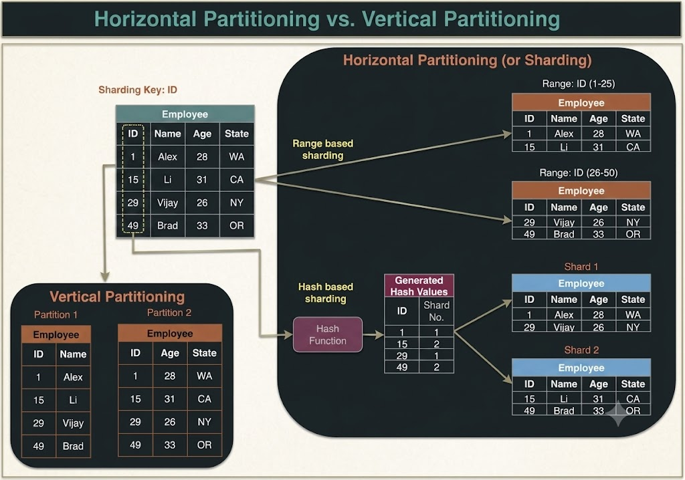

# Data Partitioning

Data partitioning is the process of dividing a large database into smaller, more manageable subsets known as **partitions** or **shards**. Each partition functions independently and holds a subset of the complete dataset.

During partitioning, data is segregated according to specific criteria, such as data ranges, size thresholds, or entity types. Each partition is assigned to a distinct processing node, enabling independent operations and parallel query execution across nodes.

Partitioning significantly improves performance and scalability in large-scale systems by distributing computational tasks, reducing network data transfer, and lowering query execution times. Furthermore, distributing data across multiple servers balances workloads and enhances overall request handling capacity.

Data partitioning can be executed through several core techniques, including **Horizontal Partitioning**, **Vertical Partitioning**, and **Hybrid Partitioning**.

---

## 1. Partitioning Methods

Designing an optimal partitioning strategy requires evaluating application access patterns and data characteristics. Below are three widely used partitioning methods in distributed systems:

### a. Horizontal Partitioning (Sharding)
Horizontal partitioning (commonly referred to as **sharding**) involves splitting a database table by **rows**, where each partition or shard contains a distinct subset of rows. Each shard is hosted on a separate database server, enabling parallel processing and accelerated query performance.

- **Example:** A social media platform might partition its user table based on geographic location (e.g., US users in Shard A, European users in Shard B). When a user logs in, queries are routed directly to the relevant geographic shard, reducing scanned data volume.
- **Challenge:** If the partition key or range is chosen poorly, it leads to unbalanced shards (hotspotting). For instance, geographic sharding assumes uniform population density, which fails when certain regions have significantly higher user activity.

### b. Vertical Partitioning
Vertical partitioning involves splitting a database table by **columns**, with each partition storing a specific subset of columns. This approach optimizes query performance by decreasing I/O scans, particularly when certain columns are queried far more frequently than others.

- **Example:** An e-commerce platform might partition a customer table by separating profile details (name, address) into one shard, and transaction history and payment details into another. When fetching order history, queries access only the transaction shard.

### c. Hybrid Partitioning
Hybrid partitioning combines both horizontal and vertical partitioning techniques to divide data across shards. It optimizes system performance by ensuring even data distribution while minimizing scanned columns per query.

- **Example:** An e-commerce store might horizontally partition customer records by geographic region, and then vertically partition each regional shard by data type (profile data vs. purchase history). Each resulting shard can be deployed on distinct hardware nodes for maximum throughput.

---

## 2. Partitioning Criteria

Partitioning criteria define the rules or data attributes used to distribute records across shards:

### a. Key or Hash-Based Partitioning
A hash function is applied to a specific attribute (partition key) of a record to determine its destination partition number.
- **Example:** For 100 database servers and sequential auto-increment IDs, the hash function could be `ID % 100`. This maps each record ID to a server index between 0 and 99, achieving uniform data distribution.
- **Limitation:** The number of database servers is fixed. Adding or removing servers alters the hash modulus, requiring data redistribution across nodes and causing service downtime. **Consistent Hashing** is commonly used to resolve this limitation.

### b. List Partitioning
In list partitioning, each partition is explicitly assigned a fixed list of values. When a record is inserted, the system matches the record's key against the defined value lists to determine the target partition.
- **Example:** Storing users from Iceland, Norway, Sweden, Finland, and Denmark together within a designated "Nordic Countries" partition.

### c. Round-Robin Partitioning
A simple partitioning scheme where tuples are distributed sequentially across $n$ partitions. The $i$-th tuple is assigned to partition $(i \pmod n)$, ensuring uniform data distribution regardless of key attributes.

### d. Composite Partitioning
Composite partitioning combines multiple partitioning criteria into a multi-tiered routing scheme (e.g., applying list partitioning first, followed by hash partitioning on sub-partitions). Consistent hashing can be viewed as a composite scheme where a hash function maps keys onto a continuous ring divided into logical lists.

---

## 3. Common Problems of Data Partitioning

Partitioning introduces multi-node complexities and operational constraints because operations spanning multiple rows or tables may no longer execute on a single physical machine:

### a. Joins and Denormalization
Executing table joins on a single-node database is straightforward. However, performing joins across partitioned database nodes is inefficient and often infeasible due to high cross-network data transfer costs.
- **Workaround:** Databases are often **denormalized** so that queries requiring joins can be served from a single table/shard. However, denormalization introduces data redundancy and potential inconsistencies across records.

### b. Referential Integrity Constraints
Enforcing foreign key constraints across partitions hosted on separate database servers is generally unsupported by RDBMS engines.
- **Workaround:** Applications must enforce referential integrity within application code or run periodic background cleanup jobs to remove orphaned references.

### c. Rebalancing and Hotspots
Rebalancing becomes necessary when data distribution is non-uniform (e.g., a single ZIP code accumulates too many records) or a partition experiences extreme traffic (hotspotting).
- **Challenge:** Creating new partitions or rebalancing existing ones requires moving large data volumes across nodes. Executing this without downtime is difficult. Using **Directory-Based Partitioning** can simplify rebalancing via a lookup service, though it adds architectural complexity and creates a potential single point of failure (SPOF).
