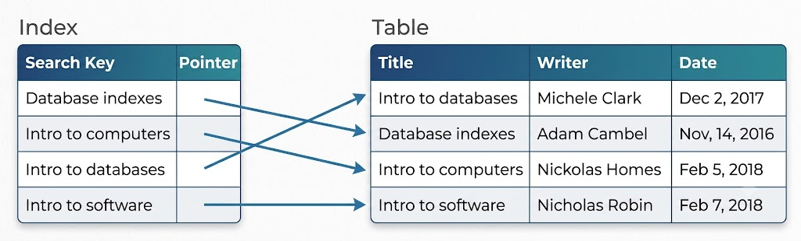

# Indexes

Indexes are fundamental components of database optimization. As databases grow, query execution performance can degrade. When database performance is no longer satisfactory, database indexing is typically one of the primary techniques engineers turn to.

The goal of creating an index on a database table is to accelerate search queries and quickly locate targeted rows. Indexes can be defined using one or multiple table columns, enabling rapid point lookups as well as efficient ordered scans.

---

## Example: A Library Catalog
Consider a library catalog that registers books available in a library. The catalog can be structured like a database table with columns for **Book Title**, **Author**, **Subject**, and **Publication Date**.

To facilitate searching, the library might maintain two separate catalogs:
1. One organized alphabetically by **Author Name**.
2. Another organized alphabetically by **Book Title**.

If a reader wants to browse works by a specific author, they consult the author catalog. If they know a book's title but not the author, they use the title catalog. These catalogs act as indexes for the library's book repository, offering sorted, easily searchable reference lists pointing directly to the book's shelf location.

---

## How Indexes Work
In simple terms, an **index** is a data structure acting like a table of contents that points directly to the physical storage location of the target data rows. When an index is created on a specific column, the index stores the values of that column alongside pointers (e.g., row IDs or disk addresses) to the full records in the primary table.

For example, on a table storing a collection of books, an index created on the `Title` column maps each title value directly to its corresponding row reference:

---

## Indexing Large-Scale Datasets
Beyond traditional relational databases, indexing principles apply equally to massive distributed datasets. When datasets grow to many terabytes while storing small record payloads (e.g., 1 KB items), indexing becomes essential for acceptable data access latency.

Scanning multi-terabyte datasets sequentially (full table scans) is computationally infeasible within reasonable timeframes. Moreover, such large datasets are typically partitioned across multiple physical servers or storage drives. Indexes provide the mapping mechanism required to locate the exact physical machine and disk offset where the requested record resides.

---

## Impact of Indexes on Write Performance
While indexes significantly accelerate read queries, they introduce write overhead. An index is a secondary data structure that must be maintained whenever underlying data changes.

### Write Performance Trade-Offs
- **Update Overhead:** When inserting, updating, or deleting rows in an indexed table, the database must write the data to the primary table and simultaneously update all associated indexes.
- **Performance Degradation:** Every write operation (`INSERT`, `UPDATE`, `DELETE`) incurs latency for index recalculation and disk I/O.
- **Best Practices:** Unnecessary or unused indexes should be identified and removed.

Index creation should be guided by query patterns. If a database is **write-heavy** (frequently written to but rarely read from), adding multiple indexes can severely degrade overall throughput without providing meaningful read benefits.
