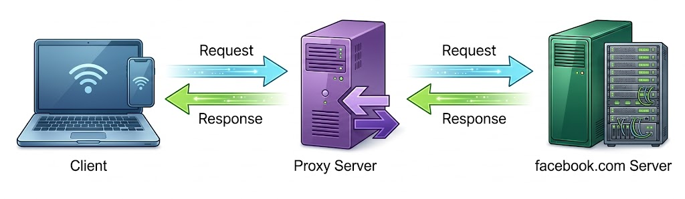
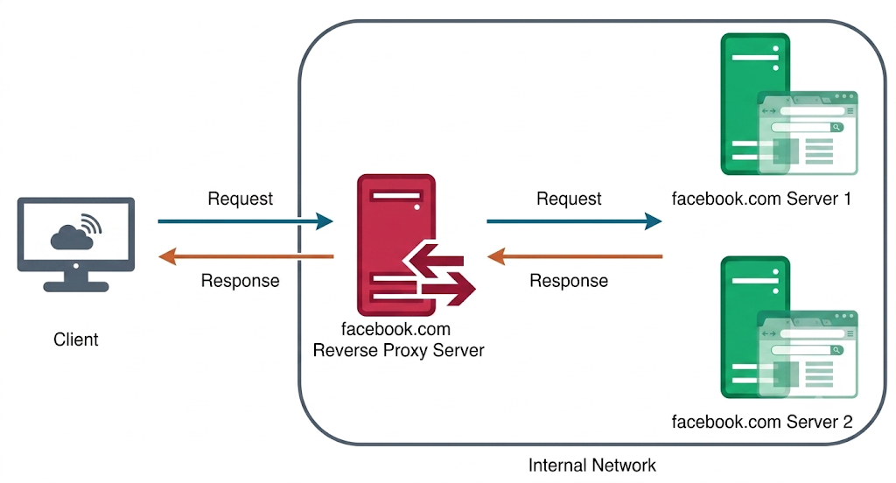
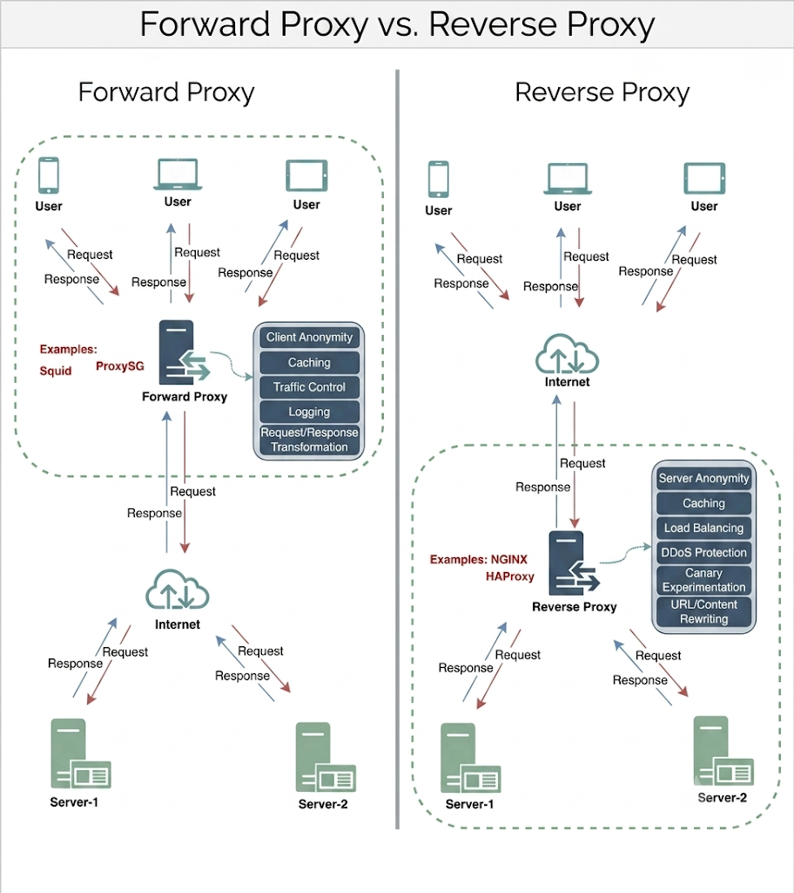

# Proxies

## What is a Proxy Server?
A proxy server is an intermediate hardware or software component positioned between client devices and destination servers. When a client requests a resource (such as a web page, file, or API payload), the request is routed through the proxy server.

Essentially, a **forward proxy** requests resources from destination servers on behalf of clients, thereby masking the client's IP address and identity from the target server.

### Functions of a Forward Proxy
Typically, forward proxies are deployed to:
- **Cache Data:** Store static resources locally to accelerate response times.
- **Filter & Log Requests:** Enforce security policies, block malicious traffic, or maintain audit logs.
- **Transform Traffic:** Modify HTTP headers, handle SSL encryption/decryption, or compress payloads.

By intercepting outgoing requests and transmitting them under its own network identity, a forward proxy conceals client details from external target servers.

### Collapsed Forwarding
Beyond routing requests, proxies can optimize system-wide network throughput using a technique known as **collapsed forwarding**. 

When multiple client nodes simultaneously request identical uncached data, routing these concurrent requests through a proxy allows it to consolidate them into a single read operation to the backend storage or database. The proxy then returns the fetched result to all requesting client nodes, ensuring data is read from disk only once.

---

## Reverse Proxy
A **reverse proxy** acts on behalf of backend servers. It intercepts incoming client requests, forwards them to one or more backend application servers, and returns the server responses to the client as if they originated directly from the reverse proxy itself. 

Unlike a forward proxy (which anonymizes the client), a reverse proxy anonymizes the backend servers, hiding internal network infrastructure and IP addresses from clients.

### How It Works
For instance, when a client requests content from `facebook.com`, the request hits Facebook's reverse proxy infrastructure. The reverse proxy evaluates the request, selects an appropriate backend server, retrieves the content, and sends the response back to the client. The client remains unaware of which specific backend server fulfilled the request.

Similar to forward proxies, reverse proxies are widely used for:
- **Load Balancing:** Distributing incoming traffic across server pools.
- **Caching:** Retaining static and dynamic assets close to the client.
- **SSL Termination & Security:** Handling TLS encryption and shielding internal servers from direct public exposure.

---

## Summary: Forward Proxy vs. Reverse Proxy

| Proxy Type | Position / Purpose | Identity Shielded | Primary Use Case |
| :--- | :--- | :--- | :--- |
| **Forward Proxy** | Sits in front of **clients** | Protects/hides **Client** identity | Internal networks, content filtering, outgoing privacy |
| **Reverse Proxy** | Sits in front of **servers** | Protects/hides **Server** identity | Load balancing, backend security, SSL termination |

- **To protect internal clients** accessing the external internet, place them behind a **forward proxy**.
- **To protect backend servers** handling incoming public traffic, place them behind a **reverse proxy**.
