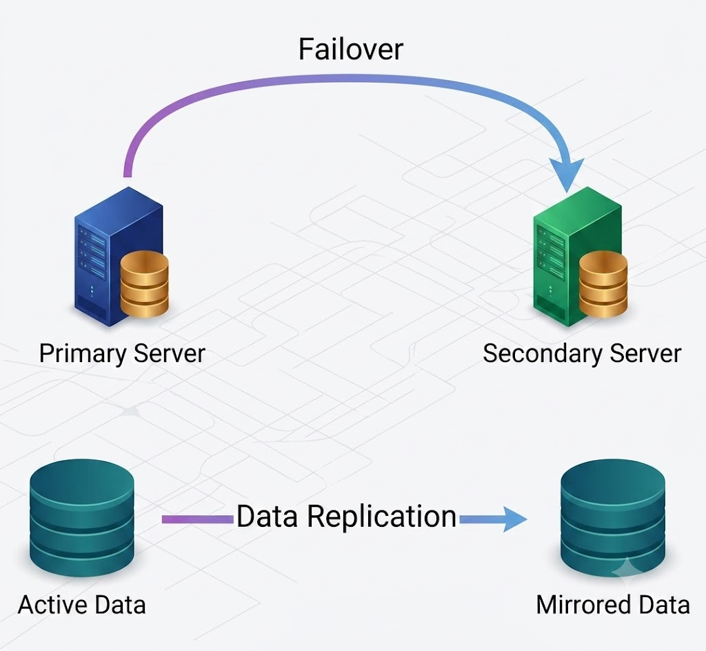
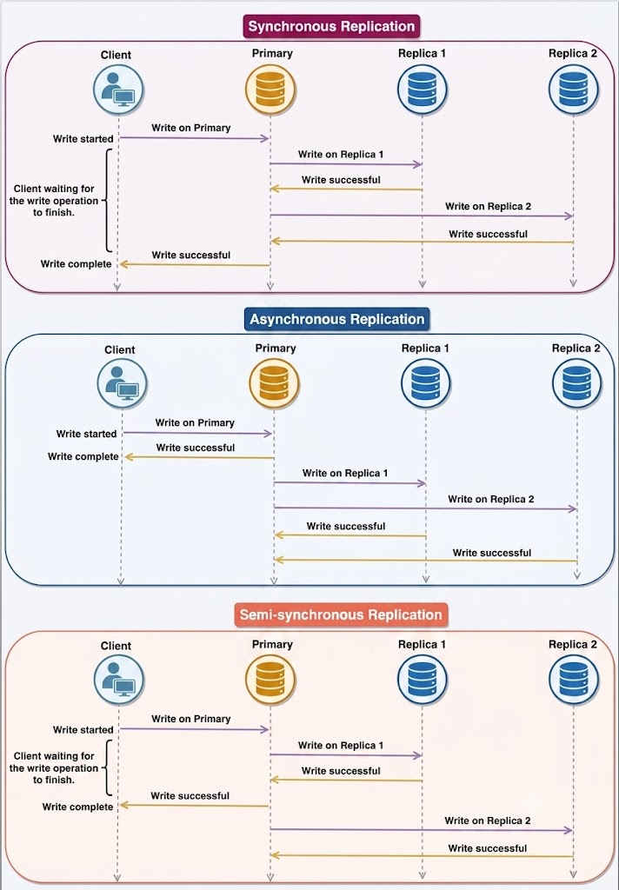

# Redundancy and Replication

## Redundancy
Redundancy is the duplication of critical system components or functions to increase overall system reliability, provide fail-safe backups, or enhance performance. For example, if a file exists on only a single server, losing that server results in permanent data loss. To mitigate this risk, redundant copies of the file are stored across multiple physical devices.

Redundancy plays a vital role in eliminating **Single Points of Failure (SPOF)** across a system architecture:
- If two production service instances are deployed and one fails, traffic automatically fails over to the healthy instance.
- Data backups ensure systems can recover quickly during outages or hardware failures.

---

## Database Replication
Database replication is the process of copying and synchronizing data across multiple database instances. In distributed systems, keeping multiple identical copies of data is essential to ensure high availability, fault tolerance, and read scalability.

Most Database Management Systems (DBMS) employ a **Primary-Replica** (Master-Slave) model:
1. The **Primary** database handles all write and update operations.
2. Changes propagated from the primary are replicated to one or more **Replica** databases.
3. Replicas confirm receipt and application of updates, allowing subsequent write transactions to proceed.

---

## Database Replication Strategies

There are three primary database replication strategies:

### 1. Synchronous Replication
In synchronous replication, changes made on the primary database must be successfully written and confirmed by replica databases before the write operation is acknowledged as complete to the client.
- **Data Consistency:** Ensures strong consistency between primary and replica nodes, as updates are reflected across all databases immediately.
- **Data Safety:** Eliminates data loss risks if the primary database fails after a write is confirmed.
- **Trade-Off:** Higher write latency, as the primary node must block until all replicas acknowledge the update.

### 2. Asynchronous Replication
In asynchronous replication, write operations on the primary database are acknowledged immediately to the client. The changes are queued and transmitted to replica nodes asynchronously at a later time.
- **Performance & Availability:** Write operations complete with minimal latency without waiting for replica confirmation. If replica nodes are down or experiencing network lag, writes on the primary still succeed.
- **Trade-Off:** Introduces replication lag, leading to temporary data inconsistency between primary and replica databases. In the event of a sudden primary failure, un-replicated changes in the queue may be lost.

### 3. Semi-Synchronous Replication
Semi-synchronous replication combines features of both synchronous and asynchronous replication. A write operation on the primary database is considered complete as soon as **at least one** replica acknowledges receiving and processing the change, while remaining replicas update asynchronously.
- **Balanced Approach:** Guarantees that at least two nodes hold the updated data (reducing data loss risk compared to pure asynchronous replication) while maintaining lower write latency than fully synchronous replication.

