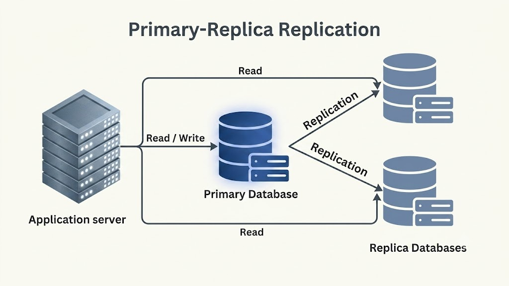
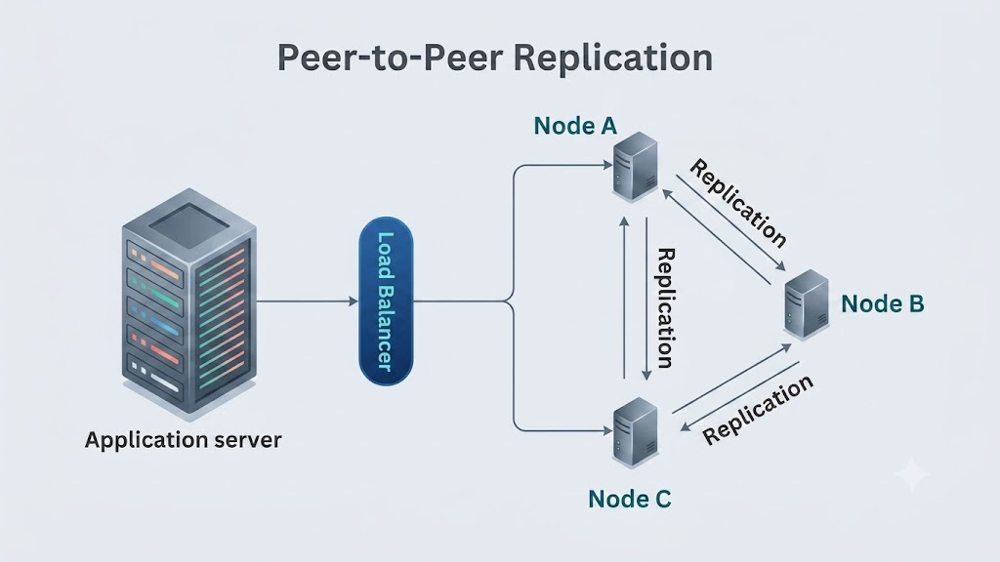

# Primary-Replica vs. Peer-to-Peer Replication

Data replication is a core strategy in distributed systems for achieving fault tolerance, high availability, and read scalability. **Primary-Replica (Master-Slave)** and **Peer-to-Peer (Master-Master / Multi-Master)** replication represent two distinct architectural paradigms for managing data updates across multiple server nodes.

---

## Primary-Replica Replication

### Definition
In **Primary-Replica Replication** (historically known as Master-Slave replication), a single designated server node—the **Primary**—handles all write operations and data updates. The Primary then propagates state changes down to one or more read-only **Replica** nodes.

### Key Characteristics
- **Unidirectional Data Flow**: Data flows strictly in one direction: from the Primary node to the Replica nodes.
- **Read/Write Splitting**: All write requests (INSERT, UPDATE, DELETE) route to the Primary. Read queries (SELECT) route across multiple Replica nodes, scaling read capacity.

### Real-World Example: Web Application Database Backend
In a relational web backend (e.g., MySQL or PostgreSQL cluster), user signups and profile updates are written to the single Primary database. Read-heavy traffic, such as rendering user feeds or browsing product catalogs, is load balanced across multiple read-only Replica databases.

### Pros & Cons
- **Pros**:
  - **Architectural Simplicity**: Easier to manage consistency and ordering since a single node processes all writes.
  - **High Read Scalability**: Easily scales read operations by spinning up additional Replica nodes.
- **Cons**:
  - **Single Point of Failure (SPOF)**: If the Primary node crashes, the system cannot process writes until failover elects a new Primary.
  - **Replication Lag**: Asynchronous replication can lead to temporary read staleness on Replicas.

---

## Peer-to-Peer Replication

### Definition
In **Peer-to-Peer Replication** (also called Multi-Master or Leaderless replication), every node (peer) in the cluster acts as both a client and a server. All nodes share equal privileges and can independently accept read and write operations.

### Key Characteristics
- **Multi-Directional Data Flow**: Data updates originate on any node and propagate in all directions across peer nodes.
- **Node Autonomy**: Each peer maintains its own copy of the dataset and can independently execute reads and writes.

### Real-World Example: BitTorrent & Distributed Databases
In P2P file-sharing networks like BitTorrent, every user (peer) simultaneously downloads file pieces from others and uploads file pieces to peer nodes. In distributed NoSQL databases like **Apache Cassandra** or **Amazon DynamoDB**, any node can accept writes for any data key.

### Pros & Cons
- **Pros**:
  - **High Availability & Decentralization**: Eliminates single points of failure; if any node fails, other peers continue serving reads and writes.
  - **Write Scalability**: Scales write capacity across the cluster by allowing writes on all nodes.
- **Cons**:
  - **System Complexity**: Complex conflict resolution mechanisms (e.g., Last-Write-Wins, Vector Clocks, CRDTs) are required to resolve concurrent write conflicts.
  - **Consensus Overhead**: Ensuring global data consistency across all peers requires extra network coordination.

---

## Key Differences

| Feature / Aspect | Primary-Replica Replication | Peer-to-Peer Replication |
| :--- | :--- | :--- |
| **Write Control** | Single Primary node handles all writes. | All peer nodes accept read and write operations. |
| **Data Flow** | Unidirectional (Primary → Replicas). | Multi-directional (Peers ↔ Peers). |
| **Architecture Type** | Centralized write control. | Fully decentralized / Leaderless. |
| **Single Point of Failure** | Yes (Primary node is critical for writes). | No (Any node failure is tolerated). |
| **Conflict Resolution** | Trivial (Primary determines write order). | Complex (Vector Clocks, CRDTs, LWW). |
| **Ideal Workload** | Read-heavy workloads with centralized control. | High-availability, multi-region write workloads. |

---

## Conclusion

The selection between Primary-Replica and Peer-to-Peer replication depends on your application's write scalability and fault tolerance requirements:
- **Primary-Replica** is ideal for traditional, read-heavy relational database applications where centralized consistency is preferred.
- **Peer-to-Peer** is suited for decentralized networks, multi-region NoSQL clusters, and fault-tolerant systems where continuous write availability is paramount.
