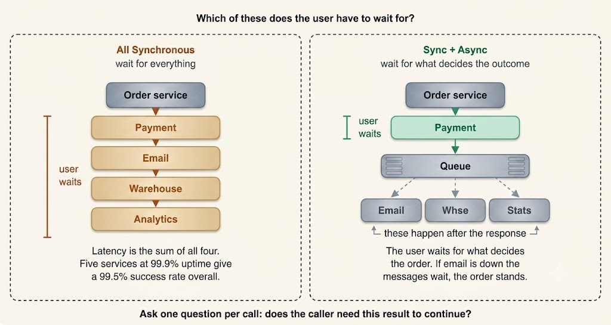

# Synchronous vs. Asynchronous Communication

A user clicks **"Place Order"**. Behind that single button click, the system must charge their payment card, persist the order record, dispatch a confirmation email, notify the fulfillment warehouse, update the recommendation machine learning model, and log analytics events.

Which of those tasks should the user wait for interactively?

Charging the card is mandatory—if payment fails, there is no order. However, no customer should sit looking at a loading spinner while an analytics pipeline processes or a recommendation model recalculates.

That core question—**does the caller require this work to finish before continuing?**—is the essence of the **Synchronous versus Asynchronous** architectural decision.

---

---

## Synchronous Communication

In synchronous communication, the caller dispatches a request and blocks execution until the recipient returns a response. Standard HTTP REST requests and gRPC calls operate synchronously.

### What It Gives You

- **Straightforward Control Flow**: Send a request, receive a response, and act on it. It reads sequentially like standard code and is easy to trace.
- **Immediate Feedback**: The caller knows instantly whether the operation succeeded or failed, making it simple to present a real result or error message to the user.
- **Simplified Debugging**: One execution thread, one call stack, and a single localized point of failure.
- **Strong Consistency at the Boundary**: When the call completes, the underlying business operation is fully committed.

### What It Costs You

- **Temporal Coupling**: Both sender and receiver must be operational at the exact same moment. If the receiving service is offline, the caller fails as well.
- **Cumulative Latency**: In a synchronous call chain where Service A calls B, which calls C, latency accumulates additively. Four microservices at $100\text{ ms}$ each force a $400\text{ ms}$ user-facing delay.
- **Multiplied Availability Degradation**: Availability compounds downward across synchronous chains. If a request depends on 5 downstream services each with $99.9\%$ availability, overall request availability drops to:
  $$0.999^5 \approx 0.995\quad (99.5\%)$$
  Adding synchronous dependencies makes a system less reliable than any of its individual components.
- **Cascading Failures**: A slow downstream service keeps caller connections and threads open, which saturates thread pools upstream. This thread exhaustion is how a single struggling dependency crashes an entire ecosystem—necessitating timeouts, retries with exponential backoff, and circuit breakers.

---

## Asynchronous Communication

In asynchronous communication, the caller hands off the workload—typically to a message queue or event stream—and immediately continues execution. A separate consumer picks up and processes the message asynchronously.

### What It Gives You

- **Rapid Caller Returns**: The caller waits only for the message broker to acknowledge receipt of the message, not for the underlying work to execute.
- **Failure Isolation**: If the email service is down, messages buffer safely in the queue. The user's order succeeds, and the confirmation email dispatches automatically when the service recovers.
- **Spike Absorption**: Sudden traffic bursts that would overload a service accumulate in a queue, draining steadily at the consumer's capacity. The queue absorbs depth instead of the system crashing.
- **Independent Elastic Scaling**: Consumers scale based on queue depth metrics, independently from the producers generating the load.
- **Decoupled Architecture**: Producers publish an `"order.placed"` event without knowing or caring which services consume it. Adding a new downstream subscriber requires zero changes to the publisher.

### What It Costs You

- **Eventual Consistency**: The order exists immediately, but the confirmation email or warehouse record updates later. User interfaces must reflect this with states like `"Processing"`.
- **Infrastructure Overhead**: Operating distributed brokers like Apache Kafka, RabbitMQ, or AWS SQS adds real operational complexity.
- **Duplicate Processing**: Most message queues guarantee **at-least-once delivery**, meaning consumers can receive identical messages twice. Handlers must be strictly **idempotent** (e.g., charging a card twice due to duplicate delivery is a critical production failure).
- **Ordering Complexity**: Messages may arrive out of order unless explicitly partitioned by a key, which caps throughput to single-partition limits.
- **Harder Distributed Debugging**: A single user action breaks into disconnected processing steps, requiring **correlation IDs** and distributed tracing tooling (e.g., Jaeger, OpenTelemetry).
- **Silent Failures**: Because callers do not wait for answers, consumer failures can go unnoticed without dedicated **Dead Letter Queues (DLQs)** and automated alerting.

---

## Requesting Answers Asynchronously

Choosing asynchronous design does not prevent callers from obtaining results. Two standard patterns bridge this gap:

1. **Request-Reply over Queues**: The producer attaches a unique `correlation_id` and listens on a dedicated reply channel. While functional, this reintroduces waiting—so evaluate whether a direct synchronous call is simpler.
2. **Accept and Poll (HTTP 202)**: The API responds immediately with `202 Accepted` and a `job_id`. The client polls a status endpoint or receives a push notification via WebSockets or Webhooks upon completion. This is standard for heavy video rendering, report generation, and bulk data imports.

---

## Architectural Decision Framework

The core test is simple: **Does the caller require the result in order to proceed?**

### Use Synchronous Communication When:
- The result directly determines the immediate next step (e.g., authentication, payment gateway authorization, stock availability validation).
- Reading data to render an interactive UI response.
- The user must confirm the definitive final outcome immediately.

### Use Asynchronous Communication When:
- The task is a side-effect (e.g., emails, push notifications, search index updates, analytics logging).
- The operation takes seconds or minutes—long-running tasks must not block user threads.
- Multiple downstream systems must react to an event without blocking the initial response.
- Traffic is spiky and buffering via queues is preferable to over-provisioning hardware.

---

## Comparison Matrix

| Dimension | Synchronous Communication | Asynchronous Communication |
| :--- | :--- | :--- |
| **Caller Behavior** | Thread blocks waiting for response | Returns immediately after message dispatch |
| **Simultaneous Availability** | Required (Both services online) | Not required (Broker buffers messages) |
| **User-Perceived Latency** | Sum of all synchronous call hops | Time to accept message into queue |
| **Dependency Outages** | Immediate failure of caller request | Work buffers safely in queue |
| **Traffic Spike Handling** | Hits downstream services directly | Absorbed by queue backpressure |
| **Data Consistency** | Immediate strong consistency | Eventual consistency |
| **Infrastructure Needed** | None (Direct network call) | Message Broker (Kafka, RabbitMQ, SQS) |
| **Primary Failure Hazard** | Cascading failure & thread exhaustion | Duplicate delivery & out-of-order messages |

---

## Real-World Hybrid Architecture

Most real-world requests utilize **both** patterns together.

For example, placing an e-commerce order:
1. **Synchronously**: Validate stock, charge the payment card, and commit the order record—because these steps dictate whether the order exists.
2. **Asynchronously**: Emit an `"order.placed"` event to a message broker. Email, warehouse, analytics, and recommendation services consume the event on their own schedules.

The user waits only for the two critical steps that matter and nothing else.

---

## 💡 System Design Interview Strategy

When adding a message queue in an interview, state both the benefit and the trade-off in one sentence:

> *"Email processing goes onto an asynchronous queue so a mail provider outage cannot fail an order, meaning the user sees 'Confirmation on its way' rather than a failed order."*

Be prepared for two standard follow-up questions:
1. **"What if the message is delivered twice?"** $\rightarrow$ Answer with **Idempotency Keys** and deduplication tables.
2. **"What if the consumer keeps failing?"** $\rightarrow$ Answer with **Retries with Exponential Backoff** and routing persistent failures to a **Dead Letter Queue (DLQ)** with alerting.

If asked why not make everything asynchronous, cite the **availability multiplication math** ($0.999^5 \approx 99.5\%$): every synchronous hop removed from the critical path removes its failure rate from your user-facing uptime number.

---

## Key Takeaway

- **Synchronous calls** block the caller until work finishes, offering simple control flow and immediate feedback, but coupling services in time, accumulating latency, and multiplying failure rates.
- **Asynchronous messaging** hands work off to a queue so callers return instantly, isolating failures and absorbing traffic bursts—at the cost of eventual consistency, running message brokers, and managing duplicate or out-of-order deliveries.
- Decide per call by asking whether the caller needs the result to continue, and design real-world systems to use synchronous calls for critical core logic and asynchronous messaging for side-effects.
