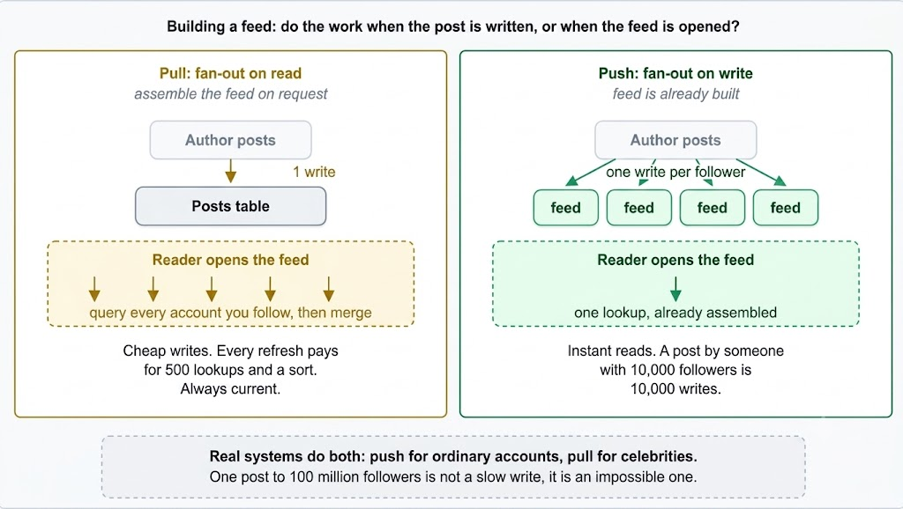

# Push vs. Pull Architecture

Suppose you follow 500 accounts on a social network. You open the application, and your timeline feed loads in under a second.

Where did that timeline come from? Either the system dynamically assembled it right now by querying all 500 accounts, or it was already sitting precomputed because every one of those 500 posts was copied into your timeline buffer the moment it was published.

That decision—**Push versus Pull**—is one of the most fundamental architectural trade-offs in system design.

- **Pull** means the data consumer requests data when it is ready.
- **Push** means the data producer transmits data as soon as it is published.

---

---

## The Classic Scenario: Building a Timeline Feed

The clearest illustration of this trade-off is assembling a social media timeline feed. The two architectural approaches have distinct names:

### 1. Fan-out on Read (Pull)

When an author publishes a post, it is written once to the author's own timeline. Nothing further happens at write time.

When a follower opens their feed, the system queries all 500 accounts they follow, fetches their recent posts, merges them in memory, sorts them chronologically, and returns the top results.

- **Writes are cheap**: One post requires exactly one database write, regardless of follower count.
- **Reads are expensive**: Loading a feed requires 500 database lookups plus in-memory sorting, repeating on every refresh.
- **Always current**: Readers fetch live data directly, so there is no fan-out lag or stale data.

### 2. Fan-out on Write (Push)

When an author publishes a post, the system immediately writes a copy of that post ID into the precomputed feed buffer of every follower.

When a follower opens their feed, the timeline is already built and ready.

- **Reads are cheap**: A single key-value lookup retrieves a precomputed timeline, delivering near-instant feed rendering.
- **Writes are expensive**: A single post by an account with 10,000 followers triggers 10,000 separate database writes.
- **Higher storage consumption**: The same post ID is duplicated across thousands of follower feed lists.

---

## The Celebrity Problem

Fan-out on write breaks at high-follower accounts. An account with 100 million followers would require **100 million writes for a single post**. That operation is too slow for real-time execution and would block database write queues across the entire platform.

To solve this, large-scale systems employ a **Hybrid Fan-out Architecture**:

- **Push for Standard Accounts**: The vast majority of users have a manageable follower count, so fan-out on write is cheap and their posts land in follower timelines instantly.
- **Pull for High-Follower Accounts**: Posts from celebrity accounts are not fanned out at write time. Instead, when a user loads their feed, the system fetches their precomputed timeline and merges in recent posts from the celebrity accounts they follow.

This hybrid model delivers rapid reads for the common case while avoiding write explosions for celebrity accounts. Explaining this hybrid design and its underlying rationale is a strong positive signal in system design interviews.

---

## Where Else Push vs. Pull Appears

The Push vs. Pull paradigm applies broadly across system architecture:

1. **Message Queues**: Apache Kafka consumers pull message batches at their own pace, gaining natural **backpressure protection**—a slow consumer simply requests less data while the log absorbs the backlog. Conversely, brokers pushing messages directly risk overwhelming slow consumers.
2. **Monitoring Infrastructure**: Prometheus pulls metrics by scraping HTTP `/metrics` endpoints on a schedule. StatsD and APM agents push metrics directly to a central collector. Pull simplifies health checks (a failed scrape indicates service outage), whereas push handles ephemeral serverless tasks that terminate quickly.
3. **Client Updates**: Polling represents client pull, whereas WebSockets and Webhooks represent server push.
4. **Cache Management**: Populating a cache lazily upon a cache miss is pull; proactively writing updated data into a cache upon database writes is push.

---

## Technical Comparison Matrix

| Trade-off Dimension | Pull Architecture | Push Architecture |
| :--- | :--- | :--- |
| **Initiator** | Data Consumer | Data Producer |
| **Execution Point** | At Read Time | At Write Time |
| **Read Cost** | High (Computed per request) | Low (Precomputed lookup) |
| **Write Cost** | Low (Single write) | High (One write per recipient) |
| **Freshness** | Always real-time current | Current once fan-out finishes |
| **Storage Overhead** | Low (Single copy stored) | High (Duplicated across recipient feeds) |
| **Flow Control** | Consumer sets ingestion rate | Producer can overwhelm consumer |
| **Breaks Down When** | Reads are frequent & heavy to assemble | One producer has huge follower counts |

---

## Core Rule of Thumb

> **Push moves computation work from read time to write time.**

This trade-off is optimal when **reads outnumber writes**, which is typical for social feeds where a post is created once but read thousands of times. Paying extra compute cost at write time to make every read fast is the correct trade-off. Reversing the read-to-write ratio reverses the architectural choice.

### When to Choose Pull vs. Push:

- **Use Push** when reads far outnumber writes and reading requires expensive data aggregation (precompute it).
- **Use Pull** when writes outnumber reads or most written data is never read (do not compute unused data).
- **Use Hybrid** when a small fraction of producers have massive recipient audiences (Push for the many, Pull for the celebrity few).
- **Use Pull** when consumers require explicit backpressure control.
- **Use Pull** when data must be strictly up-to-date at read time without fan-out lag.

---

## 💡 System Design Interview Strategy

In any feed, timeline, or notification system design question, present both options and commit to the **Hybrid Architecture**:

> *"We use fan-out on write so reads are a single key-value lookup, but we bypass fan-out for accounts above ~100,000 followers to prevent write explosions. Celebrity posts are merged in asynchronously at read time."*

Expect two follow-up questions:
1. **"Where does the fan-out write happen?"** $\rightarrow$ Explain that fan-out tasks are pushed to an asynchronous task queue (e.g., Kafka/RabbitMQ worker pool) so author posts return immediately without blocking the user.
2. **"How do you handle consumer load?"** $\rightarrow$ Mention that pull-based workers provide built-in backpressure protection.

---

## Key Takeaway

- **Pull** has consumers request data and assemble it at read time, keeping writes cheap and reads expensive.
- **Push** has producers deliver data as it is written, making reads cheap and writes expensive.
- Push shifts work from read time to write time, which is optimal for read-heavy systems.
- Fan-out on write breaks for high-follower accounts, which is why real-world systems use **Push for standard accounts and Pull for celebrity accounts**.
