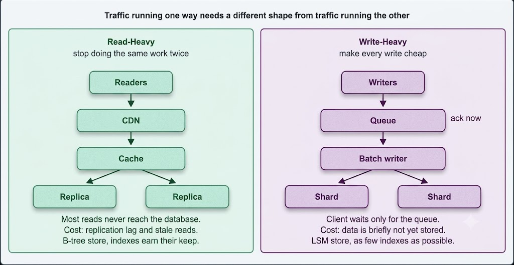

# Read-Heavy vs. Write-Heavy System

Before choosing a database or caching strategy, work out which direction your traffic runs. A system where reads outnumber writes a hundred to one and a system where writes arrive faster than anything reads them are optimised in almost opposite directions.

- **Read-heavy systems** serve far more reads than writes: news sites, product catalogues, social feeds, most public web applications.
- **Write-heavy systems** take in more writes than they serve reads: logging and metrics pipelines, IoT sensor ingestion, clickstream collection, chat delivery.

The first step is to estimate the ratio, because it determines the shape of everything downstream.

---

---

## Designing for Read-Heavy Systems

The strategy is straightforward: stop the same work being done twice. Almost every technique below is a form of that principle.

**1. Cache aggressively.** The single biggest lever. Put frequently read data in Redis or Memcached so most reads never reach the database. A news site where everyone loads the same ten articles can serve nearly all traffic from memory.

**2. Add read replicas.** Writes go to a primary, reads are spread across replicas. This scales reads almost linearly by adding machines. The cost is replication lag: a replica may be a few hundred milliseconds behind, so a user can write something and not see it on the next read. The common fix is to route a user's own reads to the primary for a short window after they write, ensuring they always see their own changes.

**3. Put a CDN in front of static and shared content.** Images, video, scripts, and even whole pages for anonymous visitors never need to touch your servers.

**4. Index for your queries.** Indexes are the read-heavy system's best friend. A query filtering on an unindexed column scans the entire table.

**5. Denormalise.** Storing data pre-joined means reads do less work. You accept duplication and the overhead of keeping copies in sync, in exchange for reads that are a single lookup.

**6. Precompute.** If a value is read constantly but changes rarely, compute it on write and store the result. A follower count read a million times and updated occasionally should never be a `COUNT(*)`.

**7. Shard.** Partition data across servers so no single machine carries the full read load.

---

## Designing for Write-Heavy Systems

Here the strategy differs: make each write cheap, and never make the client wait for work that can happen later.

**1. Choose a store built for writes.** Cassandra, and time-series databases like InfluxDB or TimescaleDB, are engineered for high write throughput. See the section below on why.

**2. Keep indexes to a minimum.** Every index must be updated on write, so indexes speed up reads at the cost of writes. The best index for a write-heavy table is the one that doesn't exist.

Where indexes are necessary, optimise the ones you have. On a B-tree database such as MySQL or Postgres, the shape of the primary key drives write performance. A sequential key (auto-increment, or a time-ordered UUIDv7) appends to the right edge of the tree and rarely disturbs existing pages. A random UUIDv4 forces inserts into the middle, causing page splits and fragmentation.

**3. Batch writes.** Writing a thousand log lines in one statement is far cheaper than a thousand individual statements, because per-operation overhead dominates at that volume.

**4. Write asynchronously.** Accept the write into a queue such as Kafka, acknowledge the client immediately, and let consumers persist it at their own pace. This also absorbs spikes: the queue buffers a burst that would otherwise overwhelm the database.

**5. Use Write-Ahead Logging (WAL).** Append the change to a sequential log first, acknowledge once that log entry is durable, and merge it into the main data files afterwards in the background.

This is faster because of how disks behave, not because the log is a cache. Appending to the end of one file is sequential I/O, while updating rows in place means seeking to scattered pages. Batching those scattered updates and applying them later turns many random writes into a few sequential ones. The data is durable the moment the log entry is written, so a crash loses nothing — though anything reading the underlying files directly may briefly be behind.

**6. Shard by write key.** Spread writes across machines so no single node becomes the ceiling. Choose the key carefully: sharding by timestamp sends every current write to one shard, which is the classic hotspot mistake.

**7. Separate reads from writes (CQRS).** Use one model optimised for writing and a separate one — built from those writes — optimised for reading.

---

## Why Storage Engines Differ: B-Tree vs. LSM-Tree

This is the read-vs-write trade-off made concrete, and it explains why the database recommendations above differ.

**B-trees** (PostgreSQL, MySQL/InnoDB) keep data sorted in a tree of fixed-size pages and update rows in place. Finding a row is a short walk down the tree, so reads are fast and predictable. A write has to locate the right page and modify it — a random write — and may need to split a page.

**LSM-trees** (Cassandra, RocksDB, LevelDB, HBase) never update in place. Writes go to an in-memory table, which is flushed to disk as a sorted immutable file when it fills. Background compaction merges those files. Every write is a sequential append, which is why LSM engines absorb writes so efficiently. The cost is that a read may need to check several files before finding the current value, so reads are slower and less predictable, and compaction consumes I/O in the background.

> **The trade-off in one line:** B-trees pay on write to make reads fast. LSM-trees pay on read to make writes fast. If someone asks why Cassandra handles a firehose of writes better than Postgres, this is the answer.

---

## Comparison

| | Read-Heavy | Write-Heavy |
|---|---|---|
| **Main lever** | Caching and replicas | Async ingestion and batching |
| **Indexes** | Add them — they earn their cost | Minimise them — they are a tax on writes |
| **Data model** | Denormalised, precomputed | Append-only, minimal work per write |
| **Storage engine** | B-tree suits it | LSM-tree suits it |
| **Scaling reads** | Replicas | Rarely the problem |
| **Scaling writes** | Rarely the problem | Sharding by a well-chosen key |
| **Main risk** | Serving stale data | Falling behind and losing data |

---

## Most Real Systems Are Both

Few systems are purely one or the other. The useful approach is to classify per data type rather than per system.

A social network is read-heavy for the timeline and write-heavy for the event log behind it. A commerce site is read-heavy for the catalogue and write-heavy for analytics. Those often deserve different stores: Postgres for orders, Cassandra for the activity stream, Redis in front of the catalogue.

---

> 💡 **Interview tip:** State the ratio early, out loud, because it justifies the rest of your design. *"A hundred reads per write, so I am optimising for reads: cache, replicas, denormalised timeline"* is one sentence that demonstrates you are designing rather than just listing components. If asked to make a write-heavy system faster, do not reach for indexes — that is backwards. Reach for batching, async ingestion through a queue, and a storage engine suited to writes. Naming the B-tree vs. LSM-tree distinction is a strong signal, because it shows you understand *why* the database recommendation changes rather than just memorising which name goes with which workload.

---

## Conclusion

**Read-heavy systems** reduce repeated work with caching, read replicas, CDNs, indexes, denormalisation, and precomputation — accepting some staleness. **Write-heavy systems** make each write cheap through batching, asynchronous ingestion, sharding, and write-ahead logging — keeping indexes to a minimum because every index taxes every write. B-trees pay on write to make reads fast; LSM-trees pay on read to make writes fast. Classify each data type separately rather than treating the whole system as one thing.
