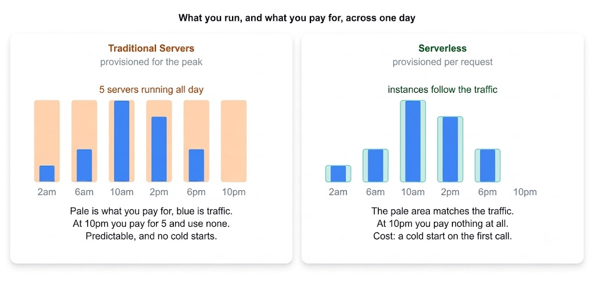

# Serverless Architecture vs. Traditional Server-Based

Serverless architecture and traditional server-based architecture represent two distinct approaches to deploying and managing applications and services, particularly in cloud computing.

---

---

## Serverless Architecture

**Definition:** In serverless architecture, the cloud provider dynamically manages the allocation and provisioning of servers. Developers write and deploy code without needing to concern themselves with the underlying infrastructure.

> **Serverless ≠ Functions.** Serverless describes *who manages the infrastructure*, not how your code is packaged. Functions-as-a-Service (AWS Lambda, Cloud Functions, Azure Functions) is the most well-known form, but containers can be serverless too (AWS Fargate, Google Cloud Run), and so can databases (DynamoDB, Aurora Serverless). This distinction matters because the drawback most commonly cited for serverless — **cold starts** — is a property of the function model rather than of serverless itself. A Fargate service with a minimum task count has no cold start and behaves much like a traditional server that someone else patches.

### Characteristics

- **Dynamic Scaling:** Automatically scales up or down based on demand.
- **Billing Model:** Costs are based on actual usage — for example, the number of function executions or total execution time.
- **Stateless:** Functions are typically stateless and triggered in response to events.

**Example:** A photo-sharing application where backend operations (such as resizing uploaded images or processing metadata) are handled by serverless functions. These functions execute in response to events (like an image upload), and the developer has no servers to maintain or scale.

### Advantages

- **Reduced Operational Overhead:** Eliminates the need to manage servers.
- **Cost-Effective:** Pay only for what you use, which can significantly reduce costs for variable workloads.
- **High Scalability:** Automatically scales with application load.

### Disadvantages

- **Limited Control:** Less control over the environment and underlying infrastructure.
- **Cold Starts:** A function that hasn't run recently must be initialized before it can handle a request, adding latency to that first invocation. This applies to the function model, not to always-on serverless containers.
- **Execution Limits:** Functions are subject to caps on run time, memory, and payload size, so long-running jobs must be split or offloaded elsewhere.
- **No Long-Lived Connections:** Functions are short-lived and cannot hold open connections, making it impossible to run a WebSocket server on them directly. A managed connection layer in front is required.
- **Database Connections:** Thousands of concurrent function instances each opening their own database connection can exhaust a traditional connection pool. This typically requires a proxy such as RDS Proxy, or a datastore designed for high connection counts.
- **Cost Inversion at Steady Load:** Pay-per-use pricing is economical for spiky or low traffic, but can become more expensive than reserved instances once load is consistently high.
- **Vendor Lock-In:** Functions bind tightly to a single provider's triggers, identity model, and deployment tooling, making migration a significant undertaking.

---

## Traditional Server-Based Architecture

**Definition:** In traditional server-based architecture, applications are deployed on servers that must be provisioned, maintained, and scaled by the developer or operations team.

### Characteristics

- **Fixed Resources:** Servers have fixed capacity and must be scaled manually.
- **Continuous Operation:** Servers run continuously, regardless of demand.
- **Billing Model:** Typically involves ongoing costs irrespective of usage, including server maintenance and operation.

**Example:** A company website hosted on a dedicated or shared server. The server runs around the clock, and the team is responsible for applying updates, managing security, and scaling resources during traffic spikes.

### Advantages

- **Full Control:** Complete authority over the server environment and infrastructure.
- **Flexibility:** Greater flexibility in configuring and optimizing the server setup.

### Disadvantages

- **Higher Costs:** Incurs costs for unused capacity and continuous server maintenance.
- **Operational Complexity:** Requires active, ongoing management of server infrastructure.

---

## Key Differences

| Aspect | Serverless | Traditional Server-Based |
|---|---|---|
| **Infrastructure Management** | Abstracted away by the cloud provider | Requires active management by the team |
| **Scaling** | Automatically scales with demand | Requires manual scaling |
| **Cost Model** | Pay-as-you-go based on actual usage | Continuous costs for server operation |

---

## Conclusion

Serverless architecture is well-suited for applications with variable or unpredictable workloads, where simplifying operational management and minimizing costs are priorities. Traditional server-based architecture remains appropriate for applications that require extensive control over the environment and predictable, consistent performance. The right choice depends on specific application requirements, workload patterns, and operational preferences.
