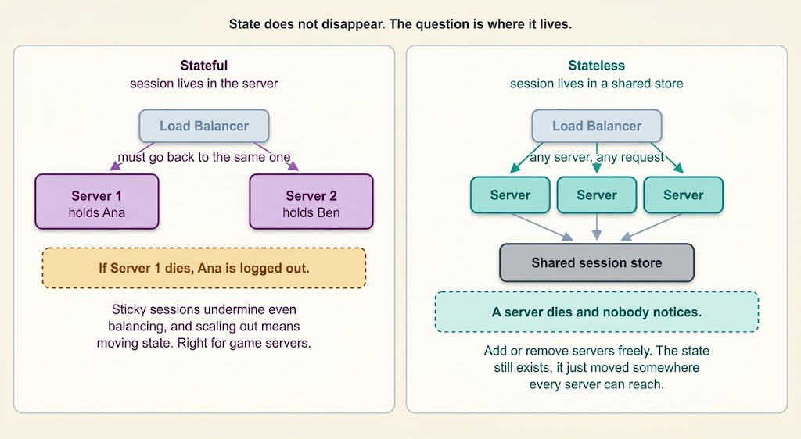

# Stateful vs. Stateless Architecture

Stateful and stateless architectures are two approaches to managing user information and data processing in software applications, particularly in web services and APIs.

---

---

## Stateful Architecture

**Definition:** In a stateful architecture, the server retains information (or state) about the client's session. This state is used to remember previous interactions and respond appropriately to future ones.

### Characteristics

- **Session Memory:** The server remembers past session data, which influences its responses to subsequent requests.
- **Dependency on Context:** The response to a request can depend on prior interactions.

**Example:** A real-time multiplayer game server holds the match state in memory while the match is running. Persisting every movement to a database would be far too slow, so the server keeps the authoritative state itself, and players are routed to the specific server running their match.

### Advantages

- **Personalized Interaction:** Enables more personalized user experiences based on previous interactions.
- **Easier to Manage Continuous Transactions:** Convenient for transactions that require multiple steps.

### Disadvantages

- **Resource Intensive:** Maintaining state can consume more server resources.
- **Scalability Challenges:** Scaling a stateful application can be more complex due to session data dependencies.

---

## Stateless Does Not Mean There Is No State

This is the point most explanations skip, and without it the distinction can seem arbitrary. Almost every useful application has state. Your shopping cart, your login session, your draft message — all of it has to live somewhere.

Calling a service **stateless** does not mean the state has vanished. It means the state does not live inside the server process. Instead, it moves to a shared location: a database, a Redis instance, or a signed token held by the client. Any server can then handle any request, because none of them own something the others lack.

That is also why an online banking application is a poor example of a stateful server, even though it clearly remembers who you are. Your session lives in a shared store keyed by a cookie or token, and any application server can serve your next request. The **system** has state. The **servers** do not.

---

## Stateless Architecture

**Definition:** In a stateless architecture, each request from the client to the server must contain all the information needed to understand and complete the request. The server does not rely on information from previous interactions.

### Characteristics

- **No Session Memory:** The server stores no state about the client's session.
- **Self-Contained Requests:** Each request is independent and must include all necessary data.

**Example:** RESTful APIs are a classic example of stateless architecture. Each HTTP request to a RESTful API contains all the information the server needs to process it (such as authentication credentials and required data), and the response to each request does not depend on past requests.

### Advantages

- **Simplicity and Scalability:** Easier to scale because there is no need to maintain session state.
- **Predictability:** Each request is processed independently, making the system more predictable and easier to debug.

### Disadvantages

- **Redundancy:** Can lead to repetitive data being sent with each request.
- **Potentially More Complex Requests:** Clients may need to handle more complexity when preparing requests.

---

## Why Stateless Is the Default

Stateless is the default for backend services, and it is worth understanding why:

- **Scaling is trivial.** Add a server and it can serve traffic immediately. Nothing needs to be migrated to it.
- **Failure is cheap.** A server dying takes no user sessions with it. Requests are routed elsewhere and no one is logged out.
- **Deploys are safe.** Rolling restarts work because no instance holds anything worth preserving.
- **No sticky sessions.** Keeping state in the server forces the load balancer to send each user back to the same machine every time (session affinity). This undermines even load distribution, and when that machine dies, those users lose their sessions.

---

## When Stateful Is Genuinely the Right Answer

Stateful servers still make sense where moving state out would cost more than it saves:

- **Real-time game servers** — match state is kept in memory because a database round trip per action is too slow.
- **WebSocket and chat gateways** — the open connection itself is state bound to one machine.
- **Stateful stream processing** (e.g., Apache Flink) — holds windows and aggregations in memory as events arrive.
- **Consensus systems** (e.g., ZooKeeper, etcd, Kafka brokers) — nodes hold data and roles intentionally.

The pattern is consistent: state stays in the process when it changes too fast to externalize, or when the connection *is* the state.

---

## Key Differences

| Aspect | Stateful | Stateless |
|---|---|---|
| **Session Memory** | Retains user session info; influences future interactions | Treats each request as an isolated transaction independent of previous ones |
| **Server Design** | More complex and resource-intensive | Simpler and more scalable |
| **Use Cases** | Applications requiring continuous user interaction and personalization | Services where each request can be processed independently (e.g., web APIs) |

---

## Conclusion

Stateful and stateless architectures offer different approaches to handling user sessions and data processing. The choice between them depends on the specific requirements of the application — such as the need for personalization, available resources, and scalability goals. Stateful architecture enables a more personalized user experience at the cost of greater complexity and resource usage, while stateless architecture offers simplicity and scalability, making it well-suited for distributed systems where each request is independent.
