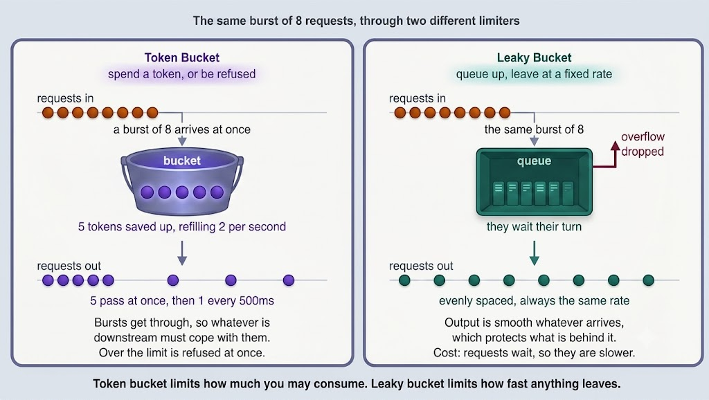

# Token Bucket vs. Leaky Bucket

Your API allows 100 requests per minute. A client sends all 100 in the first second, then goes quiet.

Did they break the limit? Over the full minute, no. But in that first second, they hit your servers a hundred times harder than the average suggests.

How you answer that question is the difference between the two classic rate-limiting algorithms. **Token bucket** allows the burst. **Leaky bucket** refuses to pass it on.

---

---

## Token Bucket

Picture a bucket that holds up to a fixed number of tokens — say, 5. Tokens are added at a steady rate (say, 2 per second), and the bucket never holds more than its capacity.

Every request must consume a token to proceed. If a token is available, the request goes straight through. If the bucket is empty, the request is rejected immediately — typically with `429 Too Many Requests`.

Two numbers control the behaviour, and they control different things:

- **Bucket capacity** is the burst you allow. A client that has been quiet accumulates tokens up to the capacity and can spend them all at once.
- **Refill rate** is the sustained rate. Once the saved tokens are spent, the client is limited to the speed at which tokens arrive.

That combination is what makes it the default choice for public APIs. Real clients are bursty in harmless ways: a page loads and fires eight requests at once, then nothing for a minute. Token bucket lets that through while still capping long-run usage. It is what AWS API Gateway, Stripe, and most commercial APIs use.

### Strengths

- Absorbs natural bursts without penalizing normal clients.
- Rejects instantly when out of tokens, so a client learns immediately and can back off.
- Cheap to store: two numbers per client — the token count and the timestamp of the last refill.

### Weaknesses

- Traffic leaving is still bursty, so anything downstream must be able to handle the burst you permitted.
- Two parameters to tune, and setting capacity too high makes the limit meaningless.

---

## Leaky Bucket

Now picture a bucket with a hole in the bottom. Requests pour in at whatever rate they arrive and collect inside. They drain out through the hole at a constant rate — no faster.

If requests arrive faster than the hole drains, the bucket fills. When it is full, new arrivals overflow and are dropped.

The defining property is the **output**. However spiky the input, what leaves is a perfectly steady stream. This is traffic shaping rather than simply limiting, and it is what you want when the downstream system cannot survive a spike: a legacy system, a third-party API with a hard cap, or a device with a fixed processing rate.

### Strengths

- Output is completely smooth, which protects whatever is behind it.
- One primary parameter — the drain rate — plus the queue size.
- Naturally absorbs a spike into the queue instead of dropping everything immediately.

### Weaknesses

- It adds latency. A request waiting in the bucket is delayed, and the caller has no indication of why the response is slow. For a user-facing API this is usually worse than a fast rejection.
- No burst allowance on the output, so a client that has been idle for an hour gets no credit for it.
- A full bucket drops requests silently.

---

## A Note on the Two Leaky Buckets

You will see leaky bucket described in two different ways, and the disagreement is genuine:

- **Leaky bucket as a queue** is the version above: requests wait and are released at a constant rate. It shapes traffic and introduces delay.
- **Leaky bucket as a meter** tracks a counter that leaks downward over time and rejects requests when it would overflow. This version does not queue anything and behaves equivalently to a token bucket, just counted from the opposite direction.

When an interviewer contrasts leaky bucket with token bucket, they almost always mean the queue version, because that is the one that behaves differently.

---

## Comparison

| | Token Bucket | Leaky Bucket (queue) |
|---|---|---|
| **Bursts in** | Allowed, up to bucket size | Accepted into the queue |
| **Bursts out** | Passed through | Never — output is constant |
| **When over the limit** | Rejected immediately | Queued, then dropped when full |
| **Effect on latency** | None — served or refused | Adds waiting time |
| **Idle time earns credit** | Yes, tokens accumulate | No |
| **Tuning** | Capacity and refill rate | Drain rate and queue size |
| **Best for** | Public APIs, per-user limits | Protecting a fragile downstream; traffic shaping |

> **One-line summary:** Token bucket limits how much you may consume; leaky bucket limits how fast anything leaves.

---

## Other Algorithms Worth Knowing

Interviewers often ask for a rate limiter without naming a specific bucket algorithm, so know these three as well:

- **Fixed window counter.** Count requests per client per fixed window (e.g., each calendar minute) and reject above the limit. Trivial to implement, but has a real flaw: a client can send the full limit at the end of one window and again at the start of the next, producing double the limit across a very short span.

- **Sliding window log.** Store a timestamp for every request and count how many fall inside the last 60 seconds. Exactly correct with no boundary problem, but storing one entry per request is expensive at scale.

- **Sliding window counter.** Keep the current and previous window counts and blend them based on how far into the current window you are. This eliminates most of the boundary flaw at a fraction of the memory. It is a solid default when token bucket is not required, and it is what many production limiters use.

---

## Rate Limiting in a Distributed System

The algorithm is the easy part. Interviewers typically push on where the state lives.

With many rate limiter instances, each holding its own counters, a client with 10 servers in front of them effectively gets 10 times the limit. So the counters belong in a shared store — normally Redis — keyed per client.

Two things to be ready for:

- **Race conditions.** A read-then-write from several instances at once will undercount. Use an atomic operation, a Lua script, or `INCR` with an expiry so that the check and the update happen together.
- **The cost of the lookup.** Every request now makes a network call to Redis. Common mitigations include checking limits at the edge or API Gateway, and letting each instance hold a small local allowance it can spend without consulting the shared store.

Also decide the key deliberately. Per user ID is right for authenticated APIs. Per IP is the fallback for anonymous traffic, but it penalizes everyone behind a shared address. Per API key is right for partner traffic. Many systems apply several limits simultaneously.

Finally, tell the client what happened. Return `429` with a `Retry-After` header — and ideally `X-RateLimit-Remaining` — so a well-behaved client can back off instead of hammering you.

---

> 💡 **Interview tip:** For a general API rate limiter, pick token bucket and justify it in one sentence: *"Token bucket, because real clients burst harmlessly and I'd rather allow a short burst and cap the sustained rate than delay everyone."* Then move quickly to the part that carries the marks — the distributed state: counters in Redis keyed by user ID, updated atomically so concurrent instances don't undercount, and a `429` with `Retry-After` so clients back off. Reach for leaky bucket only when something downstream genuinely cannot absorb a spike, and say so explicitly, because queuing a user-facing request is usually the wrong trade-off.

---

## Conclusion

**Token bucket** accumulates tokens up to a capacity and spends one per request, permitting bursts up to that capacity and then limiting clients to the refill rate — rejecting immediately when empty. **Leaky bucket** queues arrivals and releases them at a constant rate, producing perfectly smooth output at the cost of added latency, dropping requests once the queue is full.

Use token bucket for user-facing APIs and leaky bucket to shape traffic into something fragile. In a distributed system, the harder problem is keeping the counters shared and updated atomically.
