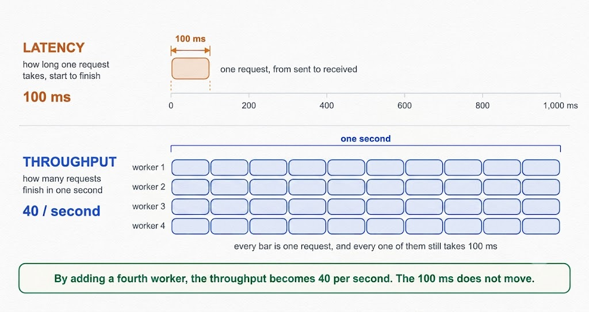
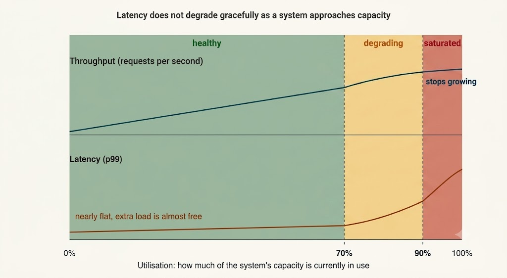
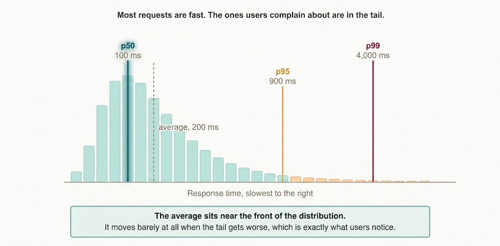

# Latency vs. Throughput

Latency and throughput are the two primary metrics you will reason about in virtually every system design interview. They are straightforward to define yet easy to confuse, because optimizing one sometimes improves the other and sometimes degrades it.

---

## Core Definitions

- **Latency** is the duration a single request takes to complete, measured from the moment it is dispatched to the moment the response arrives. Because it is a duration, it is measured in milliseconds (`ms`) or seconds (`s`). Lower numbers indicate better performance.
- **Throughput** is the volume of work a system completes per unit of time. In networking, it is expressed as data rate (e.g., Megabits per second). In system design interviews, it almost always refers to request volume, written as Queries Per Second (**QPS**) or Requests Per Second (**RPS**). Higher numbers indicate greater processing capacity.

A helpful mental model: **latency evaluates an individual request, whereas throughput evaluates all requests combined.** In a supermarket checkout queue, latency is how long you personally wait, while throughput is how many customers the store checks out per hour. A store can perform poorly on one metric while excelling at the other.

---

---

## They Are Independent Axes

Many explanations mistakenly treat latency and throughput as strict opposites. In reality, latency and throughput represent independent operational axes, and all four combinations can occur:

1. **Low Latency, Low Throughput**: A single fast single-threaded server. Every request returns rapidly, but it processes only a few requests per second.
2. **High Latency, High Throughput**: A batch data processing pipeline taking 6 hours to complete but ingesting 1 billion records in that window. Users are not waiting interactively, and overall volume is immense.
3. **Low Latency, High Throughput**: The ideal target for production systems, requiring sufficient hardware resources and optimization.
4. **High Latency, Low Throughput**: An overloaded or degraded system—the ultimate failure case.

The cleanest demonstration of their independence is adding concurrency. If a single worker node handles one request in 100 ms, throughput is 10 requests per second. Adding 10 parallel workers yields 100 requests per second while individual request latency remains unchanged at 100 ms. Throughput scales 10x without altering latency.

This relationship is formalized by **Little's Law**:

$$\text{Concurrency} = \text{Throughput} \times \text{Latency}$$

Memorizing this formula lets you calculate exact capacity requirements on the spot. For instance, to serve $2,000\text{ QPS}$ with an average request latency of $50\text{ ms}$ ($0.05\text{ s}$):

$$\text{Concurrency} = 2000 \times 0.05 = 100\text{ requests in flight concurrently}$$

This calculation turns vague scaling statements into explicit thread pools, connection caps, or server fleet counts.

---

## Why Latency and Throughput Trade Off in Practice

If latency and throughput are mathematically independent, why are they commonly discussed as a trade-off?

Because physical hardware systems have finite processing capacity, and latency degrades non-linearly as utilization approaches maximum capacity. Once server threads become saturated, new incoming requests wait in queue buffers before execution begins. That queuing delay is added directly to every response time.

---

---

### Understanding the Utilization vs. Latency Curve

- **Up to ~70% Utilization**: Latency remains virtually flat. Increasing load adds negligible delay.
- **Between 70% and 90% Utilization**: Latency begins climbing noticeably while incremental throughput gains diminish.
- **Past ~90% Utilization**: Throughput flattens completely as hardware saturates, while latency spikes exponentially. Additional traffic achieves zero extra completed work while every user experiences massive delay.

This non-linear curve explains why infrastructure teams target **50% to 70% peak server utilization** rather than 95%. That unallocated headroom absorbs unexpected traffic spikes without destroying response times. Operating at 95% efficiency means a minor 10% traffic bump breaks user-facing SLAs.

Batching illustrates this trade-off explicitly: aggregating 100 database writes into a single bulk insert reduces per-record network overhead, boosting throughput. However, the first record in that batch waits for the remaining 99 records to arrive before processing begins, degrading its individual latency.

---

## Why Averages Are Misleading

A common trap in performance discussions is relying on average latency (e.g., *"our average latency is 200 ms"*).

Average values conceal the shape of the latency distribution. Latency curves are non-symmetric: the vast majority of requests are fast, while a small tail of requests is very slow due to cache misses, Garbage Collection (GC) pauses, network retries, lock contention, or cold connections. That long right tail barely impacts the overall average, yet it represents the exact requests where users experience failure.

Real systems measure performance using **percentiles**:

- **p50 (Median)**: 50% of requests are faster than this value. It describes the typical user experience.
- **p95**: 95% of requests complete faster than this threshold (1 in 20 requests is slower).
- **p99**: 99% of requests complete faster than this threshold. This captures tail performance and represents the standard benchmark in Service Level Objectives (SLOs).

A system with a p50 of 100 ms and a p99 of 4 seconds means 1 out of every 100 requests suffers unusable delay.

---

---

## Why Tail Latency Multiplies in Distributed Systems

A p99 latency of 1 second might sound acceptable—only 1% of users wait a second.

However, modern applications make multiple downstream calls per page load. If rendering a single user dashboard triggers 100 parallel backend microservice calls, each with a p99 latency of 1 second, the probability that **all 100 calls return fast** is:

$$0.99^{100} \approx 0.37\quad (37\%)$$

Consequently, **roughly 63% of user page loads will experience at least one slow downstream call ($>1\text{ s}$)**. Tail latency is not a rare edge case—in distributed architectures with fan-out queries, the tail becomes the typical user experience.

---

## How to Improve Latency

1. **Move Data Closer to Users**: Deploy Content Delivery Networks (CDNs) and edge nodes to reduce physical network round-trip time (RTT).
2. **Implement Caching**: Cache hits bypass expensive compute and database disk I/O entirely.
3. **Eliminate Sequential Network Calls**: Avoid multi-hop sequential requests. Parallelize independent backend calls or batch related queries.
4. **Optimize Database Queries & Indexes**: Ensure hot queries utilize covering indexes and avoid full table scans.
5. **Asynchronous Request Path Offloading**: Move non-critical tasks (e.g., email notifications, analytics processing) off the synchronous request path into background queues.
6. **Maintain Headroom**: Keep server utilization around 60–70% to avoid queuing delays.

---

## How to Improve Throughput

1. **Scale Horizontally**: Add more stateless worker nodes behind a Layer 7 Load Balancer.
2. **Increase Concurrency**: Expand thread pools, connections, and worker instances based on Little's Law.
3. **Batch Operations**: Group I/O, network writes, and database operations to reduce per-item protocol overhead.
4. **Asynchronous Message Queues**: Buffer incoming requests using messaging systems (e.g., Kafka, RabbitMQ) to allow worker pools to process work at a steady state.
5. **Database Partitioning & Sharding**: Distribute write operations across multiple database nodes to remove single-node I/O ceilings.
6. **In-Memory Caching**: Offload repetitive read queries from database engines.

---

## Why Caching Enhances Both Latency and Throughput

Caching improves both metrics through two distinct mechanisms:
- **Latency Win**: A cache hit returns data directly from RAM, skipping expensive database/disk processing.
- **Throughput Win**: Every cached request frees up database CPU and I/O capacity that would otherwise be consumed, reserving system throughput for un-cached requests.

---

## 💡 System System Design Interview Strategy

When given a scale target during an interview, convert it into both throughput and latency figures before proposing an architecture:

> *"With 1 million daily active users making 5 feed loads per day, average throughput is ~58 QPS, with peak throughput reaching 200–300 QPS. Applying Little's Law for a target p99 latency under 200 ms ($0.2\text{ s}$), we need $300 \times 0.2 = 60$ concurrent workers in flight. To maintain server utilization at ~60% headroom, we will size our fleet for 100 concurrent worker slots."*

Stating a concrete latency percentile alongside Little's Law calculation demonstrates senior architectural rigor.

---

## Key Takeaway

- **Latency** measures time per request; **Throughput** measures requests completed per second.
- They are independent metrics linked by **Little's Law**: $\text{Concurrency} = \text{Throughput} \times \text{Latency}$.
- Trade-offs occur because latency spikes non-linearly as utilization approaches 100%, and because techniques like batching intentionally accept latency to gain throughput.
- Always quantify latency using **percentiles (p95, p99)** rather than misleading averages.
