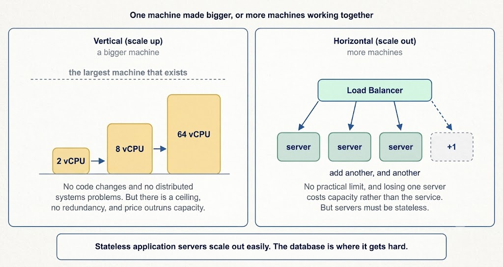

# Horizontal vs. Vertical Scaling

Your server is running at 90 percent CPU usage, and traffic is still growing. You have two options:

1. Buy a bigger machine.
2. Add a second machine.

That is **Vertical Scaling vs. Horizontal Scaling**, and almost every other architectural decision in this section eventually leads back to it.

- **Vertical scaling (scaling up)** means giving one machine more resources: more CPU cores, more memory, faster disks.
- **Horizontal scaling (scaling out)** means adding more machines and spreading the workload across them.

Vertical scaling makes one machine bigger until it reaches the largest machine that exists. Horizontal scaling adds machines behind a load balancer, with no practical limit and redundancy as a natural side effect.

---

---

## Vertical Scaling

You replace a 4-core machine with a 16-core machine. Nothing about your application changes. The exact same code runs on more capable hardware.

### What It Gives You

- **No Code Changes**: This is the real advantage, and it is easy to undervalue. There is no load balancer to add, no session store to introduce, and no data to partition.
- **No Distributed Systems Problems**: One machine cannot disagree with itself. Transactions, joins, and thread locks all work exactly as they did before.
- **Simple Operations**: One machine to deploy, monitor, and debug. One centralized set of logs.
- **Often the Cheapest Fix in Engineering Time**: Developer hours are a real cost even though they never appear on your cloud infrastructure bill.

### What It Costs You

- **A Hard Ceiling**: There is a largest machine available, and once you are on it, there is nowhere left to go. You cannot buy your way past physical hardware caps.
- **Price Rises Faster Than Capacity**: Commodity hardware is cheap. High-end hardware is not. Doubling the cores usually costs more than double the price, so each unit of capacity becomes more expensive as you scale up.
- **One Failure Domain**: A bigger server is still just one server. If it fails, everything goes down. Vertical scaling adds capacity but adds no redundancy at all.
- **Downtime Required**: Resizing usually requires downtime, or at least a restart and a failover.

---

## Horizontal Scaling

You keep the 4-core machines and run ten of them behind a load balancer.

### What It Gives You

- **No Practical Ceiling**: Need more capacity? Simply add more machines. This is how every large-scale system is built.
- **Redundancy Comes Free**: With ten servers, losing one node costs you ten percent of capacity, not the entire service. Fault tolerance is a structural side effect.
- **Cheaper Per Unit at Scale**: Commodity machines provide the best price-to-performance ratio.
- **Elasticity**: You can scale down as well as up. Running ten machines at peak and three overnight is only possible when capacity comes in modular units.
- **Safer Deployments**: Rolling updates work smoothly because you can take one machine offline at a time while others handle live requests.

### What It Costs You

- **Load Balancer Required**: You now need a load balancer, and it must be engineered for high availability itself.
- **Stateless Server Constraint**: Your servers must be stateless, or every request has to route back to the machine holding its state. This constraint dictates whether horizontal scaling is simple or painful.
- **Distributed Systems Problems Arrive**: Machines fail independently, networks partition, clocks disagree, and requests arrive out of order. None of these issues existed on a single machine.
- **Operational Complexity**: Deployments, monitoring, log aggregation, and debugging all become harder when a request may touch any of fifty machines.
- **Non-Parallelizable Workloads**: Adding machines helps only when work can be split. A single long computation that cannot be divided runs no faster on a hundred servers than on one.

---

## The Part That Actually Matters: State

Here is the honest version of this trade-off, and the key insight to present in an interview:

**Stateless application servers** scale horizontally almost for free. Put a load balancer in front, run as many instances as you like, and add or remove them at will. If a server holds nothing that other servers need, there is no hard problem to solve.

**Databases** are where horizontal scaling becomes difficult. A database holds state by definition, so you cannot simply run more copies and call it done. The options are all more involved:

1. **Read Replicas**: Scale reads horizontally. Writes still go to one primary node, while replicas lag behind it asynchronously.
2. **Sharding**: Scales writes horizontally by splitting data across machines by a shard key. Adding or removing a machine introduces hashing challenges—standard key modulation moves almost every key when node count changes, making **Consistent Hashing** the standard fix. Cross-shard joins and transactions become hard or impossible, and choosing a key that spreads load evenly is its own complex challenge.
3. **Scaling the Primary Vertically**: Frequently the pragmatic answer, and it works for far longer than people expect. A well-tuned relational database on a large machine handles a massive amount of traffic.

> **Common Architectural Evolution**: Application tiers scale out horizontally, while the database scales up vertically until it cannot, at which point sharding becomes unavoidable.

---

## Comparison Summary

| Dimension | Vertical Scaling | Horizontal Scaling |
| :--- | :--- | :--- |
| **What Changes** | The machine hardware capacity | The number of machine instances |
| **Code Changes** | None required | Requires stateless application design |
| **Ceiling** | The largest machine available | No practical limit |
| **Cost Curve** | Rises faster than capacity | Roughly linear cost growth |
| **Redundancy** | None (Single server, single failure domain) | Built-in fault tolerance |
| **Scale Down** | Requires restart / downtime | Easy dynamic scaling |
| **Complexity** | Low operational complexity | High (Distributed systems problems) |
| **Best For** | Databases, early growth, quick wins | Stateless services, large-scale systems |

---

## In Practice: Scaling Strategy

In practice, you do both, and **the order matters**:

1. **Scale up first**, because it costs almost no engineering time.
2. **Design so you can scale out later**, because eventually you will have to.

Concretely, that means keeping application servers stateless from day one—even while running on a single server—so that adding a second server is a simple configuration change rather than a code rewrite.

---

## 💡 System Design Interview Strategy

When scale comes up in an interview, do not just say *"scale horizontally"* and move on. **Split the tiers**. 

The strongest response is:

> *"Application servers are stateless, so they scale out horizontally behind a load balancer with sessions stored in Redis rather than local memory. The database is the harder question: I would scale the primary vertically and add read replicas first, and only shard when write traffic outgrows a single machine."*

Then expect a follow-up on the shard key, and be prepared to state what you would shard by and why that choice spreads load evenly. If a candidate mentions horizontal scaling without ever addressing the database, that is the exact gap an interviewer will probe.

---

## Key Takeaway

Vertical scaling gives one machine more resources, requiring no code changes and introducing no distributed systems problems, but it has a hard hardware ceiling, a cost curve that rises faster than capacity, and no redundancy. 

Horizontal scaling adds machines, providing effectively unlimited capacity, built-in fault tolerance, and elasticity—at the cost of requiring stateless services and accepting distributed systems complexity. 

Stateless application tiers scale out easily; the database is where the real difficulty lives, which is why systems usually scale the app tier out and the database up until sharding becomes unavoidable.
