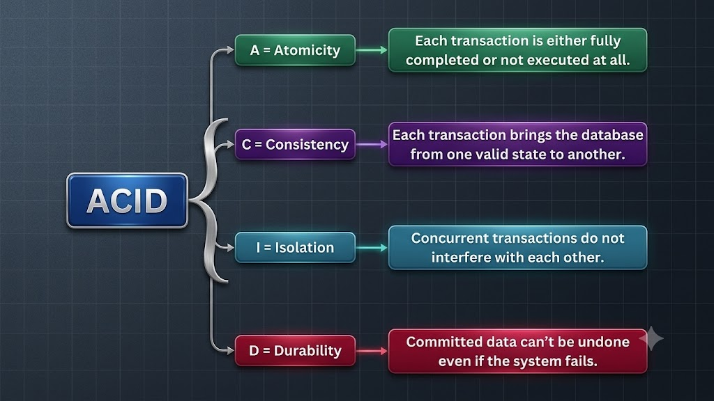
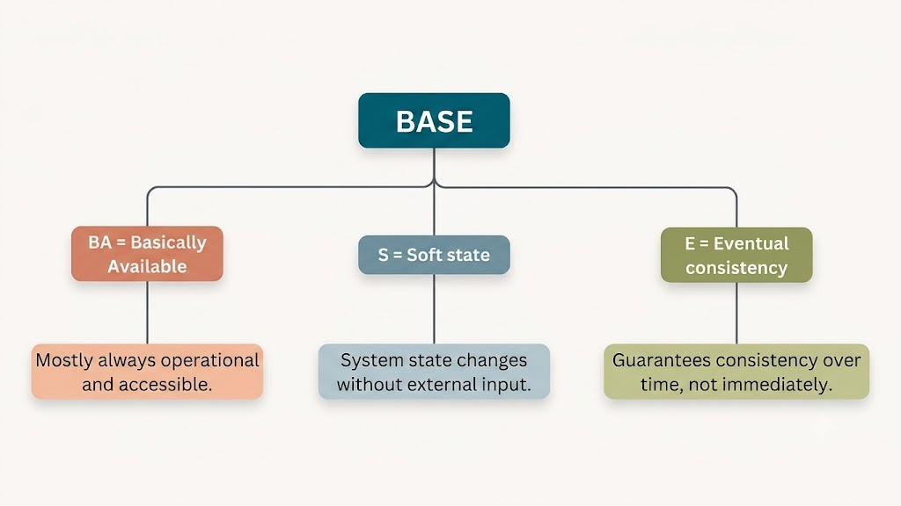
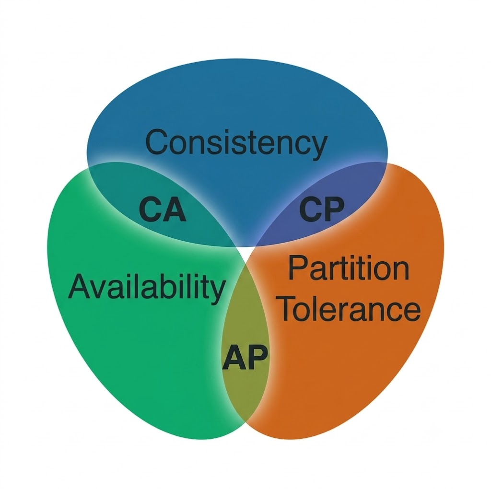

# ACID vs. BASE Properties in Databases

When interacting with critical digital applications—such as transferring funds in online banking or placing orders on an e-commerce platform—users expect reliable and correct execution. If a transaction encounters a server or network failure mid-way, the system must not deduct funds without updating the target account or leave data in a corrupted state.

To guarantee data integrity and system reliability, databases adopt specific consistency frameworks. The two predominant paradigms in database architecture are **ACID** and **BASE**. 

While **ACID** prioritizes strict transactional correctness and immediate consistency, **BASE** focuses on high availability, partition tolerance, and horizontal scalability by permitting temporary data staleness.

---

## What is ACID?

**ACID** is a set of four transactional guarantees enforced by traditional Relational Database Management Systems (RDBMS). A transaction represents a logical unit of work (e.g., transferring $100 between bank accounts) that may comprise multiple read/write operations. 



The four ACID properties guarantee data integrity despite system crashes, power outages, or concurrent operations:

### 1. Atomicity ("All-or-Nothing")
A transaction must execute completely or not at all. If any step within a transaction fails, the entire transaction is rolled back, leaving the database state untouched.
- **Example**: In a bank transfer, deducting money from Account A and adding it to Account B must occur together. If the deposit to Account B fails, the deduction from Account A is rolled back.

### 2. Consistency ("Valid State Transitions")
A transaction must transition the database from one valid state to another, preserving all defined schema constraints, rules, and invariants (e.g., unique keys, foreign keys, non-negative balances).
- **Example**: In a $100 transfer between Account A ($500) and Account B ($100), the combined total across both accounts before ($600) and after ($600) must remain identical.

### 3. Isolation ("Concurrent Non-Interference")
Concurrent transactions must execute independently without interfering with one another. Intermediate states of an uncommitted transaction remain invisible to other concurrent transactions.
- **Example**: If User 1 updates product stock from 10 to 9 while User 2 queries stock simultaneously, User 2 sees either 10 or 9, but never an intermediate uncommitted value.

### 4. Durability ("Permanent Persistence")
Once a transaction commits, its modifications are permanently recorded in non-volatile storage (such as disk or WAL logs). Changes survive subsequent hardware crashes, power loss, or system failures.
- **Example**: Once a payment gateway responds with "Payment Successful," the transaction record persists on disk even if the database server crashes a millisecond later.

---

## What is BASE?

**BASE** is a design philosophy commonly adopted by distributed NoSQL databases. It trades immediate consistency to maximize system availability and horizontal scaling across multi-node clusters.



BASE stands for:

### 1. Basically Available
The system prioritizes availability, guaranteeing a response to every incoming request even during high load or partial node outages. The returned data may occasionally be stale, but the cluster remains operational.
- **Example**: During a flash sale, an e-commerce platform continues accepting user orders even if inventory counts across secondary nodes lag behind by a few seconds.

### 2. Soft State
The system state may fluctuate over time without explicit user input because data updates propagate asynchronously across nodes. Data exists in a temporary state of transition before reaching global convergence.
- **Example**: Editing a social media profile photo might not immediately reflect on friends' screens. The data remains in a "soft state" while background replication takes place.

### 3. Eventually Consistent
If no further updates occur to a data record, all replicas will eventually receive the update and synchronize to identical states.
- **Example**: In a collaborative document editor, concurrent edits by multiple users temporarily diverge, but the background resolution protocol eventually converges all instances to a single unified document.

---

## ACID vs. BASE & The CAP Theorem

The fundamental trade-off between ACID and BASE aligns with the **CAP Theorem** (Brewer's Theorem), which states that a distributed data system can simultaneously guarantee only two of three properties: **C**onsistency, **A**vailability, and **P**artition Tolerance.



In the presence of network partitions (**P**):
- **ACID databases** prioritize **Consistency (CP)**: They block or fail requests if strict cross-node consistency cannot be guaranteed.
- **BASE databases** prioritize **Availability (AP)**: They continue serving requests locally, accepting temporary data staleness (**Eventual Consistency**).

---

## Key Differences & Architectural Trade-offs

| Feature / Aspect | ACID Properties | BASE Properties |
| :--- | :--- | :--- |
| **Consistency Focus** | **Strong Consistency**: Immediate synchronization across all nodes upon commit. | **Eventual Consistency**: Temporary staleness permitted; nodes converge over time. |
| **Availability Guarantee** | Lower availability during partitions or node locks (CP). | High availability; cluster accepts operations independently (AP). |
| **Transaction Model** | Strict multi-step transactions with rollbacks and isolation levels. | Loose or single-row atomic operations; background conflict resolution. |
| **Scalability & Performance** | Vertical scaling preferred; horizontal scaling requires complex global consensus. | High horizontal scalability (scaling out) across thousands of nodes. |
| **Developer Complexity** | Low app complexity; database automatically enforces consistency rules. | Higher app complexity; developers must handle stale reads and conflict merges. |
| **Database Types** | Traditional RDBMS (SQL databases). | Distributed NoSQL & Key-Value stores. |

---

## Real-World Database Examples

### ACID-Compliant Databases
- **SQL Databases**: MySQL (InnoDB), PostgreSQL, Oracle Database, Microsoft SQL Server, SQLite.
- **Distributed ACID Databases**: Google Spanner, CockroachDB.
- **Common Use Cases**: Banking systems, ledger accounting, order checkout processing, reservation systems.

### BASE-Oriented Databases
- **NoSQL Databases**: Apache Cassandra, Amazon DynamoDB, Couchbase, Redis, MongoDB (default read modes).
- **Common Use Cases**: Social media feeds, user session stores, real-time messaging, IoT metrics ingestion, product recommendations.

---

## Decision Framework: When to Choose ACID vs. BASE

```
                       Is data accuracy non-negotiable?
                               /             \
                             YES              NO
                             /                 \
                 [ Choose ACID ]           [ Choose BASE ]
             - RDBMS (PostgreSQL, MySQL)    - NoSQL (Cassandra, DynamoDB)
             - Strong Consistency          - High Availability
             - Strict Transactions         - Scalability & Eventual Consistency
```

1. **Choose ACID when**:
   - Financial correctness, double-spending prevention, or legal compliance is non-negotiable.
   - Operations require complex multi-row or multi-table transactional guarantees.

2. **Choose BASE when**:
   - High availability, low latency, and massive horizontal scaling are primary requirements.
   - The application business logic gracefully handles minor, temporary data staleness.

3. **Hybrid Architecture**:
   - Modern enterprise architectures frequently combine both approaches: an ACID database handles core transactional payments, while a BASE NoSQL store manages user activity logs, product recommendations, and search indexing.
