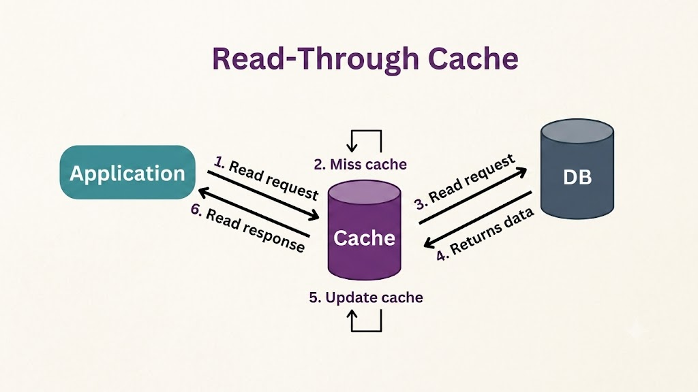
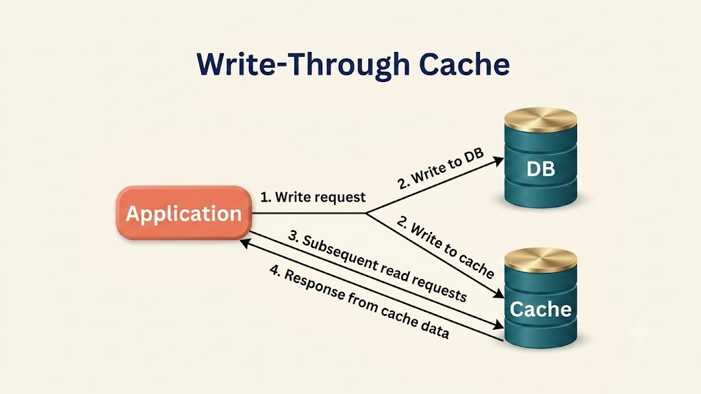

# Read-Through vs. Write-Through Cache

Read-through and write-through caching are two fundamental caching patterns used to manage data synchronization between an in-memory cache and a primary persistent database. They play essential roles in optimizing system performance, especially in high-throughput or latency-sensitive applications.

---

## Read-Through Cache

### Definition
In a **Read-Through Cache** strategy, data is loaded into the cache transparently on demand when a read request occurs for data that is not yet cached. The application interacts strictly with the caching layer, while the cache system itself handles fetching missing data from the primary database.

### Execution Process
1. **Read Request**: The client or application requests a record from the cache system.
2. **Cache Hit**: If the requested data exists in the cache, it is immediately returned to the application.
3. **Cache Miss**: If the data is absent (cache miss):
   - The cache engine queries the primary database for the requested item.
   - The cache stores the retrieved item in its memory.
   - The cache returns the data back to the requesting application.
4. **Subsequent Reads**: Future reads for the same item are served directly from the cache until the item expires (TTL) or is evicted.

### Pros & Cons
- **Pros**:
  - **Application Transparency**: The application code only talks to the cache, simplifying data access logic.
  - **Reduced Latency on Hits**: Warm cache hits deliver ultra-low latency.
  - **Offloaded Database Reads**: Protects the primary database from heavy read traffic.
- **Cons**:
  - **Cache Miss Penalty**: The initial request for an unheated key suffers extra latency due to synchronous fetching from the primary database.

### Real-World Example: E-Commerce Product Catalog
- **Scenario**: An online retailer with millions of product catalog listings.
- **Process**: When a user views a product that is not currently cached (cache miss), the cache layer queries the relational database, caches the product details, and returns the response. Subsequent page views for that product are served instantly from the cache without hitting the database.
- **Benefits**: Protects database resources during peak traffic events (e.g., Black Friday) and accelerates product page load speeds.

---

## Write-Through Cache

### Definition
In a **Write-Through Cache** strategy, data is written synchronously to both the cache layer and the primary database in a single transaction path. This guarantees that the cache always contains the most up-to-date state.

### Execution Process
1. **Write Request**: The application issues a write or update request to the cache layer.
2. **Synchronous Writes**:
   - The cache engine updates its local in-memory store.
   - Simultaneously, the cache engine writes the updated record to the primary database.
3. **Write Confirmation**: The write operation is confirmed back to the application only after both the cache and database writes succeed.
4. **Read Access**: Subsequent reads immediately retrieve the latest written value directly from the cache.

### Pros & Cons
- **Pros**:
  - **Strict Data Consistency**: Eliminates stale reads because cache and database remain synchronized on every write.
  - **Durability Guarantee**: Data is persisted synchronously to the primary database, eliminating data loss during cache crashes.
  - **Read Acceleration**: Newly written data is pre-warmed in the cache for immediate subsequent reads.
- **Cons**:
  - **Write Latency Penalty**: Every write incurs higher latency because it waits for synchronous disk/database writes before returning.
  - **Database Write Overhead**: Heavy write workloads directly impact the primary storage.

### Real-World Example: Banking & Account Balances
- **Scenario**: A banking platform processing user account balance updates.
- **Process**: When a customer makes a deposit, the update writes to the cache and the primary SQL database simultaneously. When the user immediately refreshes their account dashboard, the updated balance is served instantly from the cache with zero risk of displaying a stale balance.
- **Benefits**: Ensures total consistency and data integrity while maintaining rapid balance retrieval for subsequent queries.

---

## Key Differences

| Feature / Metric | Read-Through Cache | Write-Through Cache |
| :--- | :--- | :--- |
| **Primary Focus** | Read operation optimization & load reduction. | Write consistency & immediate data integrity. |
| **Synchronization Trigger** | Synchronizes data on **Read Requests** (on cache miss). | Synchronizes data on **Write Requests**. |
| **Data Fetch Source** | Cache fetches missing data from primary database on miss. | N/A (App writes data through cache to database). |
| **Write Performance** | Standard database write speed; cache isn't updated on write. | Higher write latency due to dual-write synchronization. |
| **Read Performance** | Fast on cache hits; penalty on initial cache miss. | Extremely fast; cached items are always pre-warmed & fresh. |
| **Stale Read Risk** | Possible if underlying database changes out-of-band. | Zero; cache and database are updated simultaneously. |
| **Ideal Workload** | Read-heavy applications with infrequent data updates. | Critical write-heavy/balanced apps requiring immediate consistency. |

---

## When to Use Which Strategy?

### Choose Read-Through Caching When:
- Read queries vastly outnumber write operations (read-heavy applications).
- Data changes infrequently or eventual read consistency is tolerable.
- You want to abstract database fetching logic away from application code.

### Choose Write-Through Caching When:
- Strict data consistency and zero stale reads are mandatory.
- Immediate read-after-write access is required.
- You cannot afford data loss if a cache instance fails suddenly.

---

## Conclusion

Read-through caching prioritizes read efficiency and reduces database load by populating cache items on demand during read misses. Write-through caching prioritizes data integrity and consistency by synchronously persisting writes to both the cache and primary storage. Systems often combine these patterns based on specific read vs. write performance requirements.
