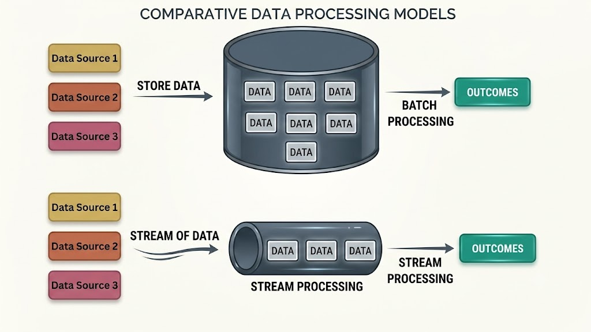

# Batch Processing vs. Stream Processing

Batch processing and stream processing are two core data processing paradigms used in modern system design to handle large volumes of data. Each paradigm caters to distinct timing requirements, operational constraints, and business use cases.

---

## Batch Processing

### Definition
**Batch processing** refers to executing operations on large, discrete chunks of data (batches) at scheduled intervals or after collecting a specific volume of data.

### Key Characteristics
- **Delayed Execution**: Data is collected over a time window (e.g., hourly, daily, monthly) and processed in a single bulk operation.
- **High Throughput**: Highly efficient for processing massive datasets where immediate, real-time results are not required.

### Real-World Example: Corporate Payroll Processing
A company's payroll system calculates employee salaries at the end of each pay period (e.g., monthly). All employee attendance records, tax deductions, and bonus data accumulated over the month are processed together in one large batch job.

### Pros & Cons
- **Pros**:
  - **Resource Efficiency**: High resource utilization as batch engines (e.g., Apache Hadoop MapReduce, Apache Spark) optimize I/O and CPU for massive datasets.
  - **Implementation Simplicity**: Generally simpler to implement, debug, and maintain compared to real-time streaming architectures.
- **Cons**:
  - **Delayed Insights**: Unsuited for scenarios requiring real-time actions or immediate feedback.
  - **Inflexibility**: Less responsive to sudden, immediate data shifts or real-time event triggers.

---

## Stream Processing

### Definition
**Stream processing** involves continuously processing data records in real-time or near-real-time as individual events arrive at the system.

### Key Characteristics
- **Immediate Processing**: Data items are processed instantly as they are generated or ingested (low-latency event-driven architecture).
- **Real-Time Responsiveness**: Ideal for applications demanding instantaneous decision-making and continuous analytics.

### Real-World Example: Credit Card Fraud Detection
When a user swipes a credit card, a fraud detection engine (e.g., using Apache Flink, Apache Storm, or Kafka Streams) analyzes the transaction within milliseconds for suspicious location or purchasing patterns. If flagged, the transaction is immediately blocked before approval.

### Pros & Cons
- **Pros**:
  - **Real-Time Analysis**: Enables immediate automated actions, alerting, and real-time dashboards.
  - **Dynamic Event Handling**: Highly adaptable to continuous, fluctuating event streams.
- **Cons**:
  - **System Complexity**: Complex to build and maintain due to out-of-order event handling, state management, and exactly-once delivery semantics.
  - **Resource Intensive**: Requires dedicated infrastructure to keep processing workers running 24/7 with continuous resource allocation.

---

## Key Differences

| Feature / Aspect | Batch Processing | Stream Processing |
| :--- | :--- | :--- |
| **Data Handling** | Large, discrete blocks accumulated over time windows. | Continuous, unbounded streams of individual events. |
| **Processing Latency** | High latency (minutes, hours, or days). | Low latency (milliseconds to seconds). |
| **Data Volume & Boundaries** | Finite, bounded datasets. | Infinite, unbounded continuous event streams. |
| **Operational Focus** | Maximizing throughput & bulk efficiency. | Minimizing latency & immediate event response. |
| **System Complexity** | Lower complexity; deterministic scheduled execution. | Higher complexity; windowing, state management, event-time ordering. |
| **Popular Frameworks** | Hadoop MapReduce, Apache Spark, AWS EMR, Snowflake. | Apache Flink, Kafka Streams, Apache Spark Streaming, Apache Storm. |

---

## When to Use Which Strategy?

### Choose Batch Processing When:
- Real-time response is not required (e.g., end-of-day financial reconciliation, monthly billing reports).
- The total dataset is bounded, complete, and stored on disk/data warehouses.
- Maximizing computational throughput per unit cost is the primary goal.

### Choose Stream Processing When:
- Instantaneous reaction is mandatory (e.g., fraud prevention, live telemetry monitoring, real-time gaming leaderboards).
- Data arrives as a continuous, unbounded stream of events.
- Your architecture requires event-driven microservices reacting instantly to state changes.

---

## Conclusion

Batch processing is optimal for large-scale, scheduled computations where processing delay is acceptable. Stream processing is essential for real-time applications where immediate event processing and low-latency decision-making are critical. Modern data architectures frequently employ a **Lambda** or **Kappa Architecture** to combine the accuracy of batch processing with the speed of stream processing.
