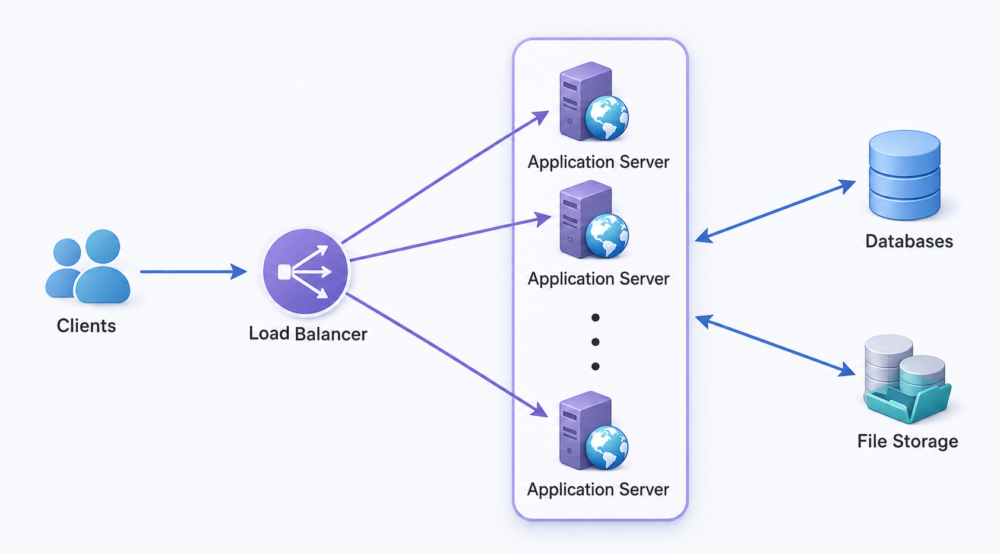

# System Design Interviews: A Step-by-Step Guide

Software engineers frequently encounter difficulties during system design interviews (SDIs) due to three primary reasons:

1. **Unstructured Format**: SDIs are inherently open-ended design problems that do not have a single standard solution.
2. **Limited Large-Scale Experience**: Candidates often lack hands-on experience developing complex and large-scale distributed systems.
3. **Inadequate Preparation**: Candidates do not spend sufficient time practicing and preparing for system design interviews.

Much like coding interviews, candidates who do not prepare thoroughly tend to perform poorly, particularly at high-profile technology companies like Google, Meta, Amazon, and Microsoft. At these organizations, candidates whose performance is not above average have a low probability of receiving an offer. Conversely, an exceptional performance often yields a better job offer—including a higher role level and compensation—because it validates the candidate's capability to architect complex systems.

In this guide, we adopt a structured, step-by-step approach to solve diverse system design problems.

---

## Step 1: Requirements Clarification

It is always vital to ask clarifying questions regarding the exact scope of the problem you are tasked with solving. Because system design questions are open-ended with no single "correct" answer, eliminating ambiguities early in the interview is critical. Candidates who dedicate sufficient time to defining the core goals of the system consistently achieve better outcomes. Furthermore, given that interviewers typically allocate only 35–40 minutes to design a complex system, you must clarify which specific subsystems require your focus.

### Example: Designing a Twitter-like Service
Consider a scenario where you are asked to design a Twitter clone. Here are essential questions that should be clarified before moving to subsequent steps:

- Will users of our service be able to post tweets and follow other accounts?
- Should we also design the creation and rendering of the user's home timeline?
- Will tweets contain rich media such as images and videos?
- Are we focusing strictly on the backend architecture, or are we designing frontend interfaces as well?
- Will users be able to search for tweets by keyword or hashtag?
- Do we need to display real-time trending topics?
- Will there be push notifications for new or high-priority tweets?

Clarifying these questions determines the functional scope and directly dictates the final architecture.

---

## Step 2: Back-of-the-Envelope Estimation

It is always good practice to estimate the scale of the system you are designing. These calculations guide subsequent decisions regarding database partitioning, scaling strategies, load balancing, and caching layers.

Key parameters to estimate include:

- **System Scale & Throughput**: What traffic volume is expected (e.g., number of new tweets published per second, tweet read requests per second, timeline generation QPS)?
- **Storage Requirements**: How much storage capacity will be required over 1 to 5 years? (Storage needs differ significantly if tweets include media like images and videos).
- **Network Bandwidth Usage**: What ingress and egress bandwidth consumption is anticipated? This is crucial for managing network traffic and balancing server load.

---

## Step 3: System Interface Definition

Define the core APIs expected from the system. This establishes an explicit contract for the platform and verifies that no functional requirements were misunderstood.

For our Twitter-like service, sample API signatures include:

```http
postTweet(user_id, tweet_data, tweet_location, user_location, timestamp, ...)
generateTimeline(user_id, current_time, user_location, ...)
markTweetFavorite(user_id, tweet_id, timestamp, ...)
```

---

## Step 4: Defining the Data Model

Defining the data model early in the interview clarifies how data flows between different system components and guides subsequent data partitioning and storage management. Candidates should identify core entities, their interactions, and data storage, transport, and encryption needs.

For a Twitter-like service, primary entities include:

- **User**: `UserID`, `Name`, `Email`, `DoB`, `CreationDate`, `LastLogin`, etc.
- **Tweet**: `TweetID`, `Content`, `TweetLocation`, `NumberOfLikes`, `TimeStamp`, etc.
- **UserFollow**: `UserID1`, `UserID2`
- **FavoriteTweets**: `UserID`, `TweetID`, `TimeStamp`

### Database & Storage Considerations:
- Which database system fits best? Does a NoSQL solution like Cassandra meet our scale, or should we use a SQL solution like MySQL/PostgreSQL?
- What block or object storage system (e.g., AWS S3) should be used for photos and videos?

---

## Step 5: High-Level Design

Draw an architectural block diagram with 5–6 primary components representing the core architecture required to solve the end-to-end system requirements.

For Twitter at a high level:
- **Load Balancers**: Placed in front of application servers for traffic distribution.
- **Application Servers**: Multiple app servers handling read and write traffic. Because read traffic heavily outpaces write traffic, separate server clusters can be allocated to handle read vs. write workloads.
- **Database Layer**: High-performance database cluster storing tweet metadata and user graphs.
- **Distributed File/Object Storage**: Object storage system for persistent media assets (photos and videos).



---

## Step 6: Detailed Design

Dig deeper into 2 or 3 major components based on interviewer feedback. Present different approaches alongside their pros and cons, explaining why one design is preferred over another while keeping system constraints in mind.

Key topics to address during detailed design:

- **Data Partitioning & Sharding**: Given the massive volume of data, how should we partition data across multiple database nodes? If we partition by `UserID`, what issues (such as hot keys or uneven data distribution) might arise?
- **Handling Hot Users**: How will the system process celebrity accounts who post frequently or have millions of followers?
- **Timeline Optimization**: Because user timelines contain recent tweets, should we optimize data storage for fast temporal scanning of latest tweets (e.g. fan-out on write vs. fan-out on read)?
- **Caching Strategy**: Where and how much caching should be introduced (e.g., CDN, application-level Redis) to accelerate response times?
- **Load Balancing**: Which layers require dedicated load balancing or health checking?

---

## Step 7: Identifying and Resolving Bottlenecks

Discuss potential system bottlenecks and present concrete mitigation techniques:

- **Single Points of Failure (SPOFs)**: Is there any SPOF in the system? What redundant components or failover protocols mitigate it?
- **Data Redundancy**: Are there sufficient data replicas to continue serving users if multiple storage nodes fail?
- **Service Redundancy**: Are enough instances of core microservices running so that isolated server crashes do not cause a total system outage?
- **Monitoring & Alerting**: How is system performance monitored? Are automated alerts triggered when key components fail or degrade?

---

## Summary

In short, structured preparation and methodical organization during the interview are the keys to success in system design interviews. Following this 7-step framework ensures you remain on track, cover all essential architectural aspects, and effectively demonstrate your engineering capability.
