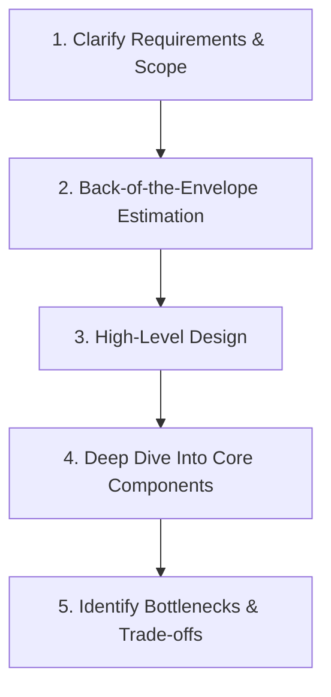

# System Design Interview Preparation

Evaluating scalability, reliability, and architectural trade-offs under pressure is the primary focus of System Design interviews. This guide consolidates the fundamental principles utilized daily by senior backend and systems engineers—ranging from load balancing and caching strategies to database partitioning and microservices.

Here, you will learn a structured methodology to navigate open-ended architectural questions, weigh design alternatives objectively, and communicate your decisions like a lead architect. Backed by practical case studies, intuitive diagrams, and comprehensive conceptual frameworks, this resource will equip you with the skills and confidence to architect complex, high-availability systems from scratch.

---

## 🗺️ Core System Design Syllabus

To help you prepare systematically, the content is organized into key focus areas:

### 1. Introduction to System Design Interview
*   [Why System Design Interview](./1-introduction-to-system-design-interview/1.1-why-system-design-interview.md)
*   [Functional vs. Non-functional Requirements](./1-introduction-to-system-design-interview/1.2-functional-vs-non-functional-requirements.md)
*   [Back-of-the-Envelope Estimations](./1-introduction-to-system-design-interview/1.3-back-of-the-envelope-estimations.md)
*   [Things to Avoid During System Design Interview](./1-introduction-to-system-design-interview/1.4-things-to-avoid-during-system-design-interview.md)
*    Quiz

### 2. System Design Basics
*   [System Design Basics](./2-system-design-basics/2.1-system-design-basics.md)
*   [Key Characteristics of Distributed Systems](./2-system-design-basics/2.2-key-characteristics-of-distributed-systems.md)
*   [Load Balancing](./2-system-design-basics/2.3-load-balancing.md)
*   [Load Balancing Algorithms](./2-system-design-basics/2.4-load-balancing-algorithms.md)
*   [Caching](./2-system-design-basics/2.5-caching.md)
*   [Data Partitioning](./2-system-design-basics/2.6-data-partitioning.md)
*   [Indexes](./2-system-design-basics/2.7-indexes.md)
*   [Proxies](./2-system-design-basics/2.8-proxies.md)
*   [Redundancy and Replication](./2-system-design-basics/2.9-redundancy-and-replication.md)
*   [SQL vs. NoSQL](./2-system-design-basics/2.10-sql-vs-nosql.md)
*   [CAP Theorem](./2-system-design-basics/2.11-cap-theorem.md)
*   [PACELC Theorem](./2-system-design-basics/2.12-pacelec-theorem.md)
*   [Consistent Hashing](./2-system-design-basics/2.13-consistent-hashing.md)
*   [Long-Polling vs WebSockets vs Server-Sent Events](./2-system-design-basics/2.14-long-polling-vs-webSockets-vs-server-sent-events.md)
*   [Bloom Filters](./2-system-design-basics/2.15-bloom-filters.md)
*   [Quorum](./2-system-design-basics/2.16-quorum.md)
*   [Leader and Follower](./2-system-design-basics/2.17-leader-and-follower.md)

<!-- ### 3. System Design Trade-offs
*   **SQL vs. NoSQL**: Choosing the right database paradigm for your use case.
*   **Database Scaling**: Replication (Leader-Follower, Leader-Leader), Partitioning/Sharding (Consistent Hashing), and Federation.
*   **Indexes**: B-Trees, LSM-Trees, and database indexing strategies.

### 4. System Design Problems
*   **APIs**: REST, GraphQL, and gRPC.
*   **Message Queues & Event Streaming**: Pub/Sub systems (Kafka, RabbitMQ) and asynchronous messaging.
*   **WebSockets & Server-Sent Events (SSE)**: For real-time updates. -->

---

## 🛠️ Step-by-Step System Design Interview Framework

When handed an open-ended design prompt in an interview, follow this structured approach:

1.  **Clarify Requirements**: Understand the functional requirements (what the system does) and non-functional requirements (scalability, latency, availability, consistency).
2.  **Back-of-the-Envelope Estimation**: Estimate DAU (Daily Active Users), QPS (Queries Per Second), storage requirements, and bandwidth requirements.
3.  **High-Level Design**: Draw block diagrams of the main components (Clients, Load Balancers, Web Servers, Database, Cache, File Storage).
4.  **Deep Dive**: Focus on specific components requested by the interviewer (e.g., database schema design, caching layer optimization, scaling a specific service).
5.  **Identify Bottlenecks**: Discuss failure points, monitoring, rate limiting, security, and single points of failure (SPOFs).
